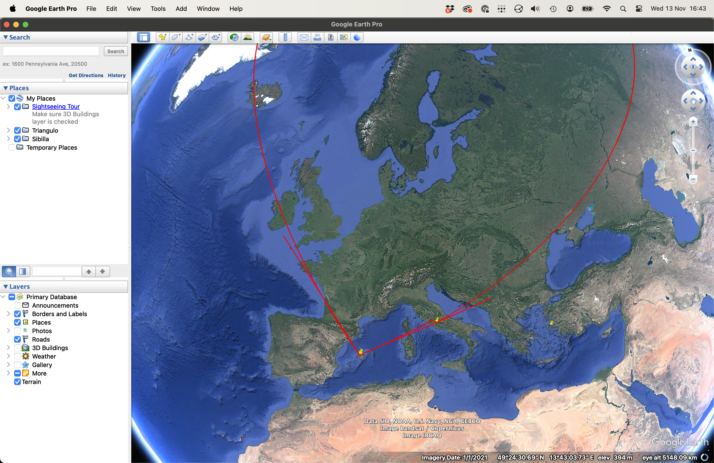
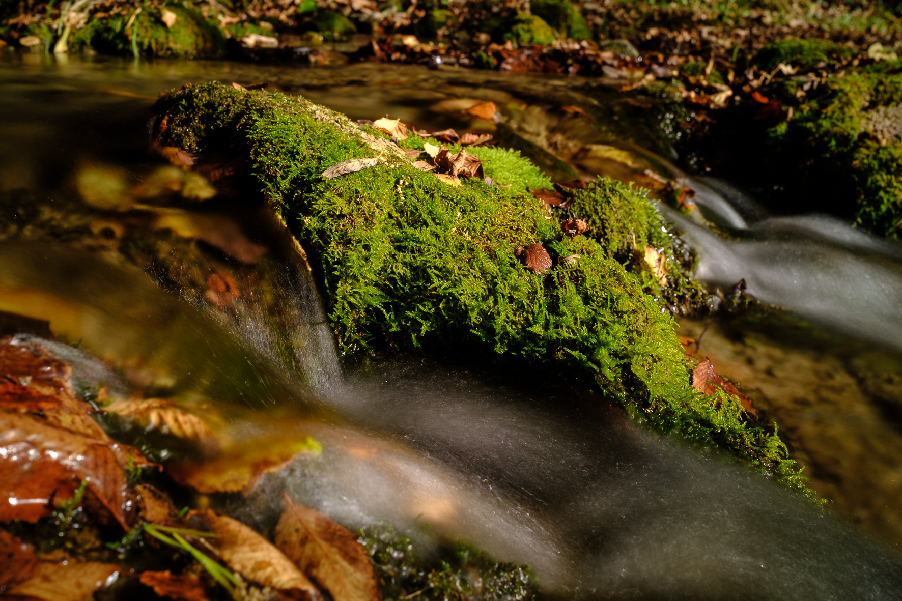
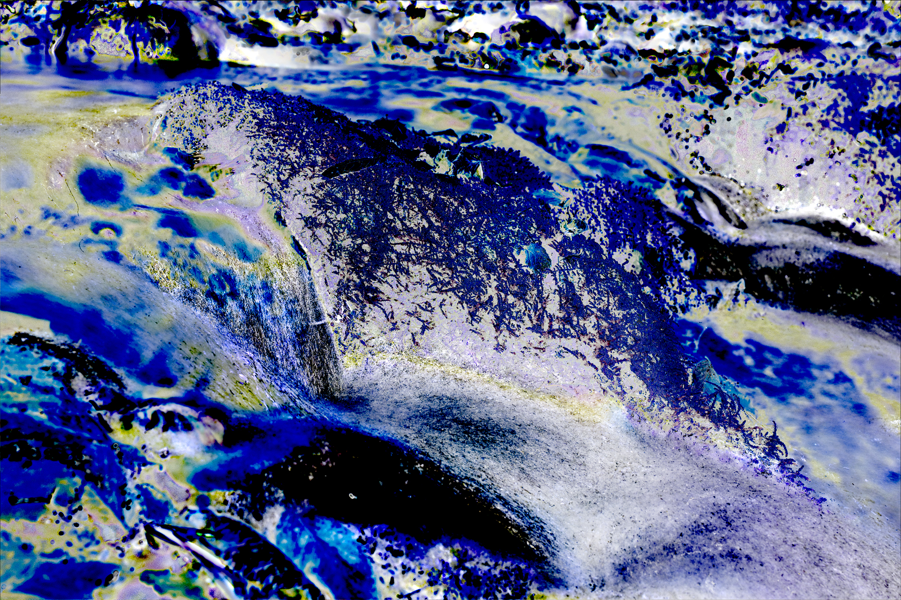
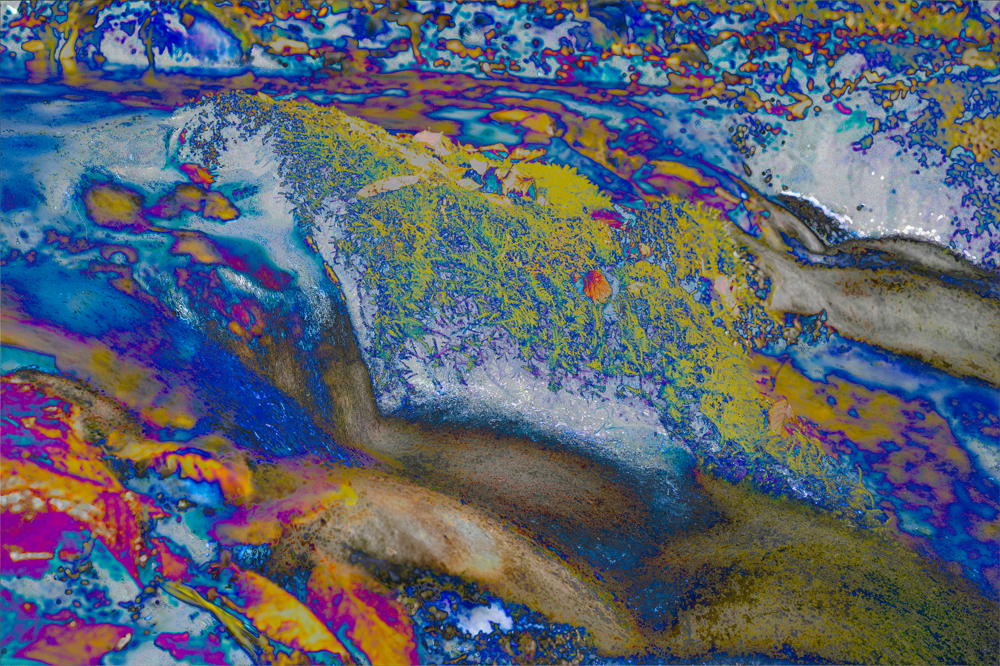

# Salts binaris

## Rumbos en els mapes

Si la Sibila és una fletxa i la investigació estudia un viatge, per què no dibuixar mapes?

Fa temps, moments abans d’atterrir a Palma, vaig veure un triangle entre les muntanyes. Intuí que havia d’anar al centre però que també era una fletxa que apuntava cap a algun lloc cap al nord.

Usant la mateixa idea vaig intentar veure com es projectava una línia entre el Santuario de Lluc i el temple de la Sibila de Tivoli.

També hi ha el "pin" a Eritrea (actual Ildırı, Turquia).

Sense conclusions però continuaré experimentant. La projecció del rumb no acaba de funcionar bé.

## Anàlisi estadística d’imatges

Imatge de referència

Stack de 7 imatges amb variacions d’exposició. [Skewness](https://en.wikipedia.org/wiki/Skewness) o [asimetria estadística](https://es.wikipedia.org/wiki/Asimetr%C3%ADa_estad%C3%ADstica).

Les mateixes imatges combinades amb diferents operacions.

## Converses amb chatGPT

Durant tot el procés he utilitzat chatGPT per buscar informació, que després havia de contrastar
amb més cerques normals a la web i dirigir-les a fonts de confiança.

Una de les proves va ser demanar a chatGPT que interpretés alguns dibuixos. El resultat va ser sorprenent.
Conseguia fer preguntes que em costava respondre.

La conversa [es pot llegir aquí](/posts/EETN/chatGPT/2024-10-21/).

