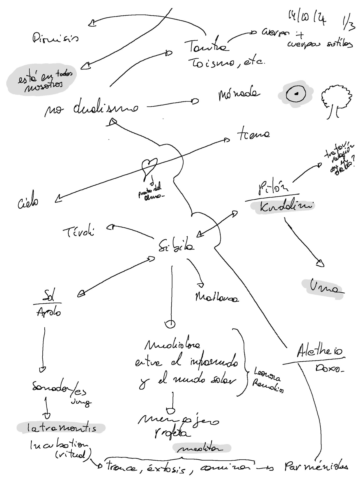
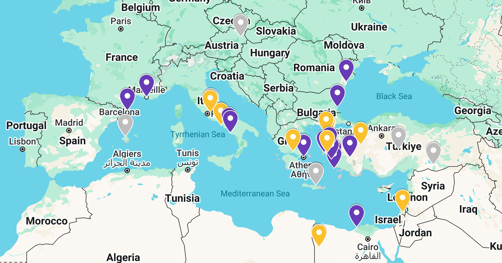

# Context

Aquest document resumeix l'estat de la investigació sobre _art i màgia_ realitzada en el marc 
d'una residència a Civitella di Licenza, Roma, Itàlia, des del 16 de setembre de 2024 al 17 de gener de 2025 
part del programa [Residency action de Culture Moves Europe](https://culture.ec.europa.eu/creative-europe/creative-europe-culture-strand/culture-moves-europe).

# Declaració al principi de la primera part

La meva investigació artística explora la relació entre l'art i la màgia, amb la Sibila com enllaç entre Mallorca, Tivoli i els fluxos d'aigua (ninfes i naïades). Investiga figures de curació pre-hipocràtica i chamànica, així com artistes 'medium' com Hilma af Klint, Leonora Carrington i Remedios Varo.

La meva pràctica personal connecta el conceptual amb el físic a través de passejades meditatives a la natura, tècniques de masatge i curació, rituals de devoció i la canalització, influenciada per tradicions com la cherokee (Tameana). Aquesta investigació es basa en una pràctica real de curació.

L'obra que emergeixi d'aquest procés evocarà la curació de l'ànima, el seu reflex en el cos, la tradició màgica europea i les seves connexions amb les tradicions orientals i americans, intentant provar l'hipòtesi que aquesta saviesa i poder són inherents a tots els éssers humans.

___

# Experimentació

En el meu camí hi ha una constant, cada dia sé menys i experimento més. Fins ara, el camí per saber menys és aprendre més. Aprendre més des del cos, la ment, la intuïció i la meditació.

"Tot passa al cos".

## Metodologia

- Meditació
	- Cap a la quietud dinàmica (en termes biodinàmiques craneosacral)
	- Converses amb els arbres:
		- Entrar en contacte (físic i camp) en estat de quietud.
		- Formular preguntes. 
        - Les respostes són imatges.
	- Dibuix automàtic.
	- Fotografia (guiada pels arbres, meditativa, intuïtiva). 
    - Caminar.
- Lectura.
- Saltos "binaris"
	- Discussions amb chatGPT
	- Sobre les interpretacions que fa de l'objecte que dibuixo [2024-10-21 Dibujos chatGPT](/posts/EETN/chatGPT/2024-10-21/)
	- Codi per dibuixar en els mapes els rumbos. 
	- Tractament estadístics de les imatges de les ninfes.
- Integració i sistematització Organització de notes
	- Obsidian Mapes mentals

## Mapa de la investigació

## Sibila

La Sibila té la seva secció pròpia [aquí](/docs/art/It_is_in_all_of_us/sibyl/).

## Converses amb els arbres

En [Pequena guia per parlar amb els arbres](/docs/art/It_is_in_all_of_us/first-part/talking_with_the_trees) i altres éssers s'explica el 
process per entrar en meditació i comunicació amb la xarxa de vida del bosc.

[Aquí es detallen les sessions](/es/tags/hablando-con-los-árboles/).

## El Susur de les Ninfes (el petit conté un univers)

El Susur de les Ninfes té [la seva pròpia secció aquí](/docs/art/photography/The_Whisper_of_the_Nymphs/).

## Saltos binaris

els saltos binaris tenen [la seva secció aquí](/docs/art/It_is_in_all_of_us/first-part/binary_links).

## Dibuixos automàtics

Els dibuixos automàtics tenen [la seva pròpia secció aquí](/docs/art/It_is_in_all_of_us/first-part/drawing).

# Llibres

## Llegint

- En els llocs foscos del saber, Peter Kingsley
- Psicomagia, Alejandro Jodorowsky
- Voices of our Ancestors, Dhyani Ywahoo

## Per llegir

- Física i metafísica de la pintura, Louis Cattiaux
- Androginia, Elémire Zolla
- Seguir amb el problema. Generar parentesco en el Chthuluceno, Donna J. Haraway

# Artistes

- Hilma af Klint
- Leonora Carrignton
- Remedios Varo
- Louis Cattiaux
- Emma Kunz
- Mikalojus Konstantinas Čiurlionis
- Mapi Rivera
- Maria Arnal

Pendents: Afegir nous / actuals... veure documentació Mapi

# Passos següents

Aquesta investigació és un viatge. La residència ha suposat deixar el meu treball i la meva casa per intentar una 
nova forma de vida. Aquests 4 primers mesos a Itàlia són només el primer pas. La meva intenció és poder continuar 
investigant i donant forma artística, ritual, canalitzadora i curadora a aquest procés.

## Mapa 

He reunit totes les “pistes” en un mapa. Crec que la investigació ha de seguir en moviment. 
Llegir és important, però per entendre crec que he de caminar per aquells llocs on la tradició va viure.

A la [web](https://www.google.com/maps/d/edit?mid=1N9lbW-JlA8tJtXUqbPD6LnPmdEML85I&usp=sharing)

- Punts grocs: són temples o possibles llocs de culte o origen de les sibiles més conegudes.
- Punts violets: llocs mencionats al llibre En els llocs foscos del saber.
- Punts grisos: llocs relacionats amb el culte a Dionís o que la intuïció m'ha marcat com a destí.

