# El Susurro de les Ninfes (el petit conté un univers)

En les passejades pel bosc vaig trobar un
lloc: [42°5'29.76" N 12°53'4.56" E](https://www.google.com/maps/place/42%C2%B005'29.8%22N+12%C2%B053'04.6%22E/@42.091604,12.8820251,17z/data=!3m1!4b1!4m4!3m3!8m2!3d42.0916!4d12.8846?entry=ttu&g_ep=EgoyMDI0MTExMy4xIKXMDSoJLDEwMjExMjM0SAFQAw%3D%3D), [un petit espai que no supera els 50 m²](https://www.google.com/maps/d/edit?mid=1RBN4q5D502HuN8aI8RgC7KfpprJPbM0&usp=sharing).
Allí, la llum del sol es filtra tímidament entre els arbres durant unes poques hores al dia. El
torrent, Fosso Maricella, és a poc a poc un fil d'aigua el qual el so hipnòtic acompanya la quietud del lloc. En aquest
racó diminut, les escales adquireixen una altra dimensió: el petit conté un univers, i el temps sembla seguir un
ritme diferent.

El Fosso de Maricella és un afluent de l'Aniene, que flueix per Tivoli, on es troba un temple dedicat a la Sibila
Tiburtina. Segons la mitologia, aquesta Sibila era una nàyade, una ninfa d'aigües dolces que encarnava la divinitat
del corrent que habitava.

Les fotografies busquen aquestes ninfes aquàtiques, les seves profecies i el seu entorn. En elles, els reflexos del sol sobre el
aigua en moviment, capturats amb exposicions prolongades, revelen traços i dibuixos que imagino com a manifestacions
de les ninfes o dels seus missatges. Aquesta recerca es converteix en un intent de fer visible l'invisible, de descobrir en
l'efímer les empremtes de l'etern.

L'ús d'exposicions llargues dilueix el temps, torna tangible el moviment i desdibuixa els límits entre el present
i el passat, entre l'energia en trànsit i la que es manté suspendida. Aquestes imatges no es limiten a registrar l'instant; permeten que el temps flueixi d'una manera diferent, revelant una dimensió més profunda.

Aquest vincle entre l'aigua i el cel va ser aprofitat pels romans en la construcció de temples, villas i ciutats.
A través d'estanques i cursos d'aigua, simbolitzaven la idea de portar "el cel a la terra".

Aquest viatge, entre el cel i la terra, és el mateix viatge de les Sibiles entre Apol·lo i l'inframón de la serp
Pitó. És també el viatge dels iatromants, els chamans europeus i americans, i les sacerdotisses tàntriques. És el
viatge de la mort abans de la mort. Tots ells poden fer el viatge, contar-lo després i ajudar a altres a
recórrer-lo.

El viatge té com a objectiu entrar en la foscor: el lloc on nasix el sol i on va a descansar. És el lloc
on resideix tot el coneixement que espera ser il·luminat. Els chamans van allà a aprendre, i la saviesa que
troben té el poder de curar.

## Fotografia

## Video



## Altres imatges del "santuari"

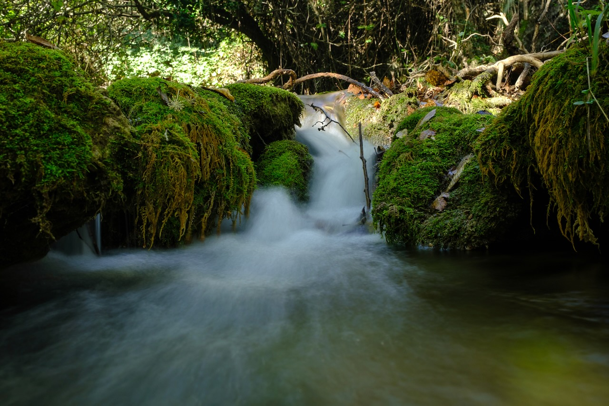

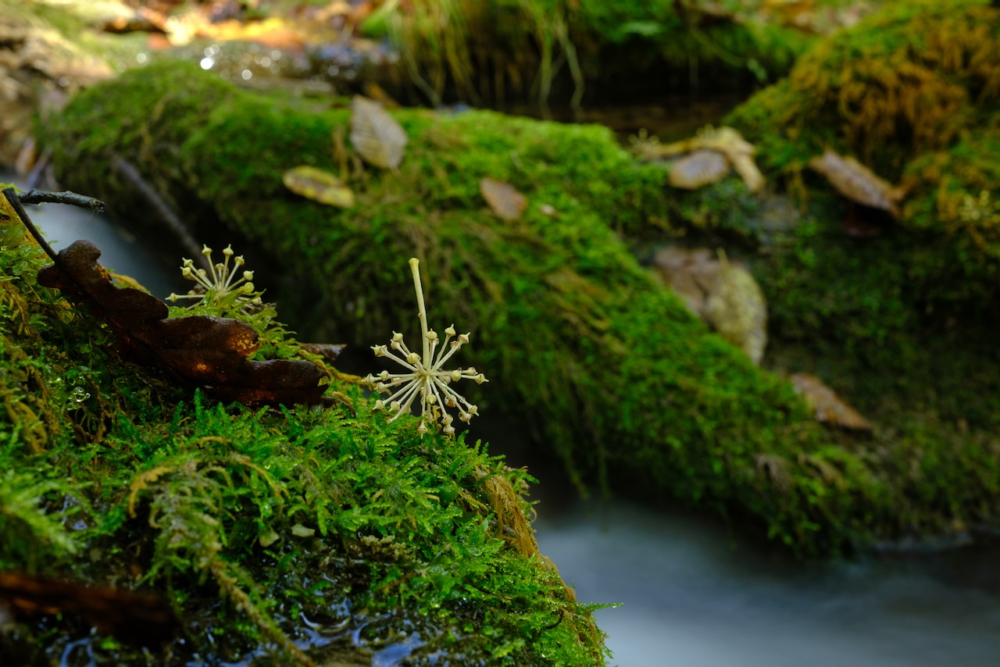

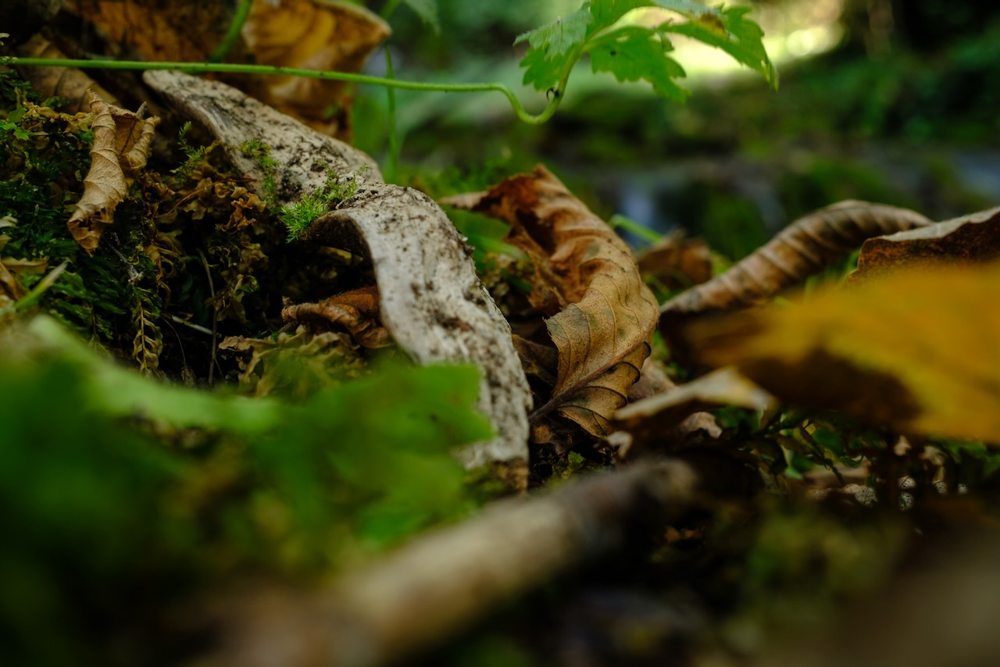

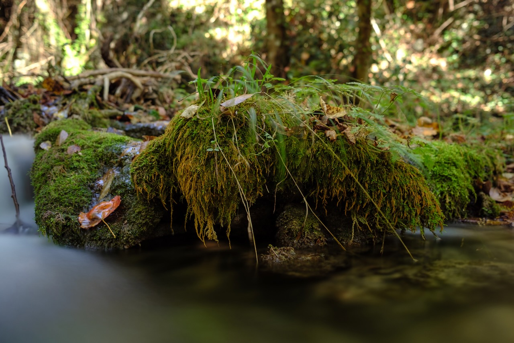

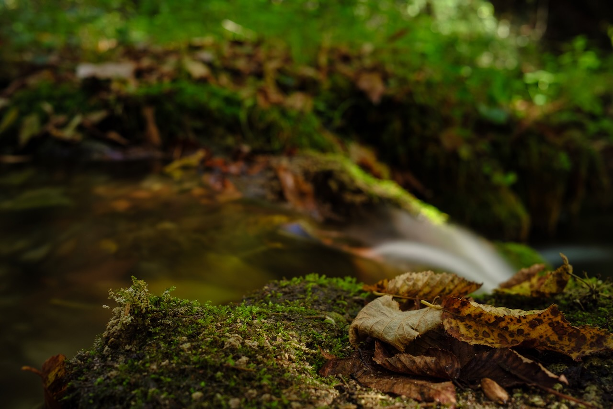

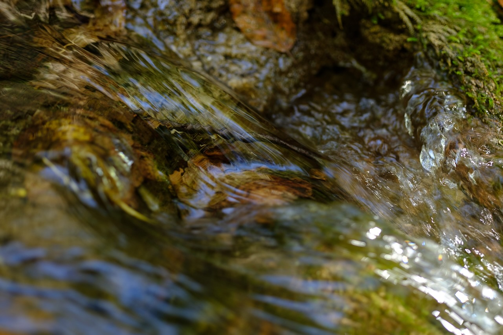

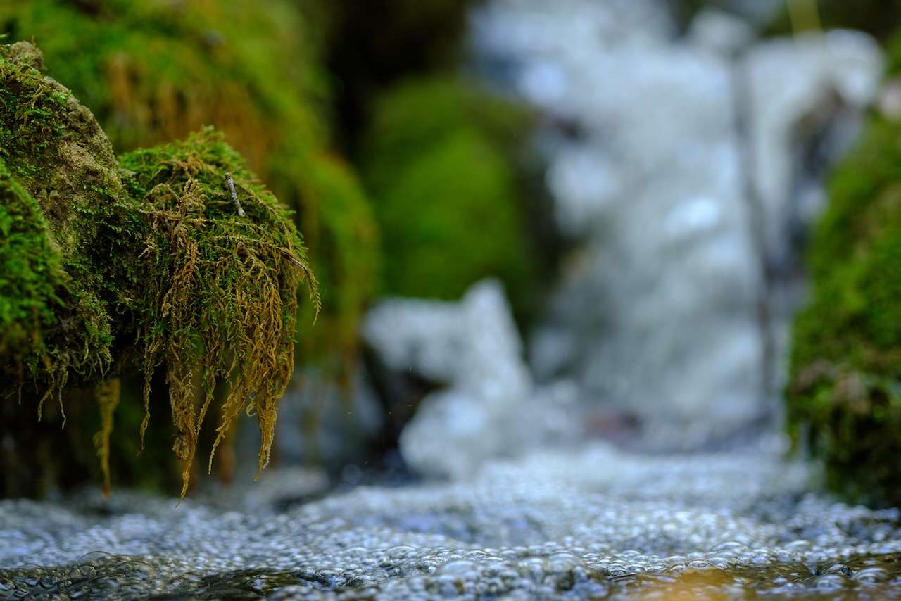

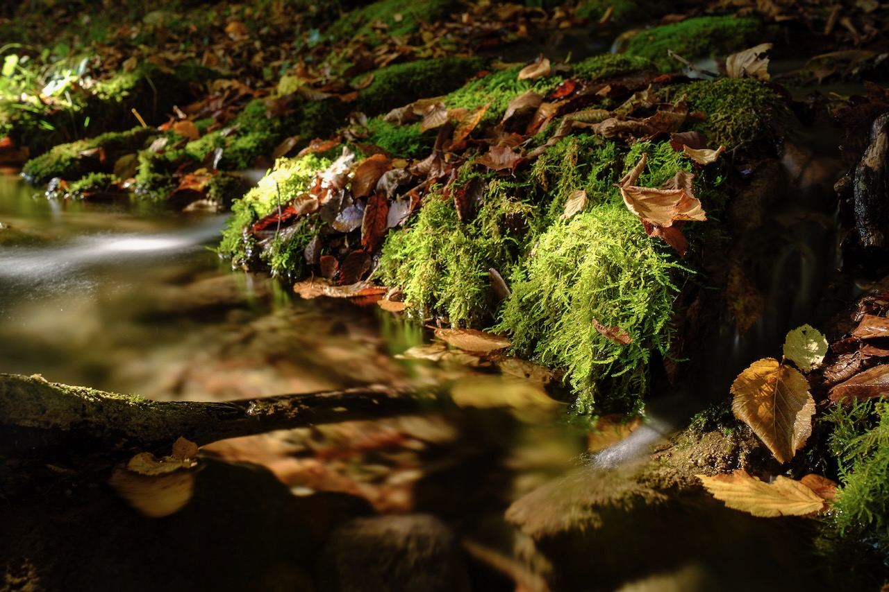

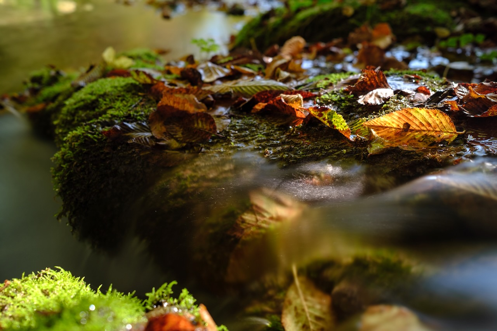

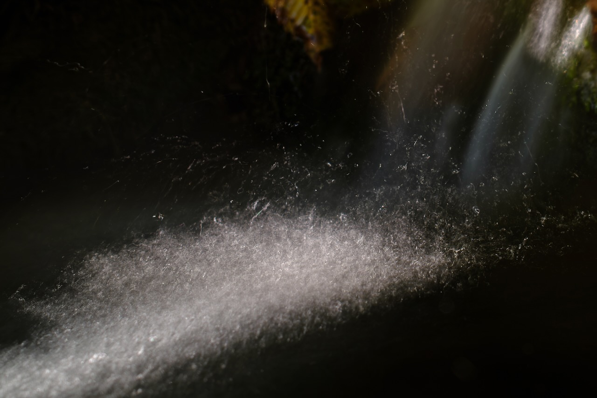

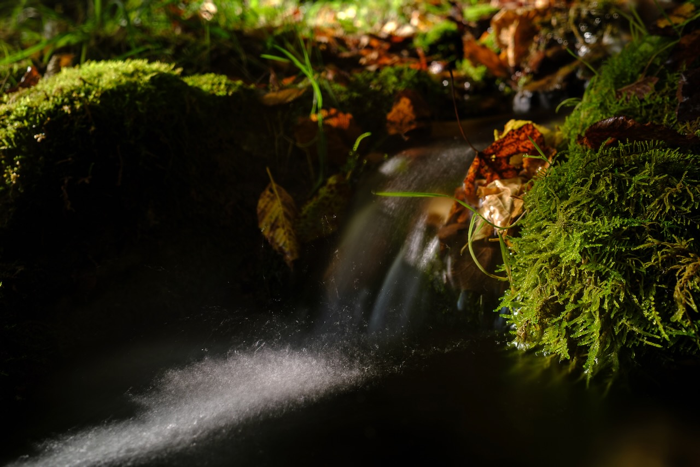

