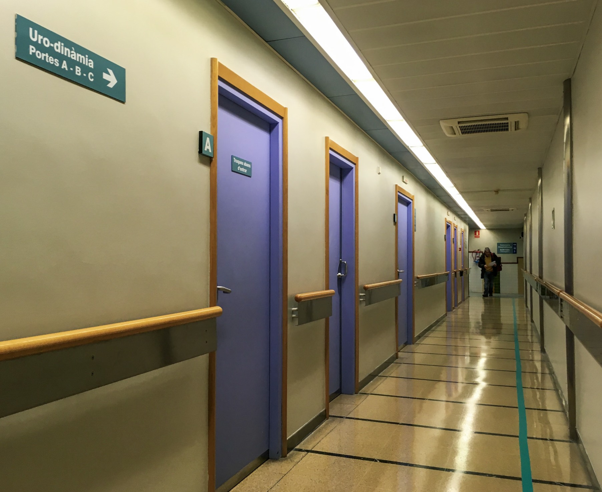

# El viatge en clau mística

El viatge més llarg està davant del mirall.

## Quan va començar aquest viatge?

En començar la recopilació de fotografies i informació per a aquesta web, em vaig fer la pregunta: Quan va començar aquest viatge?

El dia que vaig rebre la invitació, o potser quan aquella frase —a vegades ens quiten el terra de sota els peus per descobrir que ja sabíem volar— va tornar una i una altra vegada a la meva ment? O va ser durant la sessió de [Juan Manuel Giordano](https://www.juanmanuelgiordano.com/), quan vaig dirigir la meva intenció a trobar _claridat, força, coratge, amor i ecuanimitat_? Va ser el 7 de febrer quan, en una sessió de biodinàmica, vaig posar com a intenció "obrir-me a l'amor"? Quan vaig escriure _[solo camina](https://susurros.fransimo.info/posts/2023/10/nueva_ribadesella/)_ després de fer 400 km del Camí de Santiago? O va ser un any i mig abans, quan vaig decidir formar-me en masatge tàntic? Un procés que em portaria a sentir, primer "ja no sé qui sóc", i poc després "ja no sé res". O el 10 de gener de 2017, aquell dia que tremolava de febre en un hospital, fent tràmits i que no podia deixar de tornar a els meus 15 anys?

Aquell dia, el meu cos gritava "vull viure", la febre era la vida obrint-se camí. Algú em va dir alguna cosa com: certs paisatges et transporten en el temps i en els teus traumes. Aquell dia la meva vida va començar a canviar.

I per què tant de preguntes? Perquè d'això està fet el camí. De vegades la gent em diu coses com "ets valent"... la veritat és que no sé què és això. Un mestre em va dir una vegada: 'ja no tens opció; si no segueixes la crida, et malaltaràs'. I potser tenia raó. He passat anys intentant afinar la meva intuïció, d'escoltar millor aquests susurres. Ara que ho conec, no em queda més remed i seguir-los, encara que no els entengui.

## Com viatjar?

I com emprendre un viatge així? _Amb la maleta més petita_, deixant... deixant enrere tot el que no t'acompanya. Aquesta vegada això implicava deixar un treball estable, una casa i una relació. Escoltant el silenci, reconeixent els guies.

## A on vas?

Tots hem escoltat: 'Camí no hi ha camí, es fa camí en caminar'. No obstant això, crec que sí hi ha un destí, un lloc a què anar. Un per a cada un de nosaltres en cada moment perquè quan arribes apareix un altre. La nostra llibertat és la d'escollir com arribar allà, és a dir, no hi ha camí, però sí destí. Un que es transforma amb el temps.

Pots donar moltes voltes per arribar, pots fins i tot decidir no anar, però això té un cost. No anar implica que et perds el misteri que desvelaria aquell lloc.

El lloc pot ser físic o no. El viatge no implica un desplaçament, però sí té una conseqüència.  
Al tornar, si tornes, ja no ets el mateix. Vols o no, anar a aquell lloc que desitges o del que et escondes et transforma, i viatjar allà tendeix a ser inevitable. "Resistir és fútil" ;-)

De petit solia dir "el millor de viatjar és tornar". Però, si viatges, mai tornes, ni ets el mateix, ni veus el teu lloc igual. De noi no ho hagués sabut explicar, però ho entenia. Viatjar exercita el "veure amb nous ulls".

La meva recerca és la recerca de Déu. No el Déu de l'església. Per a mi, Déu està dins de mi, en tu i en tot, perquè som un, sempre, i tot el demés és il·lusió. És una veritat que està dins de mi des que tinc memòria, però encara no és una vivència. Alguna cosa com saber, sense cap dubte, que les claus estan a l'habitació i no les trobes.

És una recerca que torna a casa. Perquè al final, el viatge més llarg sempre està davant del mirall.

