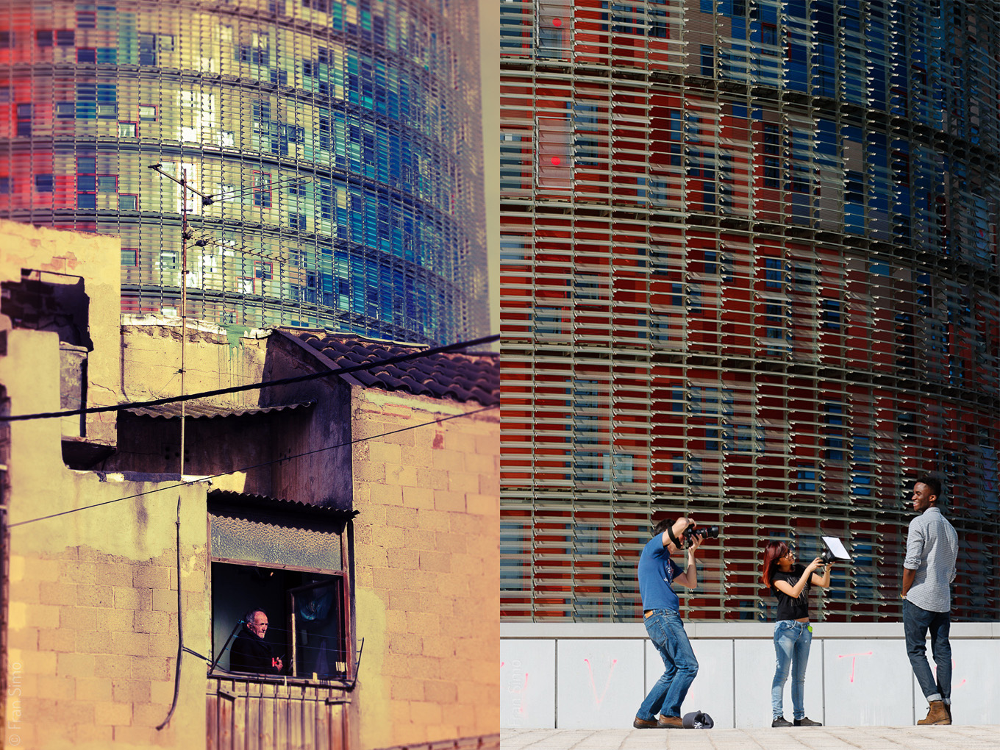

# 22.2
{}
```
2000-2014 Fanzine, edizione di 100 fanzine firmati di 24 pagine di 19×13,4 cm stampati su carta opaca rivestita di 170 g/m².
```
{}

[22.2](/blog/2015/04/23/22-2/) è la seconda versione di [22](/blog/2010/01/14/22/). Confronta le fotografie originali, scattate tra il 2000 e il 2009, con nuove immagini di giugno 2014.

[22](/blog/2010/01/14/22/) e [22.2](/blog/2015/04/23/22-2/) rappresentano la trasformazione di Poblenou dall'oblio post-industriale verso la “nuova” Barcellona.



