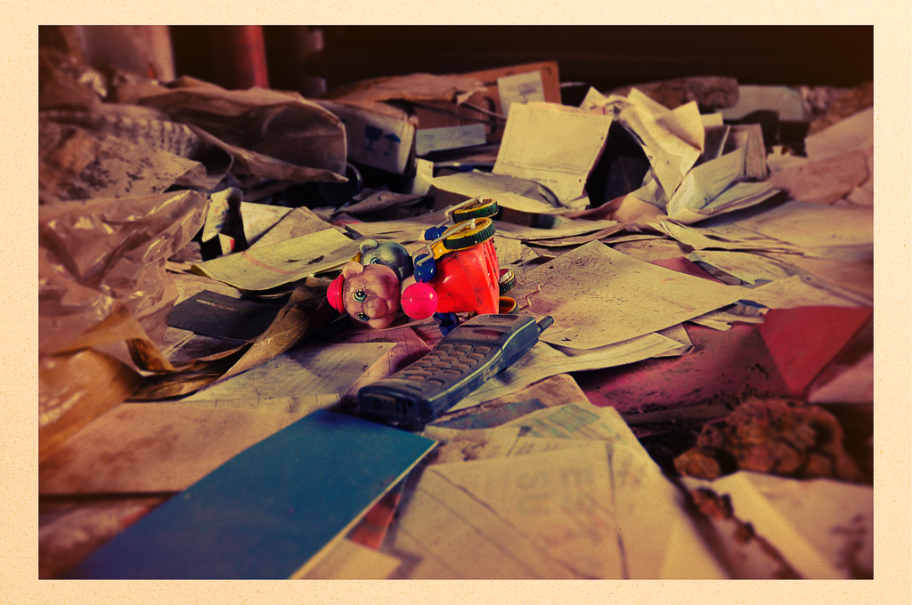
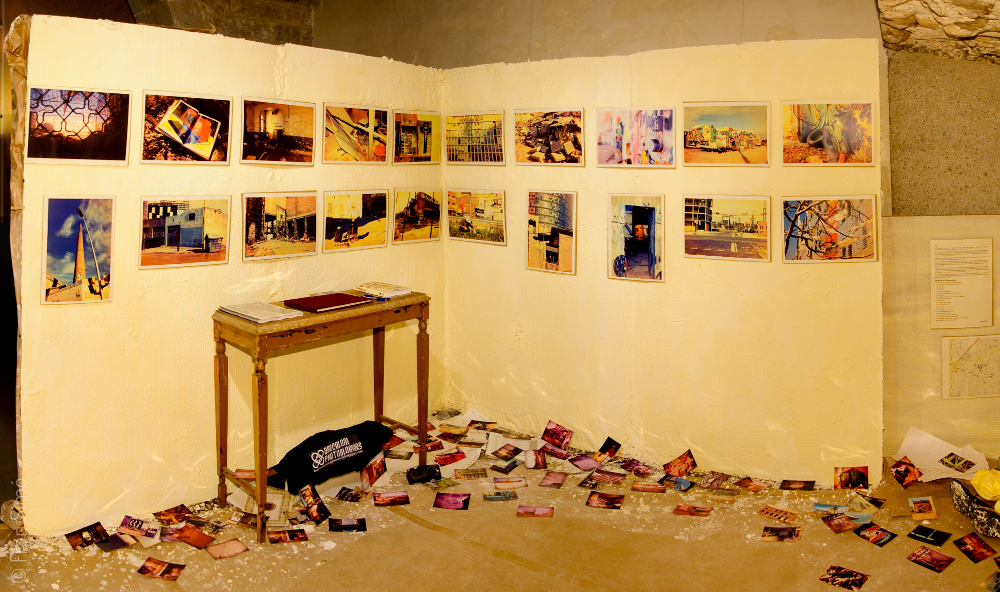
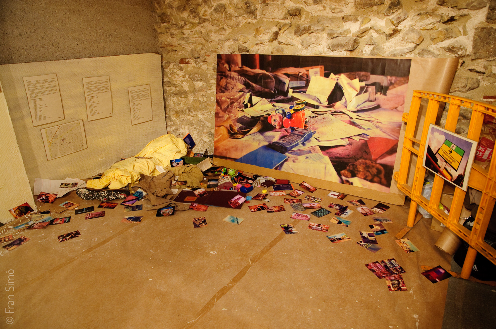
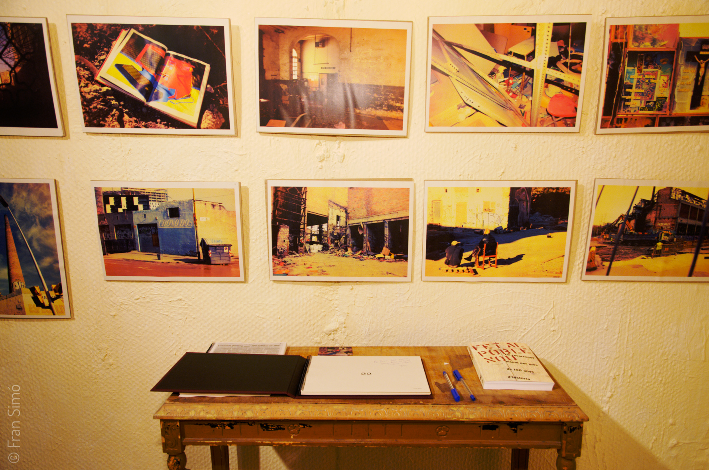

# 22 
{}
2000-2009
Llibre
Autoedició, 21×29 cm, 26 pàgines, impressió laser color sobre paper reciclat, encuadernació manual.
Edició de 10 exemplars + 1 prova d'artista

Instal·lació site-specific Centre Civi Pati Llimona.
Construcció d'espai 6x3m, objectes diversos i fotografies.
22 fotografies (21 en A4 i una còpia de 150×100 cm), impressió láser color sobre paper reciclat, enmarcades en cartró.
200 fotografies 10x15cm impressió en paper fotogràfic sense enmarcar. Còpies úniques.

Disponible com ebook en [English](http://www.lulu.com/shop/fran-sim%C3%B3/22/ebook/product-20663836.html) i [Español](http://www.lulu.com/shop/fran-sim%C3%B3/22/ebook/product-18680983.html).

{}

Les fotografies de 22 són fragments del remanso entre dues èpoques, entre dos models de desenvolupament, el primer industrial i el segon del coneixement.

Poblenou va patir la crisi de la indústria i es va quedar en un letar. En aquest tentempié va ser conquerit per altres habitants: immigrants sense llar, okupants, ruïnes, demolidors, gitanes, joguines abandonades, llibres de comptabilitat deixats enrere… …i la resistència, els que sempre havien viscut allà i que no han volgut marxar.

Aquesta selecció de 22 fotos part de l'arxiu d'uns 2000 imatges preses des de l'any 2000 fins al dia d'avui. És més emocional que estrictament documental.

Quan em vaig enfrontar al projecte sabia que volia donar-li una imatge i una presentació d'abandon, despojo i radicalment no-digital. A la vegada, m'agradava la idea d'explotar la capacitat de mentir del suport digital (base de la societat del coneixement) per convertir-lo en alguna cosa amb look analògic.

Vaig volar reproduir el que podrien haver estat fotografies fetes amb una càmera trobada entre les ruïnes de les fàbriques, alguna càmera barata que algú oblidés al deixar enrere la planta. Aquesta càmera tindria lents de plàstic i amb els anys se li filtraria llum per alguna part… a més, si portava carreta estaria caducada.

{}
 
<--->

{}



# Fotografies



  
  
  
  
  
  
  
  
  
  
  
  
  
  
  
  
  
  
  
  
  
  


