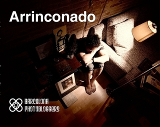

# Arrinconado (Angolato)

Il progetto “Arrinconado” (Angolato) segna l’inizio di una nuova era per Barcelona Photobloggers. L’obiettivo era creare un progetto collaborativo con un’organizzazione orizzontale in cui tutti i membri avessero l’opportunità di partecipare a ogni aspetto della creazione, dalla definizione alla produzione, e che portasse a un lavoro autoriale del gruppo e non a una raccolta di vari autori nello stesso spazio.

Il percorso intrapreso durante l’anno e mezzo di lavoro ha presentato una sfida, la parte più importante della quale è stato il processo creativo stesso, così come l’esperienza riflessiva e lo scambio di idee e metodologie.

Basato sulla novella di Santiago Ambao, scelta per la sua qualità, la sua relazione con la città e il forte legame degli autori con il gruppo, “Angolato” è una fotonovela con tre protagonisti principali: Ismael, Nuria e la città di Barcellona.

È disponibile in [versione stampata](http://www.lulu.com/shop/barcelona-photobloggers/arrinconado/paperback/product-15571787.html), [versione ebook](http://www.lulu.com/shop/barcelona-photobloggers/arrinconado-ebook-edition/ebook/product-18560631.html) e versione video in [Inglese](https://vimeo.com/31446721) e [Spagnolo](https://vimeo.com/22812002).

