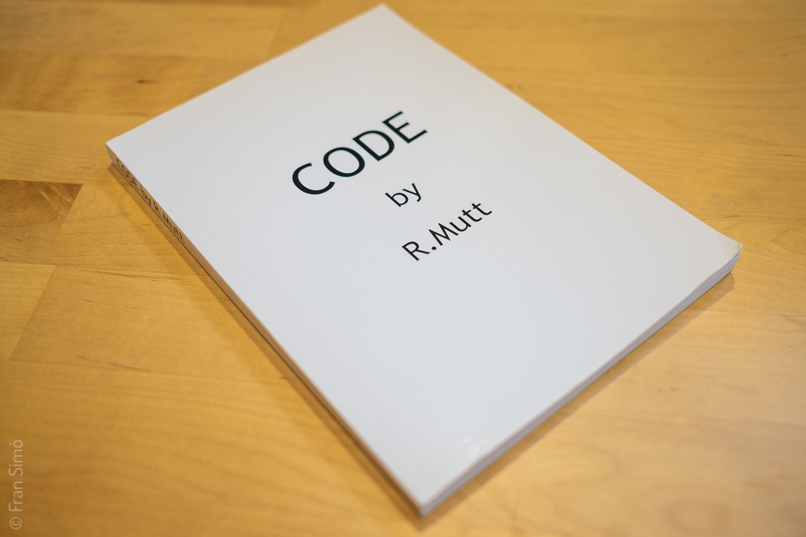
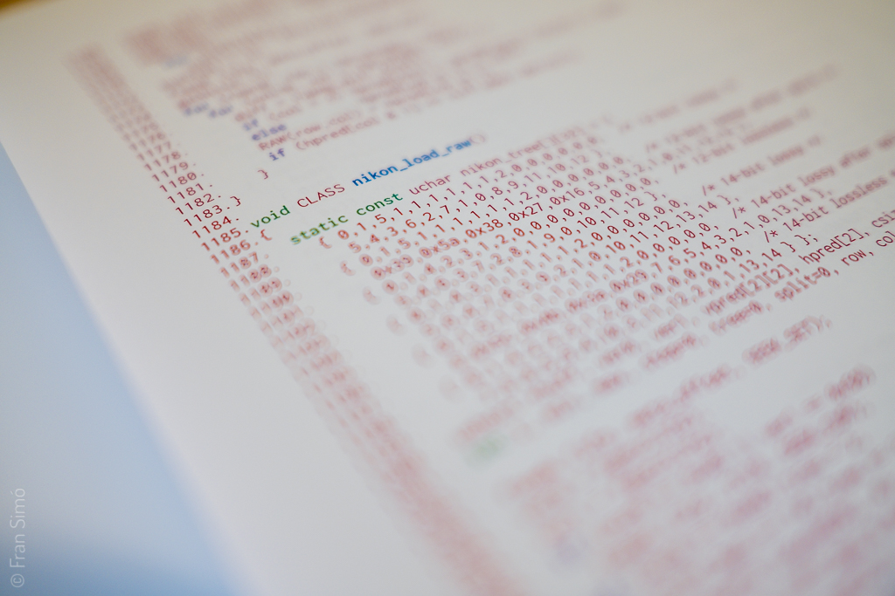

---
categories:
- art de nous mitjans
- llibres, zines i etc
date: 2019-05-29
images:
  - X1V16641_v2.jpg
tags:
- escriptura no creativa
- codi obert
- ready made
- programari
title: "CODE by R.Mutt"
description: "Presenta CODE per R. Mutt, un llibre d’artista que transforma el codi font de dcraw en pàgines colorejades, evocant els ready‑mades de Duchamp i fomentant la reflexió sobre l’autoritat i la cultura del codi obert."
schemaType: Book
author:
  "@type": Person
  name: "Fran Simó"
publisher:
  "@type": Person
  name: "Fran Simó"
isbn: "978-0-2444-8196-4"
bookEdition: "Primera"
numberOfPages: 164
datePublished: "2019-05-02"
price: "44.60"
priceCurrency: "EUR"
availability: "https://schema.org/InStock"
buyURL: "https://www.lulu.com/shop/fran-sim%C3%B3/code-by-rmutt/paperback/product-1wk5j69d.html?page=1&pageSize=4"
readURL: "/Code/CODE_by_Mutt.pdf"
---

# CODE by R.Mutt
{}

2019

Llibre color.
164 pàgines, A5.

Disponible en [Lulu](https://www.lulu.com/en/shop/fran-sim%C3%B3/code-by-rmutt/paperback/product-1wk5j69d.html?page=1&pageSize=4) i [Issue](https://issuu.com/fransimo/docs/code_by_mutt).

{}

(text per [Carlos Lozano](https://twitter.com/clozano80))

“Les ordinadors estan generant una situació que és com la invenció de l’harmonia. Les subrutines són com acords. Ningú pensaria en mantenir un acord per a si mateix. El donaríeu a qualsevol que ho vulgui. Li agrairíeu que el canviés. Les subrutines són alterades per un únic cop. Estem obtenint música feta per l’home mateix: no només un home”. John Cage, 1969.

Ja a finals dels seixanta l’artista multidisciplinari John Cage aludava a l’ús col·laboratiu que s’huria d’assignar a les creacions digitals, les creacions com bé comú, tot i que no fou fins als principis dels novant quan es va acuñar aquesta pràctica amb el terme Open Source.

Code by R. Mutt és una obra readymade que deriva de l’aplicació de codi obert dcraw(1). Aquesta proposta es desenvolupa basant-se en la filosofia Unix emprada actualment per al tractament d’imatges RAW. Per la generalitat, els fabricants de càmeres digitals ofusquen deliberadament el codi utilitzat per capturar instantànies i és gràcies a l’ús de les llicències del tipus Creative Commons que avui en dia podem fer ús d’aquest tipus de mitjans. Per naturalesa, determinats recursos són públics i no haurien de ser propietat d’individus privats ni de l’Estat, n’acaba el conflicte sobre la propietat privada i pública. En aquest àmbit, sempre s’han entès els processos de creació artística com processos individuals, tot i que de forma subtil sempre subyau un procés col·laboratiu. Podem concretar que l’activitat intel·lectual té els seus orígens en influències previs que poden semblar-nos obviants en molts casos, i no tan clars en altres. El món digital actual no disposa de barreres tan clares com en la tradició artística del món analògic, vivim en una època on s’ha establert el copy paste com una nova forma creativa per concebre, idear i construir. L’art digital és la matèria prima adequada per a la col·laboració, amb capacitat de produir multitud de productes híbrids. Productes que són el resultat del treball de molts i que contribueixen amb materials, eines, idees o simplement crítiques.

Gràcies a les llicències de Code by R. Mutt, l’artista borra les barreres amb l’observador. Amb la mateixa autoritat que l’artista va tenir sobre la realització de l’obra, es dóna al visitant o observador la possibilitat de crear el seu propi nou original. Els visitants per tant no només veuen una obra, sinó que a més poden formar part del procés de creació com a coautors. El concepte de l’obra modifica les regles d’intervenció, evocant així una sèrie de qüestions relacionades amb l’autoritat, la reivindicació i la intertextualitat, la propietat intel·lectual i el domini públic, la llicència poètica i la producció artística col·lectiva.

Es podria parlar d’una poètica de codi obert o d’una poètica cimentada en el bé comú, basada en un model descentralitzat i no propietari de codi cultural compartit i de xarxes de difusió i autoritat col·laborativa. S’utilitza, per tant, una apropiació en sentit literari, com a gest comunitari que registra un domini comú de conceptes compartits. Llançant així el codi de la seva posició fixa i estàtica, i permetent-li canviar en un mitjà de xarxes autorals, intertextuals i comunitàries. El llibre presentat és una recontextualització dins de l’entorn de les poètiques de l’Open Source. S’intensifica per tant la possibilitat de canvi de les circumstàncies que el rodegen o condicionen, propiciant el desenvolupament d’altres visions o idees, independentment de les accions de l’autor original. Un codi completament obert permet modificacions estructurals i conceptuals de l’obra, el terme redefinit de l’original no només es dirigeix cap a la singularitat, sinó que també invoca i provoca multiplicacions i en el seu propi ús.

El readymade està fonamentat en els principis de l’escriptura no creativa. Tot i que l’escriptura creativa demanda originalitat, inspiració i expressió de la subjectivitat, l’escriptura no creativa es basa en la còpia, el mètode i l’eliminació de l’autor. Una forma vàlida de crear literatura consisteix a intentar suprimir l’expressivitat i utilitzar les tècniques de la reproducció i el plagi, aprofitant la hiperabundància de llenguatge que genera el món contemporani. La paradoxa que justifica aquest acció és que la supressió de l’expressivitat és impossible. Es demostra per tant que la recontextualització dels escrits és una forma poderosa de generar nous significats i interpretacions. (2)

L’obra entrarà dins de la classificació de Software Art ja que resulta d’una pràctica creativa formal i autònoma que pot referir-se de forma crítica al significat tecnològic, cultural o social del programari. Gràcies al seu propi mitjà, es permet una reflexió crítica sobre el programari i el seu impacte cultural. A diferència del codi habitual, aquest codi no té com a fi generar obres autònomes, ja que en si mateix aquest codi és l’obra d’art. També cal destacar la força performativa del mateix codi, el qual no es troba encarregat únicament en la seva part purament tècnica. En plasmar el codi en un llibre físic, aquest es produeix fora d’un entorn tècnic tancat, és a dir, es produeix dins del camp de l’estètic, el polític i el social. El codi com a acte de rebel·lió i de parla efectiva, no és una descripció o una representació de alguna cosa, sinó que afecta directa i literalment a la mateixa convertint-se en acció. Aquesta performativitat codificada té conseqüències immediates en els espais reals i virtuals en els que ens movem i vivim actualment. Això significa, en última instància, que aquesta performativitat mobilitza o inmobilitza els seus usuaris. (3)

“El codi pot ser diari, poètic, fosc, irònic o molestar, inèrt o impossible, pot simular i disfressar-se, té retòrica i estil, pot ser una actitud”. Florian Cramer i Ulrike Gabriel.

## Referències

(1) Dave Coffin, (1997). Aplicació dcraw. [https://es.wikipedia.org/wiki/Dcraw](https://es.wikipedia.org/wiki/Dcraw)

(2) Goldsmith, K. (2015). Escriptura no creativa. Gestionant el llenguatge en l’era digital. Buenos Aires: Caixa Negra

(3) Inke Arns. El codi com a acte de parla performativa (2005). [https://artnodes.uoc.edu/articles/10.7238/](https://artnodes.uoc.edu/articles/10.7238/)

## Motivació

CODE és una peça derivada [dcraw.c, el convertidor de fotos RAW de Dave Coffin’s](https://www.dechifro.org/dcraw/).

Sempre m’ha fascinat aquest programa, responsable de la conversió de totes les fotos RAW en el món open source. Com a desenvolupador de programari la seva simplicitat em semblava molt atractiva. Un sol fitxer el tenia tot. És la bellesa expressada en codi. Per a mi ja era art però [vull convertir-lo en un objecte](https://www.lulu.com/en/shop/fran-sim%C3%B3/code-by-rmutt/paperback/product-1wk5j69d.html?page=1&pageSize=4).

CODE va ser part del festival [function(“innocence”, 2019)](https://fransimo.info/blog/2019/05/26/functioninnocence-2019/). La peça [és codi obert](https://github.com/r-mutt-1917/CODE). La motivació va ser també qüestionar l’actitud de la majoria d’artistes que treballen en art digital, que utilitzen codi obert però que no obren les seves obres a la comunitat.

Pots veure-ho [en issue](https://issuu.com/fransimo/docs/code_by_mutt).



