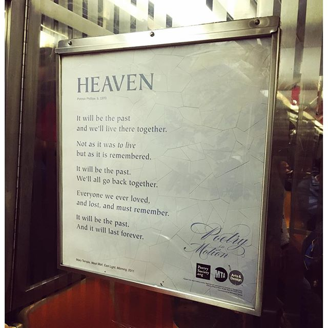

{}

<--->
````
2010-2017
Art book.
23 x 16 x 1 cm.
31 Instax Square pictures.
````
{}

# Heaven

In 2010 I noticed that a group of friends from [Barcelona Photobloggers](https://barcelonaphotobloggers.org/) were taking very good photos of commuters. I couldn’t resist the idea of creating a collaborative project using Instagram API (very open those days). [Passengers](http://passengers-streetphotography.com/en/) became a worldwide collaborative project that resulted in [three books](https://www.lulu.com/spotlight/bcnph).

I was always thinking about creating my own book. “Heaven” is a dummy that captures how I would like to create it. The photographs were printed using a Fuji SQ10 to translate the instant feeling of the original Instagram and the Passengers project onto a real copy.

During all these years, I captured different emotions, spaces, moments. I started working on the project combining that as metro lines.

The title was inspired by a poem I found on the NYC Metro, [_Heaven_ by Patrick Phillips](https://poetrysociety.org/poetry-in-motion/heaven), which I linked with the classic photo book about commuters “[Many Are Called” by Walker Evans](https://www.amazon.com/Many-Are-Called-Walker-Evans/dp/0300106173).

 
    
 
    
 
    

In November “Heaven” was announced the finalist in the DOCfield Barcelona, a documentary photography festival. Dummy Award!


## Book images



