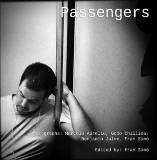

# Passeggeri

Passeggeri è un progetto di fotografia di strada, sia in formato web che in serie di libri, che riguarda i passeggeri anonimi dei mezzi pubblici. È progettato come un progetto online partecipativo. Tutte le immagini sono catturate da dispositivi mobili e pubblicate su Instagram. Il sito è una “vista in tempo reale” del processo di partecipazione. Il libro è una meditazione visiva sui passeggeri dei mezzi pubblici e sull’estetica della fotografia di strada con dispositivi mobili.

[Dall'Kodak Brownie all'iPhone](From_the_Kodak_Brownie_to_the_iPhone) è un testo che ho scritto per il libro.

È disponibile in formato cartaceo e vari formati ebook:

<ul>
<li>Download gratuito PDF: <a href="http://passengers-streetphotography.com/wp-content/uploads/2011/12/Passengers_v4_1_4_full_en_PDF.pdf">9 Megas</a></li>
<li>eBook per <a href="http://passengers-streetphotography.com/wp-content/uploads/2011/12/Passengers_en.epub">Apple</a>, <a href="http://passengers-streetphotography.com/wp-content/uploads/2011/12/Passengers_en.mobi">Kindle</a>, <a href="http://books.google.es/books?id=OIzGOE3xdekC&amp;lpg=PP1&amp;pg=PP1#v=onepage&amp;q&amp;f=false">Google Play</a>, <a href="http://passengers-streetphotography.com/wp-content/uploads/2011/12/Passengers_en.epub">Nook</a>.</li>
<li><strong>Libro tascabile <a href="https://www.lulu.com/shop/benjam%C3%ADn-julve-and-godo-chillida-and-marcelo-aurelio-and-fran-sim%C3%B3/passengers/paperback/product-1zk577dv.html?q=Passengers&page=1&pageSize=4">stampato su Lulu.com</a></strong></li>
<li>Copertina rigida <a href="http://es.blurb.com/bookstore/detail/2860658">stampata su Blurb.com</a> (revisione in attesa)</li>
</ul>

