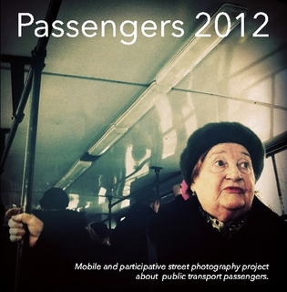

{}

<--->
# Passeggeri 2012

Passeggeri è un sito web così come una serie di libri di fotografia di strada sui passeggeri che utilizzano i trasporti pubblici.  
Il progetto è stato sviluppato come un concetto partecipativo web. Tutte le immagini sono state scattate con dispositivi mobili e pubblicate su Instagram. Il sito web offre uno sguardo in tempo reale alla partecipazione, mentre i libri sono una contemplazione visiva sui passeggeri dei trasporti pubblici, sull'estetica dei dispositivi mobili e sulla fotografia di strada.  
{}

I libri contengono brevi saggi sullo “stato dell'arte” e sul suo rapporto con la società, la storia, l'individuo e i processi creativi utilizzati in Passeggeri.

In dicembre 2011, [il primo volume di Passeggeri](http://passengers-streetphotography.com/eds/#Passengers) è stato pubblicato.  
Con solo quattro autori e quasi esclusivamente immagini di Barcellona, è stato il primo passo dell'avventura che oggi si è trasformato nel secondo volume della serie: Passeggeri 2012.

Questa edizione comprende 105 immagini di 36 autori provenienti da 25 città. Abbiamo ricevuto fotografie dal Brasile, Russia, Stati Uniti, Giappone, Francia, Spagna, Turchia, Cile, Svezia, Cina, Venezuela, Italia, Germania, Svizzera, Paesi Bassi, Ungheria, Serbia, Bulgaria, Inghilterra, Repubblica Ceca, Honduras, Hong Kong e Guatemala: 23 paesi in totale.

Il progetto riguarda la fotografia di strada nel suo senso più documentario. L'obiettivo di questa serie di libri è registrare il nostro tempo e spazio attraverso le stesse tecnologie dell'inizio di questo secolo: tecnologie che non solo si applicano al processo di cattura delle immagini ma anche a quello di editing e pubblicazione. Ciò significa che la cattura e il post-processing sono realizzati con dispositivi mobili che pubblicano sui social network, i quali sono collegati ai propri sistemi che creano un sito web in tempo reale, e poi tutto finisce in libri stampati su richiesta.

La crescente connettività e l'ubiquità dell'immagine conferiscono a questo tempo e luogo una certa forma così come una distanza caratteristica. Il nostro interesse a documentare la strada si basa sull'emozione che proviamo oggi quando vediamo immagini del 1950 scattate a New York, Barcellona o Chicago. Inoltre, Passeggeri ci offre la possibilità di rappresentare l'intero mondo in unisono attraverso gli occhi di vari autori provenienti da luoghi diversi, allo stesso tempo, in un'esperienza condivisa del quotidiano.

Gli autori di Passeggeri non viaggiano sui mezzi pubblici per scattare foto; siamo lì perché ci spostiamo proprio come chiunque altro. Il nostro nodo è il viaggio. I trasporti pubblici sono un palcoscenico di uno spettacolo in cui siamo anche attori. Come si può avvicinarsi di più a una storia se non facendo parte di essa? Quale modo migliore ci sia per documentare? Passeggeri è scritto in prima persona ma al plurale.

Leggendo i classici della fotografia di strada come *Many Are Called* di Walker Evans o *The Americans* di Robert Frank, non solo incontriamo i personaggi di quell'epoca ma li vediamo anche circondati dagli attributi di quel tempo: moda, tipografia, notizie nei giornali, automobili, pubblicità con i suoi messaggi. Vorremmo che qualcuno in futuro trovasse questi primi tablet di curiosità storica: i volti della crisi finanziaria, gli ultimi libri? Chi sa come il presente sarà interpretato in futuro. Ciò che sappiamo è che dobbiamo catturare, organizzare, confezionare e salvare questo momento in questa capsula del tempo che è un libro. Questo è lo scopo di questa serie.

Passeggeri è un progetto di Fran Simó per Barcelona Photobloggers. Questo volume è stato diretto e curato come uno sforzo di squadra da: Marcelo Aurelio, Godo Chillida, Benjamin Julve e Fran Simó. Nella sezione [“Processo partecipativo attraverso il Web”](/docs/art/books/Passengers_2012/Participative_processes_on_the_web_making_of_passengers_2012), puoi trovare ulteriori informazioni sul processo che abbiamo utilizzato in questo libro e sulle nostre esperienze.

Puoi [sfogliare il libro sullo schermo](http://issuu.com/FranSimo/docs/es_passengers_2012-e-version?e=2922899/5647894), [scaricarlo in PDF](http://passengers-streetphotography.com/wp-content/uploads/2012/book/es_Passengers_2012-e-version.pdf) o [comprarlo in formato stampato](http://www.lulu.com/shop/barcelona-photobloggers/passengers-2012-versi%C3%B3n-en-espa%C3%B1ol/paperback/product-21250175.html).

