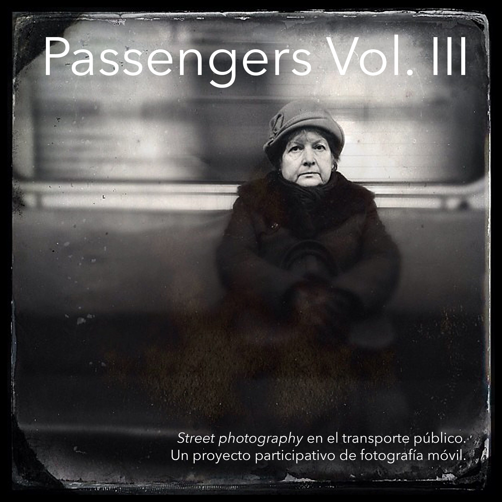

{}

<--->
# Passengers Vol. III

Passengers Vol. III termina la trilogia amb fotografies que van des del 2013 fins al 2015. En el llibre trobem 42 imatges de 12 autors. Són el resultat d'una edició de 7515 imatges de 71 fotògrafs. La selecció de la primera ronda va dur més d'un any. Els editors podien donar un vot per acceptar la imatge com a part del nou llibre. El procés va ser individual utilitzant eines en línia. Després de tot aquest treball de selecció no teníem clar que poguéssim fer un llibre més que tingués un fil comú… fins que vam veure les imatges elegides pels 4 editors en conjunt. Va ser una sorpresa veure que trobàvem una coherència dins d'aquestes set mil fotos i entre els quatre. La segona, tercera i quarta volta d'edició va ser presencial amb unes 300 fotografies impreses en paper.
{}

En la trilogia podem veure com canvien l'estètica mòbil, els dispositius apareixen en la vida diària, les càmeres veuen més, els autors canvien les seves distàncies i els editors es fan més grans en les fotos de @passengers ;-)

Passengers ha estat un projecte que ens ha portat per moltes estacions durant 9 anys. Ens ha ajudat a encurtar distàncies amb els nostres companys en molts països i esperem que serveixi per acostar la comprensió de com hem viscut el principi de segle els habitants de les ciutats.

Disponible en versió impresa a [Lulu](https://www.lulu.com/es/shop/fran-sim%C3%B3-and-benjam%C3%ADn-julve-and-godo-chillida-and-marcelo-aurelio/passengers-vol-iii/paperback/product-1y884p24.html?page=1&pageSize=4).

