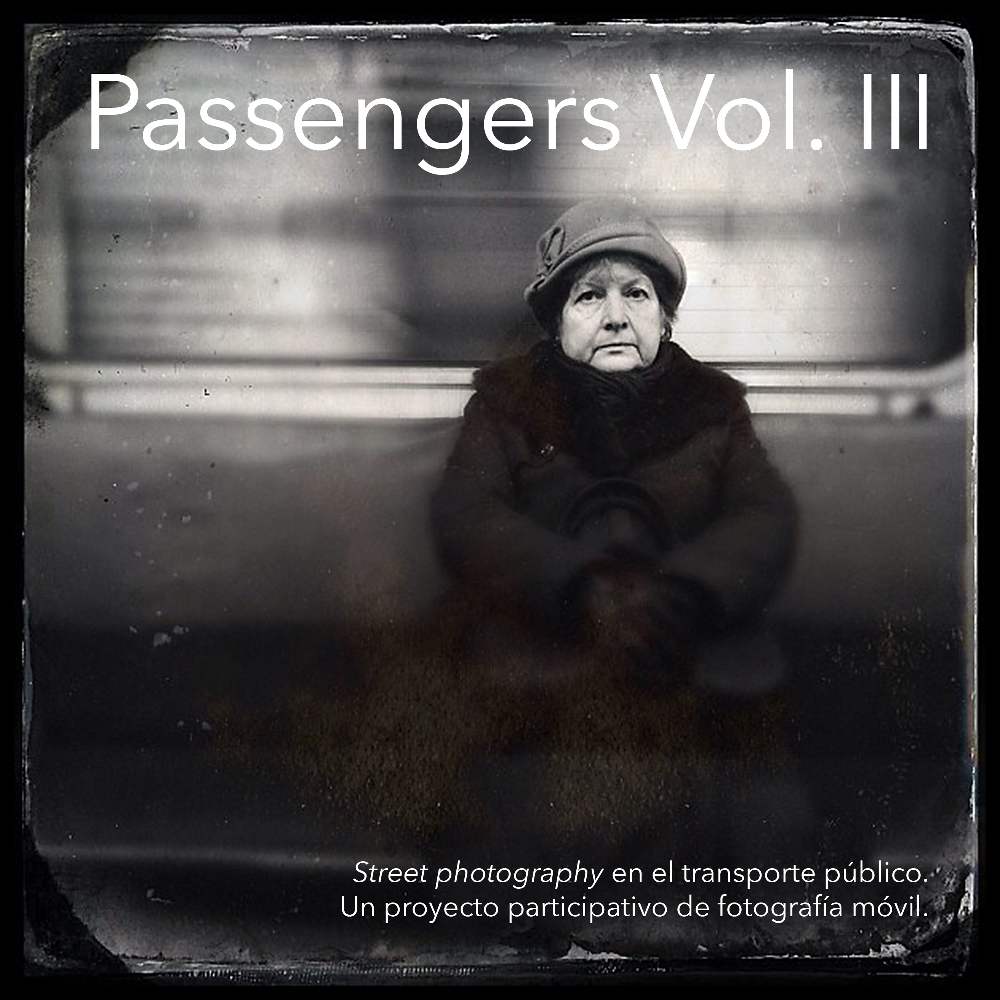

{}

<--->
# Passengers Vol. III

Passengers Vol. III termina la trilogía con fotografías que van desde el 2013 hasta el 2015. En el libro encontramos 42 imágenes de 12 autores. Son el resultado de una edición de 7515 imágenes de 71 fotógrafos. La selección de la primera ronda llevó más de un año. Los editores podían dar un voto para aceptar la imagen como parte del nuevo libro. El proceso fue individual utilizando herramientas on-line. Tras tanto trabajo de selección no teníamos claro que pudiésemos hacer un libro más que tuviera un hilo común… hasta que vimos las imágenes elegidas por los 4 editores en conjunto. Fue un sorpresa ver que encontramos una coherencia dentro de esas siete mil fotos y entre los cuatro. La segunda, tercera y cuarta vuelta de edición fue presencial con unas 300 fotografías impresas en papel.
{}

En la trilogía podemos ver cómo cambian la estética móvil, los dispositivos aparecen en la vida diaria, las cámaras ven más, los autores cambian sus distancias y los editores se hacen más mayores en las fotos de @passengers ;-)

Passengers ha sido un proyecto que nos ha llevado por muchas estaciones durante 9 años. Nos ha ayudado a acortar distancias con nuestros compañeros en muchos países y esperamos que sirva para acercar la compresión de cómo hemos vivido el principio de siglo los habitantes de las ciudades.

Disponible en versión impresa en [Lulu](https://www.lulu.com/es/shop/fran-sim%C3%B3-and-benjam%C3%ADn-julve-and-godo-chillida-and-marcelo-aurelio/passengers-vol-iii/paperback/product-1y884p24.html?page=1&pageSize=4).