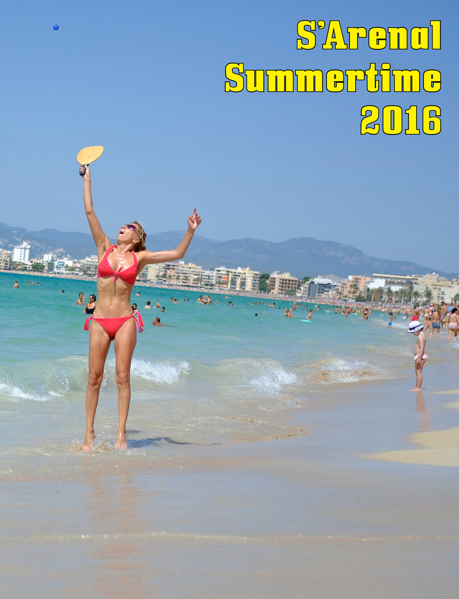

{}



<--->

````
2016-2017  
Magazine, 36 pages, 22×28 cm (Letter format)
````
-   Una edizione limitata di 50 copie, numerata e firmata per l'esposizione [“Ciutat de Vacances” (Vacation City)](http://www.esbaluard.org/es/exposicions/159/ciutat-de-vacances-stand-de-turismo-en-el-palacio-grimani-venecia). Stampata su carta 130g e 170g per la copertina, rilegata con graffette. Disponibile presso il [Es Baluard Museum Shop](http://www.esbaluard.org/) o su richiesta a [contact@fransimo.info](mailto:contact@fransimo.info)
-   Edizione on-demand. Stampata su carta opaca 118g, carta semi-gloss 216g per la copertina, rilegatura rustica. [Disponibile per l'acquisto online](http://www.blurb.com/b/7844486-s-arenal-summertime-2016).
-   Edizione digitale disponibile tramite: [Apple iBooks](http://itunes.apple.com/us/book/id1223132726), [Amazon Kindle](http://amzn.to/2o2O2JN) [(gratuito)](/SArenal/S_Arenal_Summertime_2016_v2.mobi), [Issue](https://issuu.com/fransimo/docs/s_arenal_summertime_pdf_on_line) e in [PDF](/SArenal/S_Arenal_Summertime_2016.pdf).
{}

# S'Arenal Summertime 2016

“… la cosa fondamentale che esploro costantemente è la differenza tra la mitologia di un luogo e la sua realtà.” ([Martin Parr por Martin Parr, La Fábrica, 2010](http://amzn.to/2omVlfK))

Quando Parr parlò della mitologia di un luogo, subito mi vennero in mente cartoline, cataloghi turistici e video promozionali. Ma il mito turistico va oltre la costruzione di un'icona orientata al consumatore.

Sono nato a [Villa Carlos Paz](https://es.wikipedia.org/wiki/Villa_Carlos_Paz), Argentina, una città auto-proclamata “turistica”. Nel 1998, all'età di 25 anni, sono emigrato a Barcellona, al quartiere Sagrada Familia. Nel 2014, mi sono trasferito a Palma de Maiorca. L'industria del turismo è stata una costante nella mia vita.

La mia stagionalità è legata alle stagioni turistiche, non alle colture. L'estate, il sole, la spiaggia, l'odore della protezione solare, la pelle che si stacca, l'eccessivo sole, il suono dell'acqua, le onde e i bambini che giocano sulla spiaggia non sono mai stati qualcosa che dovevo cercare in una destinazione; li ho sempre avuto a casa. Ho sempre avuto una spiaggia a meno di un chilometro dal mio luogo di residenza.

Da questa prospettiva il turismo è sempre stato: coloro che arrivano e coloro che vivono nella destinazione. Entrambi condividiamo lo stesso spazio, a volte interpretando lo stesso ruolo ludico.

Coloro che arrivano seguono il mito nel rituale delle vacanze, un elemento chiave della religione capitalistica. Che sia per fuggire, leggere, giocare, incontrare famiglia o amici, una destinazione di sole e spiaggia è il mito par excellence dell'industria.

Coloro di noi che viviamo lì si mescolano con i turisti all'interno del mito della destinazione a un certo punto. Ma la nostra illusione ha altre dimensioni. Per i residenti o coloro che sono venuti a restare, la promessa di lavoro e progresso si trasforma nella trasformazione del paesaggio, agglomerazioni, immigrazione, lavoratori occasionali, imprenditori improvvisati che arrivano nella destinazione per guadagnare un po' di soldi …

L'industria del turismo crea un mito ma non solo per il consumatore. Per quasi tutta la mia vita ho guadagnato direttamente o indirettamente grazie al turismo. Penso che il turismo sia fondamentalmente una cosa buona, amo accogliere turisti e essere un turista. Ma molti abitanti delle destinazioni non riescono a integrarsi e, anziché godersi lo scambio, soffrono dall'invasione. Questa differenza è conseguenza della mancanza di sensibilità da parte degli agenti dell'industria e tutti noi coinvolti dovremmo tenerla in considerazione per garantire la sostenibilità.



## The Process

Le fotografie per _S’Arenal Summertime 2016_ sono state scattate in 11 sessioni tra il 2 luglio e il 18 settembre 2016, tra le 11:00 e le 14:00, di solito nei fine settimana, camminando quasi senza fermarsi in una linea quasi retta, partendo dalla Via Amilcar e dirigendosi verso Can Pastilla, con il sole dietro di me.

Ciò ha formato tre tipi di immagini:

-   Di fronte, l'immagine divisa in due: la città all'orizzonte, il cielo sopra, il mare sotto formano un triangolo che suggerisce una freccia che punta verso destra, completata dal triangolo della sabbia.
-   Di sinistra, la vista tipica della sabbia, del mare e del cielo.
-   Di destra troviamo ritratti di persone che si rilassano sulla sabbia con la città e gli hotel sullo sfondo.

Le immagini sono digitali. Per lo “sviluppo” ho usato un filtro che simula il film Fuji “Velvia”, tradizionalmente usato da fotografi di natura e viaggio per cataloghi e riviste. La palette di colori “Velvia” di Fuji si basa sul concetto di “Colore memorizzato” e continua la ricerca su come una memoria è rappresentata, basandosi su domande come “Quali sono i colori che rimangono forti nella memoria delle persone?”, lasciando indietro la rappresentazione esatta a favore di evocare una memoria non come qualcosa di lontano o nel passato, ma come se “fosse qui proprio ora.”

La versione elettronica non è solo un formato di distribuzione extra. Scegliere lo schermo come mezzo d'esposizione permette alle immagini di trasmettere colore e luce. Per me, una delle principali sensazioni della spiaggia è l'intensità della luce. La carta si adatta bene al concetto di rivista di viaggio o catalogo turistico, ma lo schermo rafforza l'intensità del sole.

Il processo creativo di _S’Arenal Summertime 2016_ integra e continua il lavoro precedente. Si basa sul mio primo progetto sulle spiagge “Sant Sebastiá, Barceloneta, 2009-2013” combinato con tutti quelli relativi alla fotografia intuitiva, al drifting e alla geo-localizzazione, alla selezione automatica (senza pensare), alla pubblicazione immediata sui social network e, naturalmente, alla fotografia di strada.

Durante le passeggiate, le fotografie sono state scattate senza pensare, a volte anche senza inquadramento. La selezione preliminare è stata fatta durante il viaggio di ritorno, sui mezzi pubblici, dopo aver mostrato ogni foto per solo pochi secondi. Prima di tornare a casa, pubblicavo un gruppo di immagini sui social network. Il feedback degli spettatori (in messaggi privati o sugli stessi network) ha aiutato nel processo di comprensione del soggetto.

Successivamente, l'intero archivio è rimasto intatto per alcuni mesi, dopodiché è iniziata una nuova lettura, passando attraverso il materiale più volte. Dopo i primi tre cicli, circa il 90% delle immagini è stato scartato. Il 10% rimanente è passato attraverso varie fasi di selezione basate su raggruppamento, temi e possibilità tecniche.

Questi 10% sono stati lavorati nel formato finale e, per quanto riguarda la pubblicazione, sono stati realizzati vari prototipi di stampa utilizzando diversi fornitori di stampa, tipi di carta, ecc.

