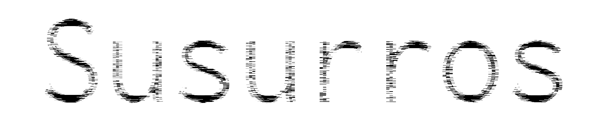

# Susurros

{}

2019

Fanzine
20 Pàgines, A5.

{}

Edició dels subtítols amb llicència open source de la pel·lícula Ghost in the Shell: Innocence.

El readymade està fonamentat en els principis de l’escriptura no creativa. Si bé l’escriptura creativa demanda originalitat, inspiració i expressió de la subjectivitat, l’escriptura no creativa es basa en la còpia, el mètode i l’eliminació de l’autor. Una forma vàlida de crear literatura consisteix a intentar suprimir l’expressivitat i utilitzar les tècniques de la reproducció i el plagi, aprofitant l’hiperabundància de llenguatge que genera el món contemporani.
La paradoxa que justifica aquest acció és que la supressió de l’expressivitat és impossible.
(Goldsmith, K. (2015))



