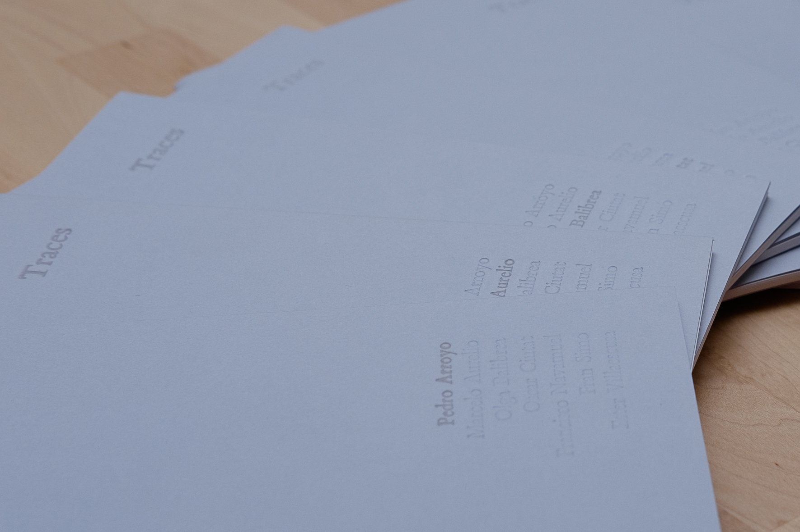
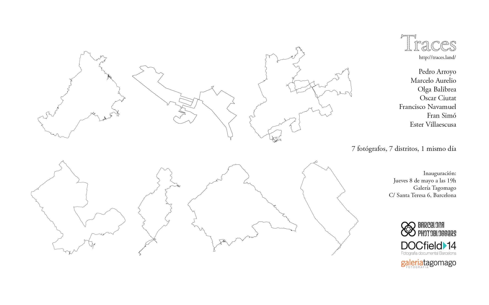

# Traces - 2013.12.07 - Barcelona

{}

2012-2014  

Progetto partecipativo transmedia: app, collezione di libri, video e mostre.

{}

[Traces](http://traces-barcelona.fransimo.info/) è un progetto collettivo che offre l'opportunità di vivere una dérive \[letteralmente: “drifting”, una tecnica di rapido passaggio attraverso varie ambientazioni\] e verificare la sua capacità di documentare lo spazio urbano da diverse prospettive, utilizzando una metodologia comune e creando una mappa psicogeografica di Barcellona.

Seguendo il concetto di una dérive proposto da Guy Debord, il 7 dicembre 2013, sette autori hanno fotografato la città, guidati dall'intuizione. Il punto di partenza per ciascun autore, così come chi sarebbe stato il suo editor, è stato scelto tramite estrazione. Lo stesso giorno la rotta è stata completata; ogni fotografo ha consegnato 100 foto affinché un altro autore potesse selezionare 21 di esse.

Il termine “trace” in inglese significa trovare o scoprire qualcosa attraverso i mezzi di indagine; scoprire l'origine di qualcosa nel tempo; seguire un percorso; copiare o disegnare una mappa e, allo stesso tempo, dimostrare l'esistenza di qualcosa nel tempo (un'impronta o un segno).

Il fatto che la cattura e la prima edizione siano basate sull'intuizione non significa che il progetto sia preso alla leggera. Il processo è parte integrante del progetto.

## Regole di una dérive

L'obiettivo di avere regole per la dérive è quello di semplificare. In questo modo, durante la dérive ci preoccupiamo solo dell'esperienza stessa.

1. **Usa una fotocamera confortevole.**  
   Essere in grado di muoversi in modo illimitato è fondamentale per permettere alla tua intuizione di guidarti liberamente.

2. **Scegli un giorno per la dérive. Questo giorno sarà dedicato completamente a essa.**  
   Non possono esserci fermate o attività premeditate in quel momento che non siano il risultato di una coincidenza. Il 7 dicembre 2013 è stato il giorno che abbiamo scelto. Per avere un punto di partenza, noi sette abbiamo diviso i quartieri della città a caso.

3. **Esci in strada, accendi il GPS e lasciati guidare dall'intuizione.**  
   Durante i primi incontri abbiamo deciso che sarebbe stato interessante fare una “foto” della città in un giorno particolare e assegnare i punti di partenza delle dérive in modo casuale.

4. **Scatta ogni volta che qualcosa attira la tua attenzione.**  
   Che sia bello, brutto, strano, noioso o divertente… qualunque cosa ti faccia fermare.

5. **Dopo aver scattato, non lasciarlo intrappolarti, passa al prossimo.**  
   Spesso tendiamo a ripetere noi stessi, ma se rimaniamo su un soggetto, una situazione o un oggetto, non saremo in grado di continuare a camminare.

6. **Continua per almeno due ore e cambia direzione per tornare.**  
   È importante che tutti si sentano sempre a proprio agio. È necessario impostare un limite di tempo perché dovrai caricare le foto, editarle e post-processarle lo stesso giorno.

7. **Scarica le foto e seleziona 100 utilizzando la tua intuizione.**  
   Usa un visualizzatore semplice e veloce per guardare ogni foto per solo due secondi. Se una cattura la tua attenzione, seguila, altrimenti passa alla foto successiva.  
   Proprio come la rotta e lo scatto sono basati sull'intuizione, l'editing segue lo stesso concetto. Inoltre, deve essere immediato per non dare nuove interpretazioni all'esperienza la possibilità di emergere.

8. **Applica il post-processing che definisce il tuo stile a queste 100 foto.**  
   A questo punto, coloro che lavorano con processi complessi devono trovare un modo per consegnare le fotografie lo stesso giorno o dedicare più tempo a tali processi durante lo stesso giorno.

9. **Invia le foto al responsabile del team.**  
   Riceve tutte le foto e le distribuisce tra tutti gli autori-editor per la selezione finale.  
   Questo insieme di regole consente anche la ripetizione tra individui diversi in luoghi e momenti diversi. La ripetibilità è una delle principali caratteristiche di un esperimento. Traces, a livello scientifico, potrebbe essere considerato semplicemente un metodo per raccogliere dati per l'analisi. Dovremmo ripetere l'esperienza molte volte per poter analizzare i risultati e formulare un'ipotesi.

## Metodo di editing

Ogni autore riceve 100 fotografie da un altro e deve selezionare 21 immagini per il libro. Gli editor sono scelti tramite estrazione. Questa edizione non ha un metodo fisso come gli altri aspetti del processo. Ogni editor può utilizzare i criteri che preferisce. L'unica condizione è farlo con dedizione e concentrazione, senza permettere alcuna distrazione. Può interagire con il fotografo per fargli domande. Non può aumentare il numero di immagini oltre 100.

L'ordine in cui le immagini appaiono nel libro è sempre sequenziale e si basa sul tempo di cattura perché narrano un percorso. Non si tratta di riscrivere una nuova storia sulle foto. L'editor deve trovare l'essenza di ciò che l'autore ha visto.

## Motivazione iniziale per il progetto

Cercare l'essenza delle città attraverso i loro abitanti mi ha portato nella direzione sbagliata. Ogni volta che mi avvicinavo al soggetto, più vicino all'umanità, ma più lontano dalla città.

Ho iniziato a sentire di omettere qualcosa di importante. È stato allora che mi sono imbattuto in _The Book of Books_ di Stephen Shore, _Psychogéographies_ di Antoine D’Agata e, attraverso di lui, in Guy Debord.

Ho deciso di tornare all'origine. Uscire senza un piano in mente con la fotocamera solo per scattare foto, senza che debbano adattarsi a una serie o avere un obiettivo. Tornare a scattare inconsciamente, a vedere senza alcun pretesto. Tornare alla [“fotografia intuitiva”](http://barcelonaphotobloggers.org/2009/01/01/fotografia-intuitiva/?referrer=Baker).

Fa parte del mio normale processo creativo fare cose che non hanno una spiegazione, che sembrano scollegate, ma che finiscono per avere senso. Arriva un momento in cui “i punti si collegano”. _Traces_ unisce Debord, Ginsberg (_First Thought, Best Thought_), D’Agata e Shore. Ho definito le 7 regole per la dérive e sono uscito in strada.

Dopo aver fatto varie dérive, ho capito che l'esperimento non poteva essere completo se partecipasse solo un autore. Non sono mai stato convinto che la figura dell'autore debba essere al centro della creazione artistica, almeno non come unico modo. Sono affascinato dalla diluizione dell'autore nel gruppo e dalla creazione di un'identità di gruppo per ottenere un risultato più oggettivo, in questo caso, più documentaristico. Questo progetto è il risultato di un processo che combina talenti così come negozia tra ego.

Non è stato difficile trovare buoni partner per perdersi a Barcellona e riunirsi per un progetto che si è trasformato ed è evoluto per diventare ciò che puoi godere ora.

[http://traces-barcelona.fransimo.info/](http://traces-barcelona.fransimo.info/)

Traces è un progetto di Fran Simó per [Barcelona Photobloggers](http://barcelonaphotobloggers.org/).



  
  
  
  
  
  


