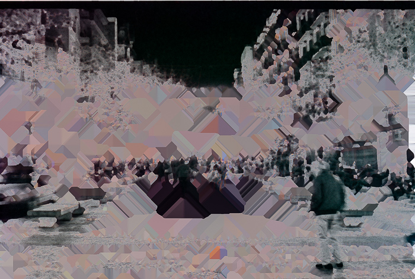

# Déu està en els «bugs»
{}
```
2021
Collecció NFT
2.501Ξ
```
{}
Déu està en els [_bugs_](https://es.wikipedia.org/wiki/Error_de_software): qualsevol evolució biològica real és la conseqüència d'un error en la còpia de l'ADN.

A diferència del que es creu comunament, l'evolució no està basada en la intenció conscient del ser que «s'adapta millor a l'entorn». Aquest animal o planta mai no va volar adaptar-se, no va tenir aquesta voluntat, l'adaptació només «ocorre». Ell/ella s'ha adaptat o té una avantatge comparativa com a conseqüència d'un error durant la seva concepció o creixement. Algunes cèl·lules cometen un error en reproduir-se i nascen amb sensibilitat a la llum. Milions d'anys després es converteixen en ulls.

L'estat actual de la xarxa ja podria considerar-se com una forma de vida, un organisme «simple». Els humans tendim a sobreestimar els que anomenem consciència, fins i tot quan solem estar molt lluny de ser conscients del nostre veritable potencial.

Una vida conscient basada en silici és inevitable. Si segueix els patrons que han fet créixer la vida basada en carboni, aquesta nasirà d'un error incontrolat en el codi.

La vida és una col·lecció d'esdeveniments «inesperats».

La sèrie «Déu està en els «bugs»» explora errors de programari o usos intencionats de la tecnologia de maneres en què no es suposa que s'hagi d'utilitzar (com el hacking o glitching) sota la suposició que alguna cosa similar però inesperada serà la causa d'un «big bang» d'una nova forma de vida si és que ja no està aquí. És la recerca d'imaginar la concepció d'una ciber-vida.

  



Aquestes imatges són el resultat d'utilitzar paràmetres equivocats en escanejar amb el programari SilverFast. (Aplicar iSDR a negatives blancs i negres). La sèrie no es limita a aquest error en particular. Seguiré investigant i creant aquesta idea.

Disponible com a NFT @ [OpenSea](https://opensea.io/collection/god-is-in-the-bugs)

