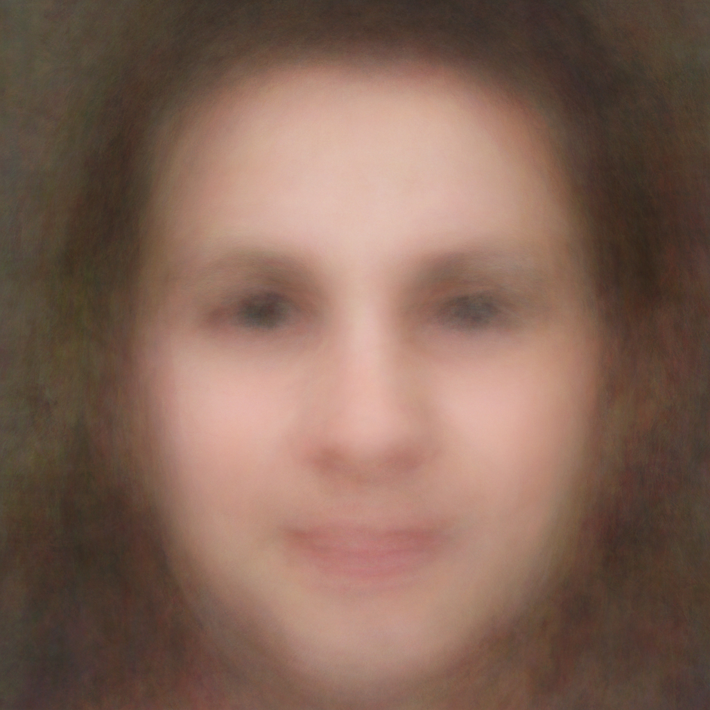
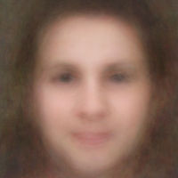
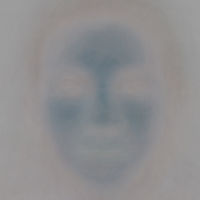
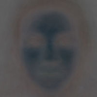
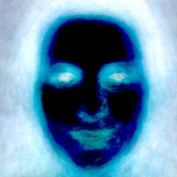
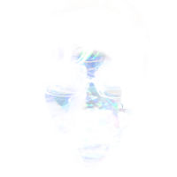
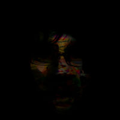

# Ho sognato un essere umano

Come immaginerebbe un robot un volto umano? “Ho sognato un essere umano” è come spiare nel cervello di un robot.

“Io ho sognato un essere umano” è parte di un progetto che esplora l'uso dell'intelligenza artificiale applicata alla fotografia utilizzando codice open source e dati online. Il progetto dispone già di un database di 56 milioni di immagini. Abbiamo strumenti e database di immagini gigantesche accessibili gratuitamente, ma non abbiamo ancora compreso appieno cosa possiamo fare con essi o cosa significhi che sono lì.

IDAAHB cerca di affrontare domande sull'identità, sulla privacy, sull'aumento del potere computazionale e sulla diffusione di algoritmi matematici incredibilmente potenti disponibili per l'uso gratuito. Tutto con un valore estetico ed educativo.

Questa prima serie di immagini è il risultato di calcoli statistici su 257 volti rilevati da un algoritmo che è stato insegnato a riconoscere ritratti di una specifica qualità estetica. La ricerca è stata condotta su 5 milioni di immagini con licenze Creative Commons pubblicate su Flickr. “Mean”, l'immagine mostrata a sinistra, è la media di queste 257 fotografie, comprendente 17 neonati, 106 uomini, 79 donne, 18 ragazze, 23 ragazzi e 14 errori.

Un altro modo di visualizzare queste immagini accumulate è vederle passare a velocità piena e sfocare leggermente la visione. È possibile vedere lo stesso “effetto medio” guardando il video seguente, che contiene 2.582 immagini che si muovono a 25 immagini al secondo: <a href="http://vimeo.com/49552899">http://vimeo.com/49552899</a>

<strong>Aggiornamento 2/14/2013</strong>: È possibile vederlo anche come “contact sheets” qui <a title="Mughe dalla nuvola" href="http://contact-sheets-idahb.fransimo.info/">http://contact-sheets-idahb.fransimo.info/</a>

<strong>Aggiornamento 8/6/2013</strong>: Il database ha 75 milioni di immagini e ha riconosciuto 345.625 volti.

<strong>Aggiornamento 1/25/2015</strong>: Il database ha 88 milioni di immagini e ha riconosciuto 1.250.415 volti.

## L'algoritmo

L'algoritmo usato per riconoscere i volti è in grado di trovare qualsiasi oggetto all'interno di una fotografia, ma per fare ciò deve essere mostrato ciò che stiamo cercando tramite immagini simili.

Quando ho iniziato questo progetto non ero interessato a trovare volti, ma ritratti con una specifica qualità estetica. Il primo passo è stato assemblare una collezione di ritratti che seguisse questa linea estetica in modo che l'algoritmo potesse iniziare a impararla.

La composizione usata per addestrare l'algoritmo era una serie di volti visti direttamente di fronte con illuminazione uniforme, occhi sotto i punti di intersezione superiori della regola dei terzi e la bocca nel terzo inferiore centrale. Questi ritratti erano simili a quelli delle foto d'identità o delle foto di arresto. L'obiettivo era insegnare all'algoritmo come individuare ritratti all'interno delle fotografie.

In altre parole, l'algoritmo riformula una fotografia per convertirla in un ritratto di tipo foto d'identità. In alcuni casi, potrebbe non esserci alcun volto nella fotografia o volti che non soddisfano la qualità estetica desiderata e quindi vengono ignorati.

Un esempio di algoritmo al lavoro è visibile di seguito in una fotografia di una persona contro uno sfondo di paesaggio. L'algoritmo riconosce il volto e lo incornicia. Possiamo vedere come gli occhi tendano a posizionarsi nelle linee centrali della regola dei terzi e la bocca nel terzo inferiore centrale.



L'apprendimento dell'algoritmo è supervisionato. Lo insegni, impara e lo valuti finché non ottieni un risultato soddisfacente. Ogni iterazione aggiunge volti e gli errori che ha commesso vengono spiegati.

Come parte della sua valutazione, avevo bisogno di vedere tutte le immagini descritte statisticamente dal loro valore medio, mediano, massimo e minimo. È così che ho scoperto “Ho sognato un essere umano”. Vedendo le immagini, ho pensato: “È così che un robot ci immaginerebbe?”

<table>
<tbody>
<tr>
<td></td>
<td></td>
<td></td>
<td></td>
<td></td>
<td></td>
</tr>
<tr align="center">
<td>Mediana</td>
<td>Deviazione standard</td>
<td>Varianza</td>
<td>Asimmetria</td>
<td>Intervallo</td>
<td>Minimo</td>
</tr>
</tbody>
</table>

Oggi diamo per scontato che le fotocamere, i telefoni, il nostro software fotografico e persino Facebook possano riconoscere volti. La maggior parte delle persone lo considera “magia”. Non solo nessuno sa come lo fanno, ma nessuno mette in discussione come lo fanno e cosa altro possono fare.

La cosa più affascinante di questo argomento per me è la domanda: Cosa altro possono imparare e cosa possiamo insegnare loro a vedere? Le tipiche applicazioni di queste tecnologie sono sempre state la sicurezza. Le applicazioni commerciali non sono molto avanzate. Per esempio, per far catalogare automaticamente un database di immagini. Algoritmi simili sono usati per l'imaging diagnostico. Ma cosa possono fare artisti o filosofi?

## Fotografia e intelligenza artificiale

“Io ho sognato un essere umano” è parte di un progetto più ampio che esplora l'uso dell'intelligenza artificiale applicata alla fotografia utilizzando codice open source e dati online.

Il progetto è iniziato nel 2008 e dispone di un database di 56 milioni di immagini con licenze Creative Commons. Nel 2011 la ricerca di immagini è terminata per iniziare a elaborare le immagini. In versioni successive, il sistema è stato in grado di aggiungere 200.000 foto al giorno al database.

Dieci anni fa, avendo accesso a queste quantità di informazioni e potendo elaborarle su un computer domestico con algoritmi di intelligenza artificiale, potrebbe essere stato considerato fantascienza.

Il fenomeno che ci ha portato qui oggi coinvolge tre dimensioni: fotocamere digitali e social network, la filosofia della condivisione open source e la capacità aumentata di computer e reti che può essere riassunta nella popolarizzazione della tecnologia digitale.

Le fotocamere digitali e i social network incoraggiano l'esistenza di un gran numero di immagini catturate e pubblicate. Queste immagini possono essere accessibili tramite interfacce di programmazione pubbliche, che ti permettono di programmare computer per accedere a queste immagini quasi illimitatamente.

I concetti di open source e della sua ideologia non appartengono più al mondo del software e si sono espansi in licenze d'uso per quasi qualsiasi tipo di contenuto. Di conseguenza, gli utenti consentono l'accesso e concedono esplicitamente il permesso di riutilizzo pubblicando queste immagini con licenze Creative Commons.

Allo stesso tempo, molte aziende e università hanno realizzato che rilasciare il codice per alcune parti della loro ricerca può aiutarle a vendere prodotti o a sviluppare progetti con input dalla comunità open source.

Di conseguenza, oggi esiste un open source di qualità specializzato in visione artificiale e intelligenza artificiale.

La tecnologia usata in questo progetto è stata sviluppata e rilasciata da Intel, Compaq e Mitsubishi.

Tutto questo può essere aggiunto alla capacità di calcolo aumentata e alla velocità di trasferimento su Internet.

Siamo tutti immersi nella tecnologia digitale come siamo stati immersi nelle automobili, anche se ci sono voluti 100 anni per vedere l'impatto sull'ambiente.

Ma l'impatto di questa tecnologia non finisce nell'atmosfera; entra nei nostri cervelli e persino altera la loro struttura.

È essenziale che proviamo almeno a capire le capacità delle tecnologie che stiamo usando.

## Domande frequenti tecniche

### Quale algoritmo è stato usato?

### Posso scaricare il cascade di Haar?

### Come è stato addestrato?

### Perché 257 su 5 milioni?

### Quali software sono stati usati?

### Come è stato realizzato il rendering statistico?

Con il terzo versione del cascade addestrato ho eseguito un test sul database.

I risultati sono stati memorizzati in MySQL.

Un programma PHP scarica immagini ad alta risoluzione da Flickr e genera file JPG con informazioni di ritaglio del rilevamento.

Tutti questi file sono stati importati in Lightroom dove le immagini possono essere viste in versione ritagliata e originale.

Un gruppo di 257 immagini è stato selezionato per risoluzione e esportato a 3000 per 3000 pixel.

La maggior parte delle immagini ha una risoluzione più grande.

Successivamente, quelle immagini sono state aperte in Photoshop come livelli e impilate in un “smart object” e renderizzate.

