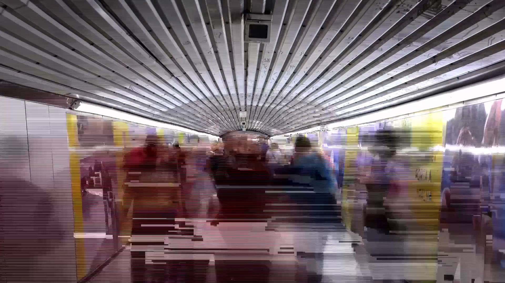



{}
- 2013-2014. Produced: 2025.
- Single-channel glitch 4k video with original loop-based stereo score by the artist; 2′09″.
- Built from a time-lapse of 6,341 long-exposure photographs shot in the Barcelona Metro.

{}

# Rivers of Souls

> We flow in our technology like water building its own caves. Absent and unconscious. Frightened, bulging and forgotten by ourselves. We forget that life, as we perceive it physically, is the sum of infinite errors in the process of evolution.
>
> Deaf to the whisper of error amid the noise of the current. We ignore the visions: beauty, madness, compassion. The whisper insists: beauty, madness, compassion. Evolutionary fear drags us down, deafens us and blinds us. We fall back into transformation for transformation's sake.
> 
> In the senseless chaos of our evolution, it seems that the only thing that can save us is the same thing that created us, an error or a fortuitous combination of errors. Perhaps [God is in the bugs](../God_is_in_the_bugs).

Rivers of Souls treats rush hour traffic as an organism that travels through the infrastructure we have created. By
collapsing time with long exposures, the images blur individuals into a single stream, revealing how technology and
architecture shape collective movement.

The use of glitches in the video and musical loops with errors pursues a sense of randomness through controlled
variations that never quite repeat themselves. In this context, error is not a failure, but the source of evolution
through which living systems adapt and cultures change.

The work proposes listening to that whisper — beauty, madness, compassion — and confronting the evolutionary fear that drives us to
transform for the sake of transforming. The medium is not important, but rather the flow that runs through it: life understood as an informational process
that self-produces and drifts. ‘Rivers of Souls’ is thus conceived as a device for observing that drift and
embracing error as a driving force and method.

## Gallery

> Translated with DeepL.com (free version)

