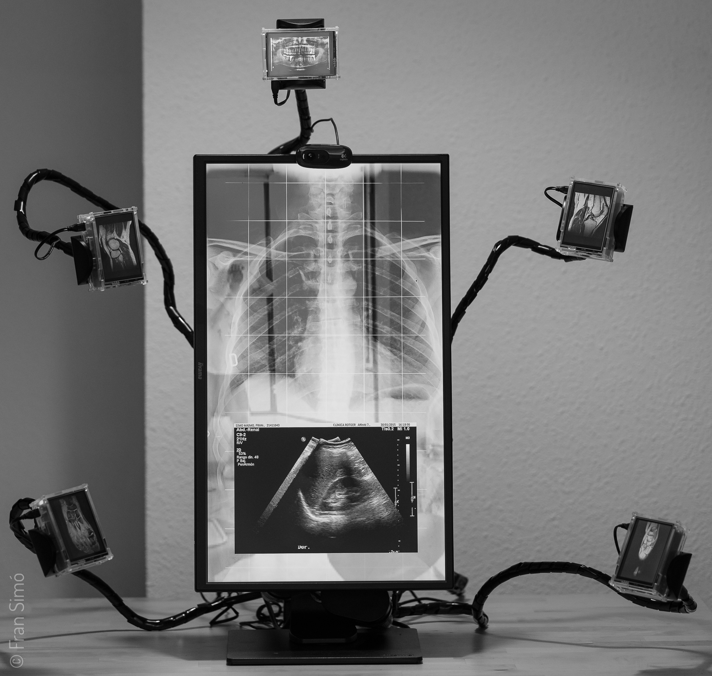

{}
- Scultura video interattiva. 1,1 m x 1,1 m x 60 cm.
- RM delle gambe e delle ginocchia. Ecografie renali. Radiografie del torace, della mascella e dei denti. Dal 2012 al 2021.
- Video in formato GIF animato. Immagini JPG.

L'opera è composta da 6 RasperriPis. Cinque di essi sono modello 3 con uno schermo da 3,5″ e un involucro trasparente. Questi schermi sono posizionati intorno al torace, emergendo da una “colonna vertebrale”. Il case trasparente permette di vedere l'interno dei mini computer. Il torace è composto da un modello 4 Pi con un monitor da 24″ e una webcam.

Source code @ [github](https://github.com/fransimo/selfie_v2).

{}

# #Selfie_v2

## Motivazione

Negli ultimi anni siamo diventati affezionati a pubblicare la nostra immagine. Un'immagine costruita di ciò che vogliamo mostrare di noi stessi, della nostra vita. In questo modo creiamo un personaggio che pubblichiamo, esibiamo o vendiamo, a volte anche in cerca di amore. Alcuni cadono nella trappola di credere che quel personaggio sia reale, che sia loro.

In questa distopia psicologica e spirituale, vedere è più difficile. Proiettiamo un personaggio nato dalle convenzioni dei social media. Convenzioni generate ed evolute a livello globale. Guidate da un'idea standardizzata di “felicità” e, spesso, indirizzate da pubblicitari e “influencer”. In che misura lo scegliamo?

Le ossa nelle immagini, pur essendo ancora mie, sono allo stesso tempo “le stesse” o difficilmente riconoscibili tra quelle di altri umani. Attraverso la pelle per rendermi indistinguibile, per fondermi con gli altri. All'interno, mi assomiglio di più a te.

Le immagini provengono da scansioni mediche reali richieste da professionisti sanitari durante una patologia o un follow-up. Con questo volevo usare il dolore fisico come riflesso del dolore spirituale che spinge la società a lanciarsi nella costruzione di un'immagine di felicità quasi obbligatoria che utilizza ogni mezzo per costruire e dirigere comportamenti tipificati e domesticati. Una tipificazione tanto selvaggia quanto quella di alcune religioni che non permettono alle donne di votare, ma molto più sottile. Non proibisce i comportamenti, ma li indirizza. In questo modo non si sogna nemmeno di fare qualcosa di diverso perché si è “scelto” da soli.

Tutta questa follia ci acceca. Ci allontana da noi stessi. Una società che riesce a costringere i suoi membri a sentire la necessità di creare, pubblicare e condividere un'immagine di sé che aderisce a qualche standard, è la società più polarizzata e stereotipata. Non è libertà.

Se volessimo ancora sapere chi siamo, dovremmo solo guardare nei nostri occhi in uno specchio e entrare nella nostra anima. Da lì potremmo ottenere quella sensazione di “all'interno mi assomiglio di più a te”.

Per seguire questa idea, l'opera riflette i visitatori in arrivo, simulando uno specchio che mescola il visitatore con le mie ossa, conformandosi alla natura duale degli specchi. Riflette la verità e mette in evidenza le bugie a seconda dell'intenzione dello sguardo. Può essere usata come allegoria, ad esempio: tu e io siamo uno; i tuoi occhi possono essere nel mio cuore; puoi guardarti negli occhi e riconoscerti; o può semplicemente essere intesa come un gadget informatico. Tutto è vero contemporaneamente. Così, ci ricordiamo che né l'immagine, né lo specchio (né la fotocamera) ci aiutano sul nostro cammino, solo la nostra intenzione può disperdere il rumore.

L'opera permette al visitatore di prendere un souvenir _#Selfie_v2_. Lo stream video può essere catturato dall'installazione e scaricato dal visitatore.

La scultura e tutti i pezzi sono disponibili come NFT su [OpenSea](https://opensea.io/collection/selfie-v2-fransimo).

## Fatti interessanti

I fatti interessanti

L'osservatore attento noterà che i video delle RM “saltano”. Le sequenze di immagini sembrano “sbagliate”. Il software di visualizzazione delle scansioni, esportando il formato video, ordinava i fotogrammi come 0, 1, 10, 11, 2, 3. Un errore informatico piuttosto comune. Quando l'ho visto, ho pensato che sarebbe stato molto interessante collegare _#Selfie_v2_ a _[God Is in the Bugs](https://fransimo.info/blog/2021/07/31/god-is-in-the-bugs/)_. 

## Gallery



 
  
  
  
  
  
  
  
  


## Video



