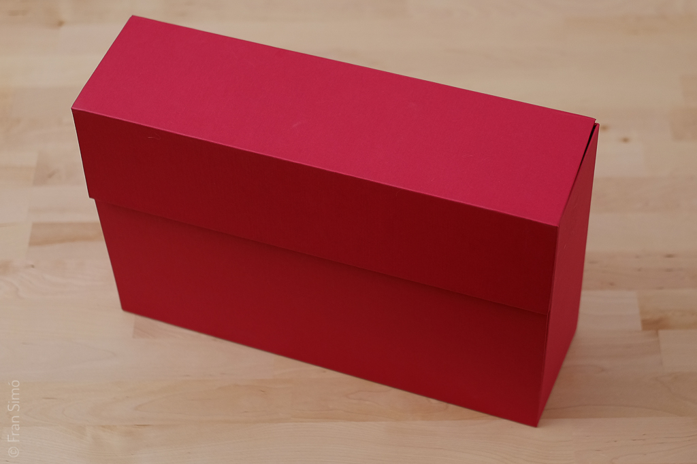
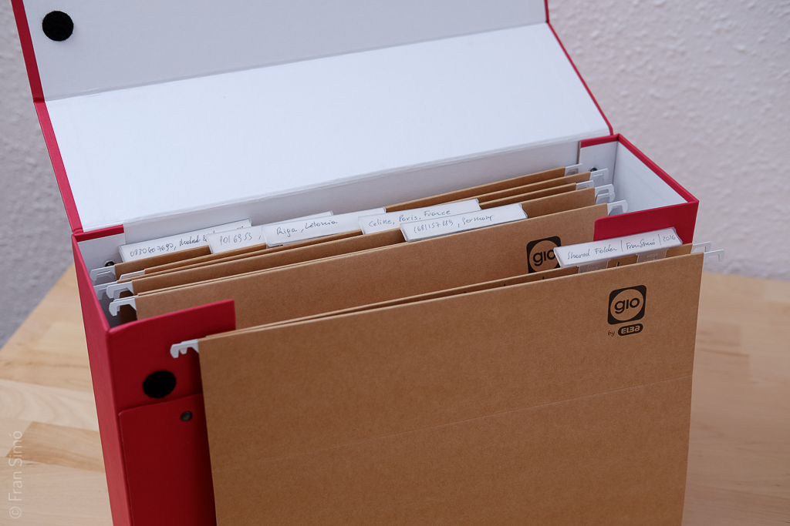
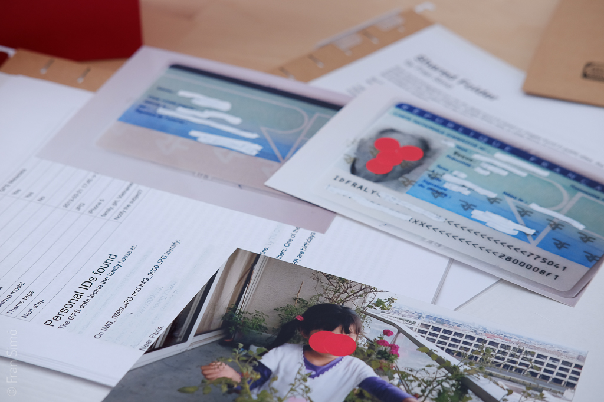
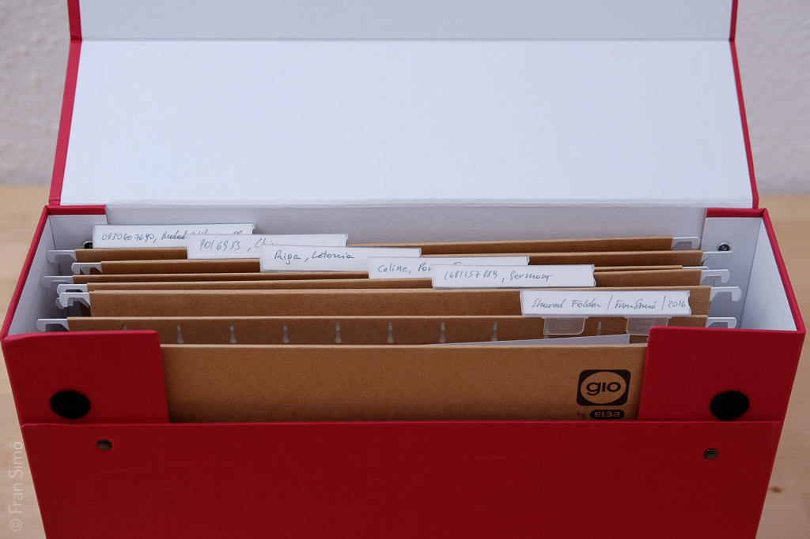

{}
```
Llibre d'artista  
10,50 x 20,50 x 38cm  
29 pàgines A4 80gm  
57 fotografies 13x18cm  
6 Carpetes
```
{}

# Shared Folder (Red box)

Quan la _[found photography](https://en.wikipedia.org/wiki/Found_photography)_ entra en l''era digital es basa en imatges trobades a webs públiques, com xarxes socials: Flickr, Instagram, Google Street View. En tots aquests casos el creador de les imatges va tenir la intenció de fer aquestes imatges accessibles (encara que només fos per una obligació legal, com els sistemes de vigilància)

La _found phtography_ original treballava sobre imatges que mai havien tingut la intenció de ser públiques. Els seus autors no les van publicar. Es van mantenir en caixes durant anys.

Em vaig preguntar a mi mateix: On puc trobar aquestes imatges? On estan les imatges digitals que mai s'han volgut fer públiques? Hauria d''comprar discs durs obsolets en els mercats de pulgas? Hauria d''hackear maliciosament ordinadors?



Aleshores vaig recordar el protocol antic eDonkey i els seus clients primitives.

Al principi dels 2000 la instal·lació d'alguns d'aquests programes tenia per costumbre compartir la carpeta «Mis Documents». Windows ubicava “Mis Fotos” dins de “Mis Documents”. Per això, qualsevol instal·lació per defecte compartia totes les fotos que havien estat descarregades de les càmeres digitals o telèfons.

Hi ha persones compartint totes les seves imatges per error sense saber-ho? Quanta informació privada estan compartint?

El 2015 vaig començar una cerca sistemàtica d'imatges a la xarxa ed2k.

_Shared folder_ mostra el que vaig descobrir



# Dades tècniques

## El llibre

Vaig volar que l'espectador tingués la mateixa sensació que vaig tenir quan vaig veure les imatges, transformant una experiència digital/mental en una física.

**Quants descobriments faràs sobre aquesta gent?**

Trobaràs una caixa i l'obriràs. Dins descobriràs carpetes que contenen informació personal i íntima sobre persones. Les dades rellevants estan enmascarades, però pots treure els [gommettes](https://www.google.es/search?q=gommettes&espv=2&biw=1437&bih=778&source=lnms&tbm=isch&sa=X&ved=0ahUKEwie17Ki1NHMAhUK1B4KHdUbBbAQ_AUIBigB) (pegatines), la tinta que està tapada amb Tipp-ex es pot veure a contra llum. Els enllaços ed2k estan allà, només necessites enganxar-los en un client eDonkey i descarregaràs les mateixes fotos que vaig trobar. El codi que vaig usar per a la cerca massiva és públic.

Assumo que les imatges han estat compartides per error. **Seguir amb aquesta investigació és una violació a la intimitat?** Vaig crear el llibre com un mitjà per posar els espectadors en la posició de triar.

**Quants dades o imatges estàs compartint sense saber-ho?**

## La maqueta del llibre

El llibre final serà una caixa amb carpetes dins, amb les mateixes dimensions que la maqueta. Contindrà imatges i pàgines dins de les carpetes. Les fotografies tindran gommettes sobre elles. Les pàgines tindran Tipp-ex sobre la informació sensible.

Alguns detalls podrien canviar per evitar marques comercials i millorar la qualitat general de l'objecte.

## Cerca

Per buscar i descarregar vaig usar el servidor mldonkey. Té una interfície que permet l'automatització de les cerques i descàrregues. Part de les cerques van ser manuals, especialment per a les fotografies en format RAW. Per als JPGs vaig usar un algoritme molt senzill que buscava el patró: IMG_0001, IMG_0002, IMG_0003…

Pots trobar el codi aquí [https://github.com/fransimo/shared_folder](https://github.com/fransimo/shared_folder) (llicència GPL).

## Classificació

Vaig usar el número de sèrie de la càmera que està disponible en els EXIFs per al primer sistema d'agrupació. Aquest dada em donava l'oportunitat de seguir una càmera.

Per als mòbils, que no registren el número de sèrie, vaig usar les dades GPS. Les fotografies que tenien dades de GPS es agrupaven per ubicació i després les vaig verificar manualment.

## Estadístiques

La biblioteca conté 17934 fotografies, després d'haver borrat la pedofília, que representava el 13% de les descàrregues.

4469 imatges tenien dades del número de sèrie (3747 eren JPGs i 722 RAWs)  
2405 imatges tenien dades GPS.



# Contingut complet


[PDF Download](/docs/art/new_media_art/Shared_folder_red_box/Shared_folder_with_photos_and_scan.pdf)

