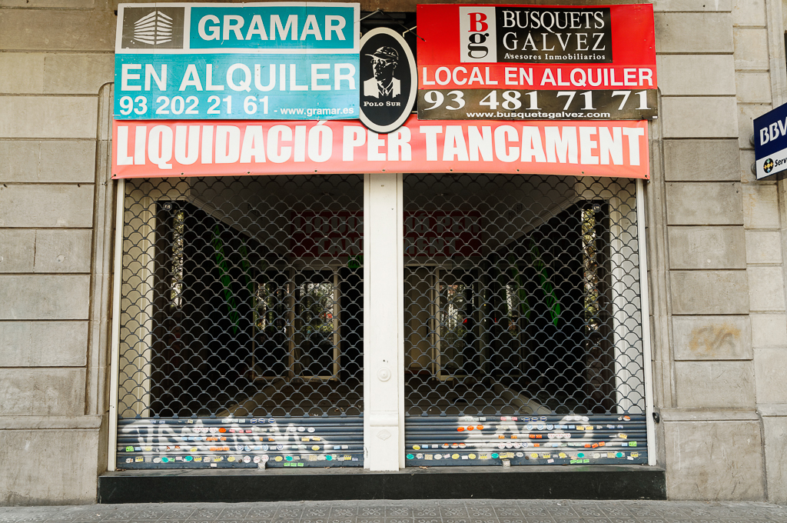

# Es lloga (Es lloga)

2009-2010

> 17/11/2009 Diari: La Vanguardia. Barcelona. (Redacció).- El xicte no deixa de augmentar a Espanya i castiga amb més crueldat a les petites i mitjanes empreses. Es calcula que, cada dia, 500 autònoms perdin el seu treball i cada setmana, unes 4.000 empreses es veuen obligades a tancar. Les petites i mitjanes empreses catalanes es manifestaran demà de nou davant el Congrés...

El tancament de milers de petits comerços és només la cara exposada d’un drama més complex. Cada botiga que tanca afecta al propietari, als seus empleats, als seus proveïdors i les famílies de tots ells.

Cada una d’aquestes portes encerta somnis robats per un cataclisme financer dels responsables dels quals no tenen nom, ni culpa, ni càstig. **Tots aquests somnis ara estan disponibles “per llogar”**.

El capitalisme, en estat pur, exalta un esperit emprenedor, creatiu, el coratge, la constància i el valor de l’intercanvi. Com a conseqüència d’aquest esperit es genera riquesa, ocupació, tecnologia i benestar. En l’altra banda l’avarícia, l’opulència, la manca d’escrúpuls i l’egoisme el destruen.

Aquesta crisi no és el resultat d’un atac extern. Aquí no hi ha enemic. La bomba la hem posat nosaltres mateixos. Perquè el capitalisme sigui sostenible ha d’existir un equilibri entre l’esperit creador i l’avarícia.

Els mecanismes d’autocontrol del sistema no van funcionar. Ningú va escoltar els analistes que van advertir de la situació i la roda dels dividends ràpids basats en riscos elevats acabà per sortir del camí.

Cada vegada que penso en la crisi i els seus responsables recordo aquella línia de Bruce Springsteen a Youngstown “Once I made you rich enough, rich enough to forget my name”.



  
  
  
  
  
  
  
  
  
  
  
  
  
  
  
  




