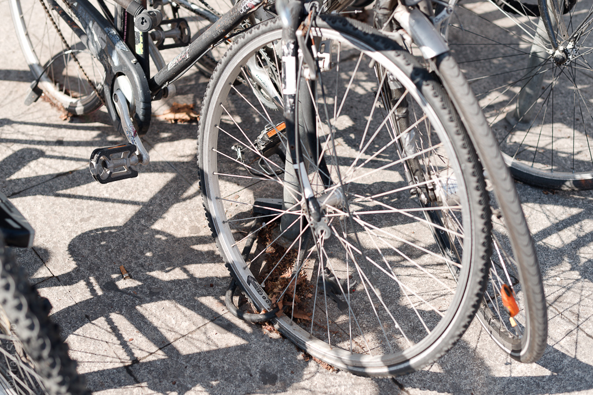

# Tracce (drift personali)

_Tracce_ è una serie di passeggiate non pianificate attraverso il paesaggio urbano basata sul _Dérive_ di Guy Debord (“Drift”).

Lo scopo della passeggiata è scattare foto, niente altro. È sempre circolare: inizia e termina nello stesso punto.  
Si svolge in un solo giorno. Lascia che il mio subconscio scelga la direzione. Scatto ogni volta che vedo qualcosa che cattura il mio sguardo, qualunque cosa sia. Non cerco alcuna correlazione con le altre serie su cui sto lavorando, ma non le rifiuto nemmeno.

_Tracce_ è una pratica meditativa che esplora la relazione tra il conscio e il subconscio attraverso la fotografia. Un solo drift è insufficiente. Per comprendere questa relazione e le sue conseguenze fotografiche, l’esperimento deve essere ripetuto. La ripetizione richiede regole. Le regole costringono l’autore a concentrarsi sul subconscio e a sperimentare il drifting.

Le sette regole di drifting sono:

1. Usa una fotocamera compatta. Il movimento libero del corpo è essenziale.  
2. Scegli una giornata libera per il Dérive. L’intera giornata sarà dedicata ad esso.  
3. Esci e abbandonati all’intuizione; ti guiderà attraverso la città. Usa un tracciatore GPS per registrare il tuo percorso.  
4. Scatta ogni volta che qualcosa cattura la tua attenzione.  
5. Non farti intrappolare da questa immagine, continua, muoviti.  
6. Segui il processo per almeno due ore e cambia direzione verso il punto di partenza della passeggiata.  
7. Quando arrivi a casa, scarica tutte le foto e guardale per 2 secondi per immagine. Valutale e selezionale senza pensare, solo per impulso. Ripeti la selezione finché non ottieni 21 fotografie.

## Radici

Qualche tempo fa ho visto l’intervista di Stephen Shore con Phaidon Press su _The Book of Books_. L’idea di creare un libro in un solo giorno, dal scattare foto a avere una copia “in viaggio”, mi ha davvero catturato. Dal 2003, pratico il _Dérive_ come metodo per scattare foto. Non sono molto sicuro di quando “tutti i punti si connettono” in un progetto, ma il 14 febbraio 2013 sono uscito con una fotocamera e mi sono affidato al mio subconscio. Quel giorno ho scritto le regole.

## Come drift collettivi

Ho iniziato Tracce come progetto personale ma presto ho deciso di sperimentarlo in modo collettivo. L'ho aperto alla collaborazione cercando altri 6 autori per ritrarre Barcellona. Il progetto collettivo [è stato esposto a Barcellona alla _Galeria Tagomago_ a maggio 2014](http://fransimo.info/blog/2014/05/02/traces-2013-12-07-barcelona/ "Traces Tagomago").

## Galleria


  
  
  
  
  
  
  
  
  
  
  
  
  
  
  
  
  
  
  
  
  
  
  
  
  
  
  
  
  
  
  
  
  


