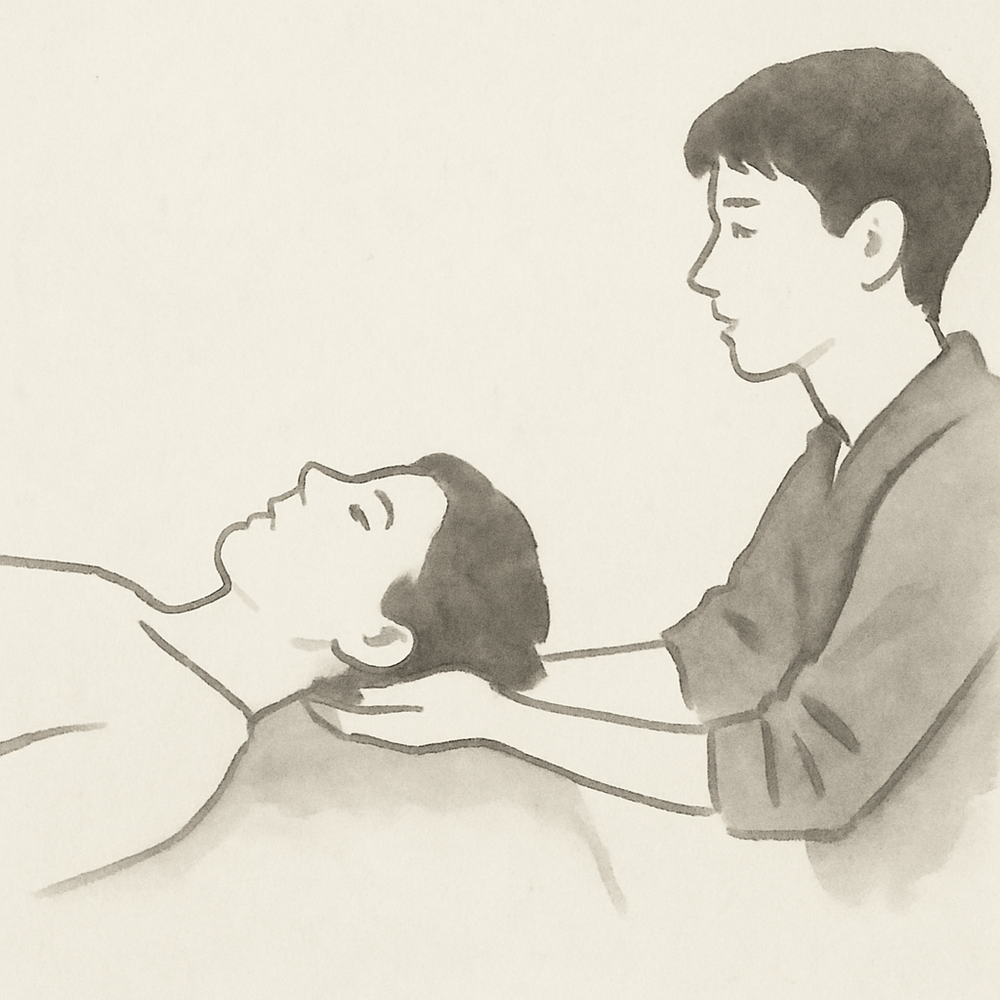

{}

<--->
# Biodinámica Craneosacral

Es un trabajo corporal extremadamente sutil, no intrusivo, suave y eficaz, que combina técnicas científicas con
intuición y sensibilidad, dentro de un espacio de conciencia meditativa.

La biodinámica craneosacral se basa en el principio del «Aliento de Vida»: la fuerza vital que nos conecta con nuestro
origen, con la salud inherente, con la fuente del ser y la totalidad, donde no hay separación.

El Aliento de Vida es una fuerza ordenadora que se expresa en un movimiento lento, constante y cíclico, al que llamamos
«Marea» o «Respiración Primaria», la manifestación de la vida misma desde la concepción.

El entrenamiento en esta disciplina permite percibir la respiración primaria, o las «Mareas», y basarse en ellas para la
evaluación y el tratamiento.
{}
Una sesión de biodinámica se realiza en camilla de masaje, con ropa, hay un contacto con las manos muy suave, casi sin
movimiento.

Las sesiones duran aproximadamente una hora y constan de cuatro partes: una pequeña conversación inicial y tres fases de
contacto inmóvil donde las manos del practicante permanecen en una posición fija.

El practicante no manipula ni canaliza energía al cliente. El objetivo es mantener un espacio seguro y sin juicios,
donde las fuerzas que organizan el sistema del cliente puedan expresarse y, a través de esa expresión, encontrar una
nueva forma de reorganizarse. Esto potencia la autocuración.

El dolor y el trauma suelen dejar una huella en los flujos energéticos del cuerpo. Esta huella puede aliviarse, incluso
si el cliente no recuerda conscientemente el evento que la causó.

Soy estudiante del [Instituto Español de Biodinámica Craneosacral](https://biodinamicacraneosacral.org/es/que-es-2/). El
enfoque de mis profesores combina las visiones de Andrew Taylor Still, William G. Sutherland, Rollin Becker, James S.
Jealous, John Upledger, Franklyn Sills y Ray Castelino.

## Precios 

- **Duración:** 1 hora.
- **En:** camilla.
- **Precio:** ~~60€~~ las primeras tres sesiones gratuitas como parte de mis prácticas de estudiante.
- **Lugar:** desplazamiento a tu lugar o sala contratada.

¡Haz tu reserva [aquí](../book/)!