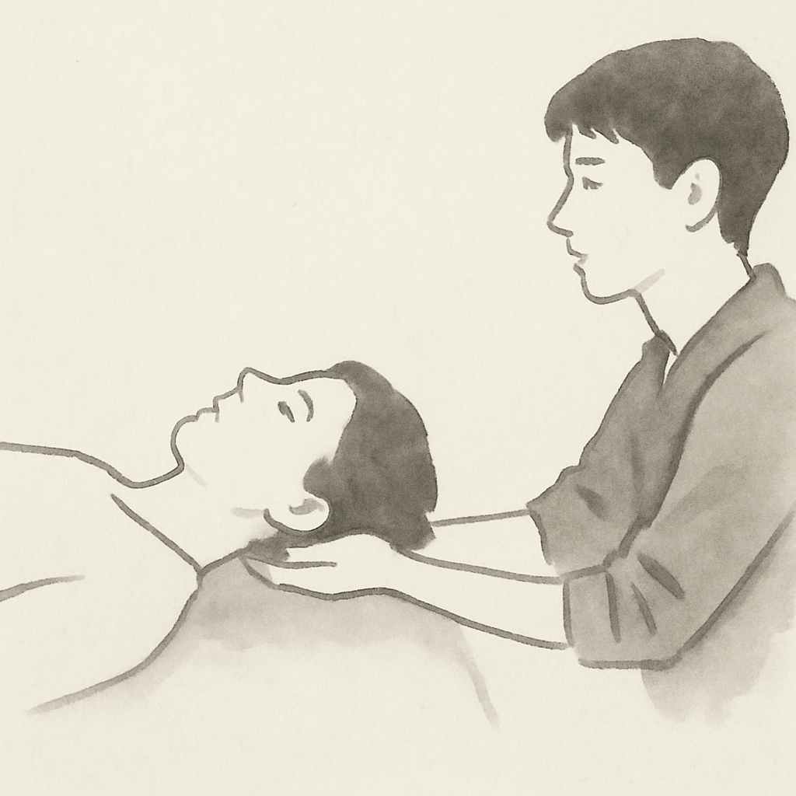

{}

<--->
# Terapia Craniosacral Biondica

La Terapia Craniosacral Biondica è un lavoro corporeo estremamente sottile, non intrusivo, delicato ed efficace che fonde tecniche scientifiche con intuizione e sensibilità, all'interno di uno spazio di consapevolezza meditativa.

La Terapia Craniosacral Biondica facilita la guarigione del sistema del cliente secondo il proprio piano di trattamento, utilizzando la propria forza vitale. È una terapia basata sull'ascolto che rimane in silenzio finché non percepisce l'intelligenza della vita che abita tutti gli esseri. Questa vita sa sempre come trovare la salute: uno stato di maggiore fluidità e armonia nel corpo.

Il terapeuta crea uno spazio dove quella forza può trovare un nuovo punto di equilibrio, uno stato più favorevole per la salute fisica, mentale e spirituale.

Il terapeuta “non fa”, ascolta e accompagna la saggezza già presente in te ora. In questo processo la TCB aumenta la tua capacità di auto-guarigione con la tua stessa energia.

In lingua biondica quella forza vitale è chiamata “Respiro della Vita”, entra nel corpo attraverso il liquido cerebrospinale, diventando una potenza distribuita in tutto il corpo. Il _respiro della vita_ è la forza originaria della vita, un'energia che ci collega alla nostra origine, alla fonte dell'essere e alla totalità dove non c'è separazione.

Il Respiro della Vita è una forza espressa in un movimento lento, costante e ciclico, che chiamiamo “Marea” o “Respiro Primario”. L'addestramento in questa disciplina ti permette di percepire il respiro primario, o le “Maree”, e basare la valutazione e il trattamento su di essi.

Una sessione biondica si svolge su un lettino da massaggio, con abbigliamento, con contatto manuale molto delicato, quasi nessun movimento.

Le sessioni durano circa un'ora e consistono in quattro parti: una breve conversazione iniziale e tre fasi di contatto immobile dove le mani del praticante rimangono in una posizione fissa.

Il praticante non manipola né canalizza energia al cliente. L'obiettivo è mantenere uno spazio sicuro, libero da giudizi, dove le forze che organizzano il sistema del cliente possano esprimersi, e attraverso quell'espressione trovare un nuovo modo di riorganizzarsi. Ciò potenzia l'auto-guarigione.

Il dolore e il trauma spesso lasciano un segno sui flussi energetici del corpo. Questo segno può essere alleviato, anche se il cliente non ricorda consapevolmente l'evento che lo ha causato.

Sono studente dell'[Istituto Spagnolo di Terapia Craniosacral Biondica](https://biodinamicacraneosacral.org/es/que-es-2/). L'approccio dei miei insegnanti combina le visioni di [Andrew Taylor Still](https://es.wikipedia.org/wiki/Andrew_Taylor_Still), [William G. Sutherland](https://en.wikipedia.org/wiki/William_Garner_Sutherland), [Rollin Becker](https://rollinbeckerinstitute.co.uk/who-we-are/about-rollin-e-becker/), James S. Jealous, [John Upledger](https://www.upledger.com/about/john-upledger), **[Franklyn Sills](https://www.resourcingyourlife.org/about-us/)**, [Ray Castellino](https://castellinotraining.com/raymond-castellino/), e [Peter A. Levine](https://www.somaticbarcelona.com/peter-a-levine/).

La formazione, 900 ore, è accreditata dall'[Associazione Spagnola di Terapia Craniosacral Biondica](https://www.asociacioncraneosacral.com/), riconosciuta dall'[Istituto Svizzero Internazionale](https://www.icsb.ch/en/), e segue gli standard dell'[International Association of Biodynamic Training](http://biodynamic-craniosacral.org/).

## Prezzi

- **Durata:** 1,5 ore.
- **Luogo:** su un lettino.
- **Prezzo:** ~~60€~~ le prime tre sessioni a 30€ come parte della mia pratica studentesca.
- **Sede:** <M> Diagonal / <FGC> Provença, Barcellona.

Prenota il tuo appuntamento [qui](../book/)!

{}

