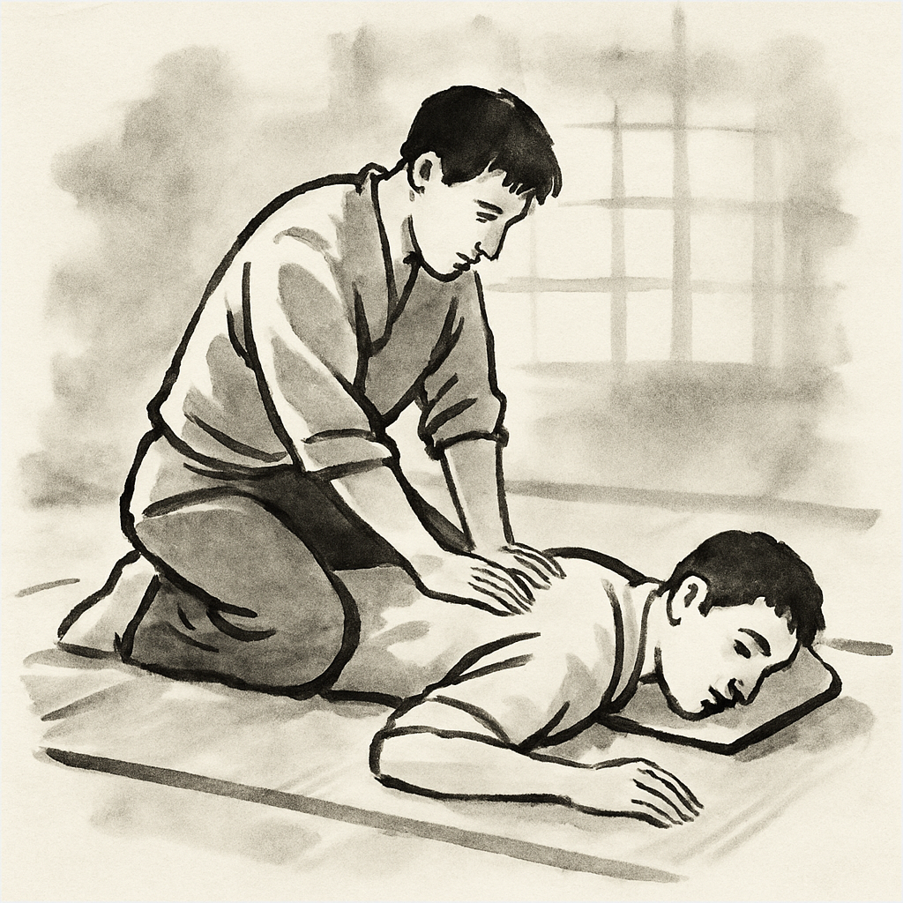

{}

<--->
# Holistic Massage Session  

These sessions blend all the techniques I have learned over time, adapting them to a wide range of situations.  

They can be oriented towards relaxation, healing, or a sensory experience.  

Nudity is not required; in fact, contact can be entirely avoided, and the session can be conducted solely on an energetic level—or even remotely if necessary.  

Some days, the best approach may be to guide a meditation, while in another session, a massage _inspired_ by Shiatsu or Reiki might be more appropriate. The essence of the encounter is dialogue, and the main goal is to connect you with your energy. If there are blockages, to relieve them. If there is a need for stillness, to give it space. If there is fire or anger, to create a safe environment for it to be expressed.  

Skin contact and the use of oils often enhance the experience.  

{}

You can check prices and service limitations [here](../prices/). 
