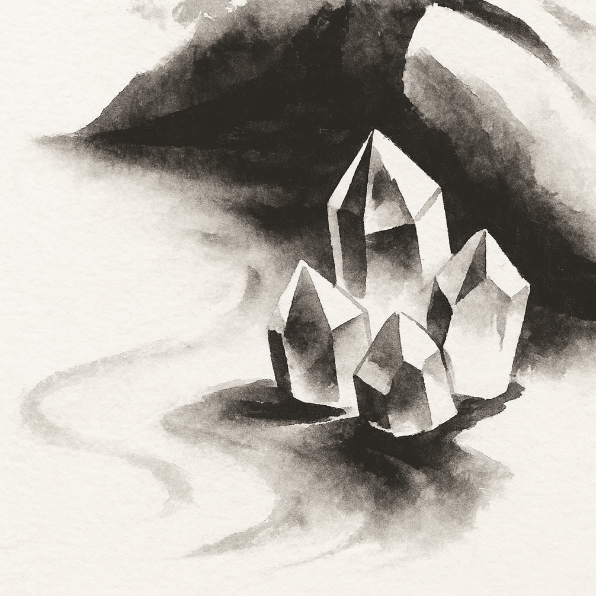

{}

<--->
# Tameana  

Tameana is a vibrational healing practice that **uses quartz crystals and channeled symbols to work on both the energetic and physical bodies, facilitating their integration with the Whole**. It is based on the idea of raising a person's vibrational frequency to unblock emotions, release stagnant energies, and promote inner transformation processes.  

It has roots in the Pleiadian tradition and was spread by [Juan Manuel Giordano](https://www.juanmanuelgiordano.com/).  

The practice consists of placing quartz crystals in specific positions around the body, which are then activated with Pleiadian symbols. It can also be performed remotely.  
{}
During a Tameana session, energy centers are stimulated and harmonized, aligning the person with higher vibrational fields and restoring their magnetic field. This induces a process of cleansing and purification of physical, mental, emotional, and spiritual blockages.  

A session typically lasts a little over half an hour. The person receiving the vibration can be lying down. In an in-person session, the crystals are placed around the body and moved geometrically at intervals. In a remote session, the person can be in bed or on a couch while the "activator" uses their crystals, following the same geometric patterns and directing the energy from a distance.  

"Activators" simply initiate the vibrational process. It is the recipient and the energy itself that find the path. For this reason, there is no need to explain anything about your life, pain, or traumas. As Juan poetically puts it: _"God meets God."_  

The in-person session does not involve physical contact.  

The process can consist of up to three sessions, only if the person receiving the energy feels it is necessary.  

You can read more about Tameana, even get training, at [here](https://tameanavirtual.com/).  

After attending several retreats in Montserrat with Juan, I trained in 2024 with [Angelica Alercia](https://www.instagram.com/angelica.alercia.ser/).  

I practice two techniques:  

- **Salush Nahí**: Sessions for complete system harmonization and physical, emotional, and mental healing. It awakens and connects the intelligence of the entire Being, balancing the chakras.  
- **H’ama**: Energetic cleansing of spaces. It releases imprinted energies that may be densifying and blocking homes, businesses, etc. Instead, it raises the vibration to optimize the space’s energy flow.  

## Price information

- **Duration:** 1 hour.  
- **Setting:** chair, massage table, or tatami.  
- **Price:**  
    - Salush Nahí: €60  
    - H’ama: €30  
- **Location:** remote, at your place, or a rented space.  

You can all check prices and service limitations [here](../book/).  
