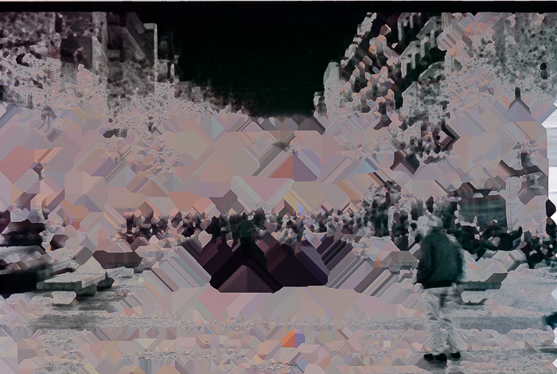

God is in the [_bugs_](https://es.wikipedia.org/wiki/Error_de_software): cualquier evolución biológica real es la consecuencia de un error en la copia del ADN.

A diferencia de lo que se cree comúnmente, la evolución no está basada en la intención consiente del ser que «se adapta mejor al ambiente». Este animal o planta nunca quizo adaptarse, no tuvo esa voluntad, la adaptación solo «ocurre». Él/ella se ha adaptado o tiene una ventaja comparativa como consecuencia de un error durante su concepción o crecimiento. Algunas células comenten un error al reproducirse y nacen con sensibilidad a la luz. Millones de años después son ojos.

El estado actual de la red ya podría considerarse como una forma de vida, un organismo «simple». Los humanos tendemos a sobreestimar los que llamamos conciencia, incluso cuando solemos estar muy lejos de ser consientes de nuestro verdadero potencial.

Una vida consiente basada en silicio es inevitable. Si sigue los patrones que han hecho crecer la vida basada en carbono esta nacerá de un error incontrolado en el código.

La vida es una colección de eventos «inesperados».

La serie «God is in the bugs» explora errores de software o usos intencionados de la tecnología de formas en las que no se supone debería usarse (como el hacking o glitching) bajo el supuesto de que algo similar pero inesperado será la causa de un «big band» de una nueva forma de vida si es que ya no está aquí. Es la búsqueda de imaginar la concepción de una cyber-vida.

  

    

Estas imágenes son el resultado del utilizar parámetros equivocados al escanear con el software SilverFast. (Aplicar iSDR a negativos blanco y negro). La serie no se limita a este error en particular. Seguiré investigando y creando esta idea.

Disponible como NFT @ [OpenSea](https://opensea.io/collection/god-is-in-the-bugs)
