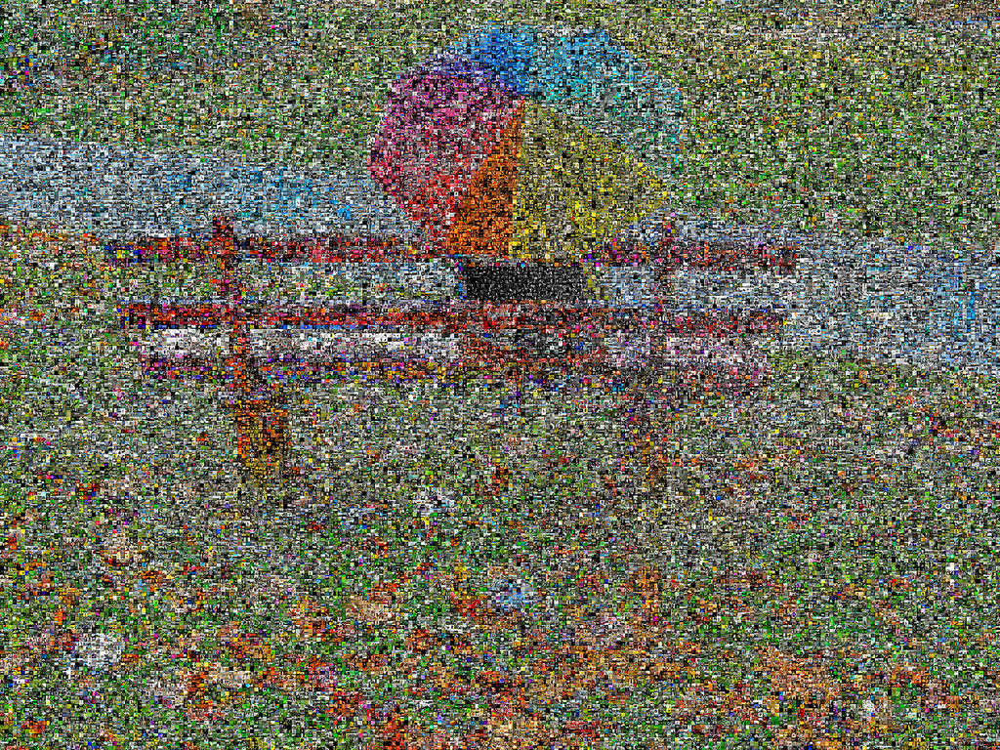

[Rainy Day](http://www.flickr.com/photos/summerfeelings/3030122090/) as flickrGrama.

This is a project I’m working on called **flickrGramas**.

This is a very early version, my first attempt. Future improvements include:
1) Using only Creative Commons derivatives allowed images  
2) Creating flickrGramas by tags (e.g., a face formed by thousands of face images, a rainy day formed by thousands of rain-related images)  
3) Improving color indexing techniques

Higher resolution available [here](3049300655_8ca88c85b5_o.jpg) (1,800px)  
Full resolution available [here](http://entregas.fransimo.info/flickrGramas/3030122090/fG_3030122090_ps.jpg) (18,000px, 106MB).

This flickrGrama contains 43,200 pixels represented by 22,938 different images.

flickrGramas are an evolution of the [Elements Exhibition](http://elements-barcelona.com/) software.

