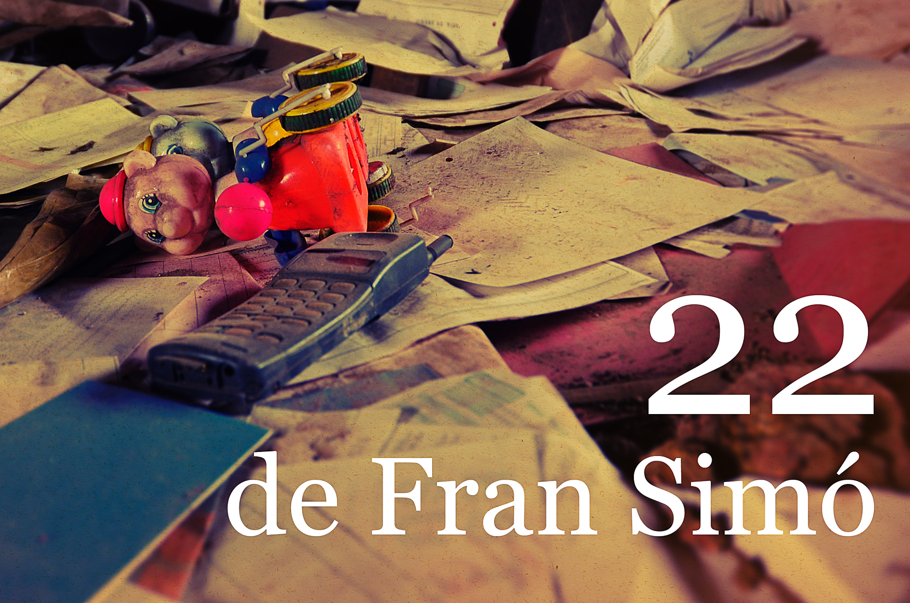

Me encantan los libros como canal para enseñar fotografía. Las exposiciones están bien, pero nos limitan a un espacio/tiempo concreto. La mezcla multimedia, que acaba siempre en un vídeo, es interesante pero fuerza al espectador a un ritmo y, aunque me interesa mucho, no me acaba de convencer. Por eso, desde que empezamos con el proyecto [Arrinconado](http://arrinconado.barcelonaphotobloggers.org/) en [Barcelona Photobloggers](http://barcelonaphotobloggers.org/ "Barcelona Photobloggers"), estoy investigando y probando sistemas de impresión por demanda y ahora los eBooks.

[«22»](/docs/art/books/22/) nació como un libro de autor de edición limitada a 11 ejemplares, al menos por ahora. No creo en las ediciones limitadas, pero dada la naturaleza del proyecto no se puede reproducir en masa como objeto. Debe ser impreso en papel reciclado por una impresora laser color de oficina, sino se rompe su espíritu.

Con la nueva aparición de los servicios de agregación de Lulu.com a la iBookstore me he animado a crear una versión de “22” especialmente diseñada para iPad/iPhone.

Los eBooks son una cosa “nueva” y para fotografía y tienen serias limitaciones. Un eBook estándar, por definición, no tiene “layout” eso hace que nunca sepamos cómo se va a mostrar el contenido en el dispositivo lector. En abril de este año Apple adoptó para sus iBook una variante del estándar que permite decidir al diseñador dónde y cómo se mostrarán los elementos en la pantalla. Después de ver muchos libros electrónicos he decidido que la única manera que me interesa montarlos es con esta variante.

Por ahora, he creado la versión en [castellano](http://www.lulu.com/shop/fran-sim%C3%B3/22/ebook/product-18680983.html "versión en castellano de "), de descarga gratuita, y la versión en [inglés](http://www.lulu.com/shop/fran-sim%C3%B3/22/ebook/product-20663836.html), con precio para poder entrar a la iBookstore. Los servicios de agregación no son la solución perfecta, pero me dan la oportunidad de experimentar con el formato sin las complicaciones de ser un editor oficial de Apple. El princpial problema es que no puedo enviar la versión en castellano a la iBookstore desde Lulu.

Esto es sólo el principio. Espero poder editar más contenido en eBooks pronto 🙂
