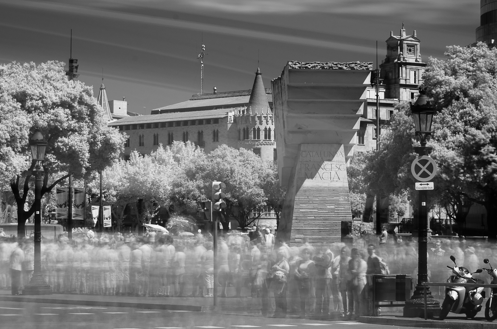
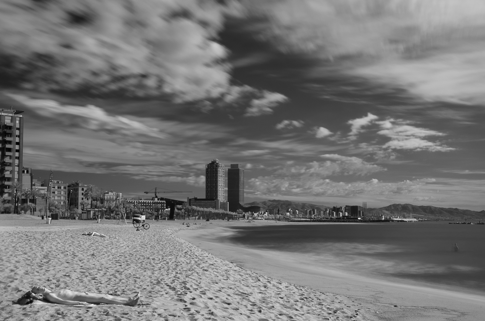

Tarde o temprano a todos los que amamos la street photography nos acaba llegando una copia
de [Street photography Now](http://amzn.to/1nPcTNa "Street Photography Now / Sophie Howarth, Stephen McLaren "). El
regalo me sacó una sonrisa y las páginas una inquietud: [Alexey Titarenko](http://www.alexeytitarenko.com/). Su
serie «[City of shadows](http://www.alexeytitarenko.com/port_cityshadows.html)» me hipnotizó. Desde luego no es lo que
se podría denominar street photography clásica, de hecho el libro roza varias veces la frontera de lo clásico, llegando
a citar la famosa frase «la realidad solo puede ser explicada a través de la ficción» que oí por primera vez del que sin
duda es mi influencia más imporante Krzysztof Kieślowski.

Normalmente la street congela el instante, en cambio Titarenko congela el alma de las ciudades. Sus fotos quedaron en mi
cabeza y después de resolver detalles técnicos y cambiando un poco la orientación he dado mis primeros pasos.

 

La primera diferencia es un filtro infrarrojo. Captar lo invisible me seduce, pero aún no me convence, porque
los [falsos colores](http://vimeo.com/10560793) que se suelen sacar del infrarrojo en tomas RGB no me gustan y el blanco
y negro no es lo mío. Haré más cesiones con filtros neutros para resolver el tema del color, pero Titarenko me ha
impulsado a jugar con la street de una manera diferente a la que estoy acostumbrado.

Datos técnicos:

- Cámara: Nikon D7000
- Lente: Nikkor 16-85mm f/3.5 – 5.6 VR
- Filtro infrarojo: Hoya R72
- Exposición: 20 o 30 segundos.
- Apertura: f/9 u f/11
- ISO: 100
- Postprocesado: Lightroom, blanco y negro con filtro rojo.

 

Originalmente publicada en [Calle 35](http://calle35.com/influencias-alexey-titarenko/)  
