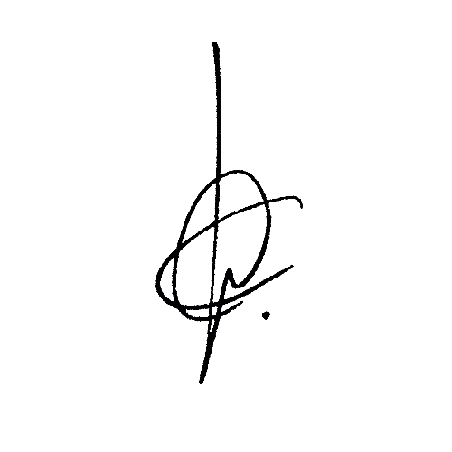
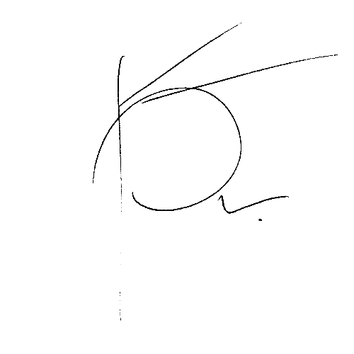
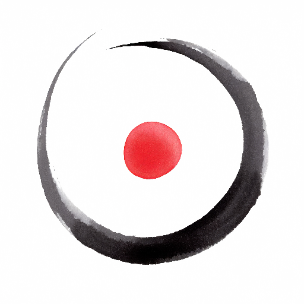
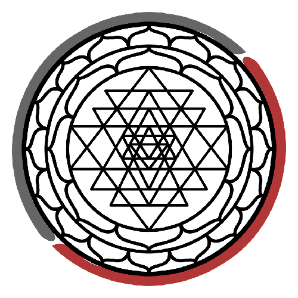

La visió en la primera conversa amb l'arbre va ser una dona a la cama en intimitat, sense rostre.  
La mirada s'enfoca a l'omblic. L'he vinculat amb l'Ónfalo com a obligo i representat amb un cercle amb un punt dins.  
Aquell dia, més tard, l'he relacionat amb la Monada, Pau i Ilaria.

El 13 de novembre veig també la relació amb les meves firmes i els meus logos. Ambdues firmes tenen un cercle principal i un punt a l'exterior avall a la dreta. Els logos ja porten el punt al centre.

Nota: [Pau Lluc](https://pau-lluc.xyz/) és el meu seudònim de massajista.

| Fran Simó - Legal | Fran Simó - vagabund | Pau Lluc         | Unity Labs                  |
| -------------- | --------------------- | ---------------- | --------------------------- |
|  |      |  |  |

