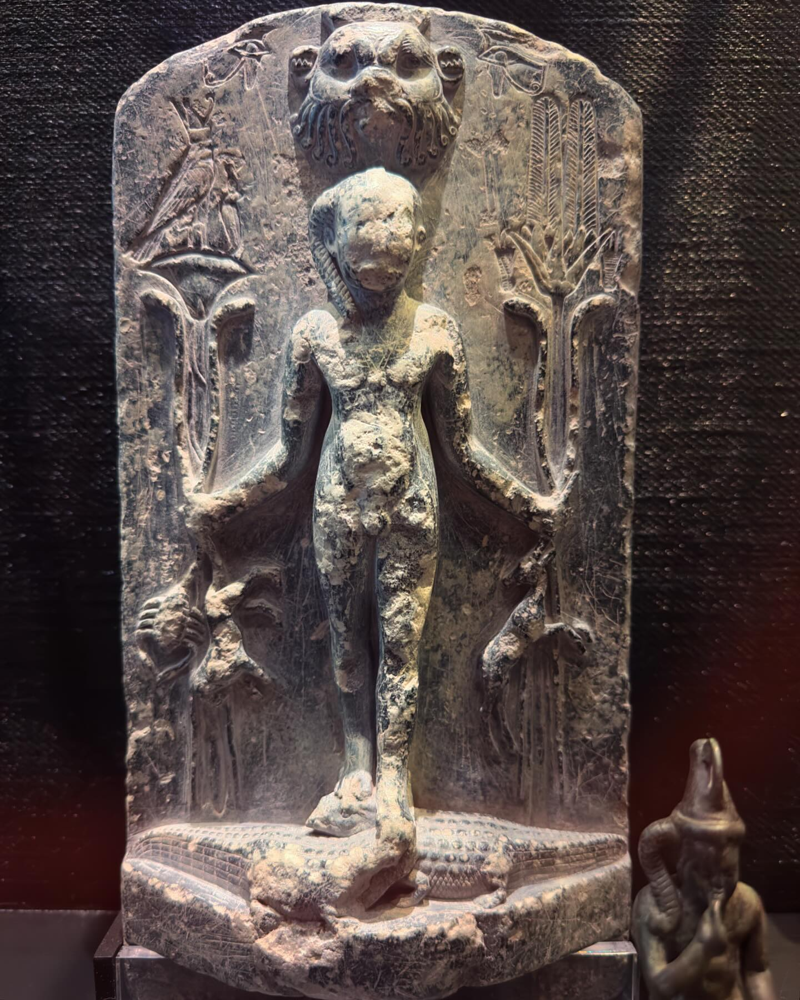
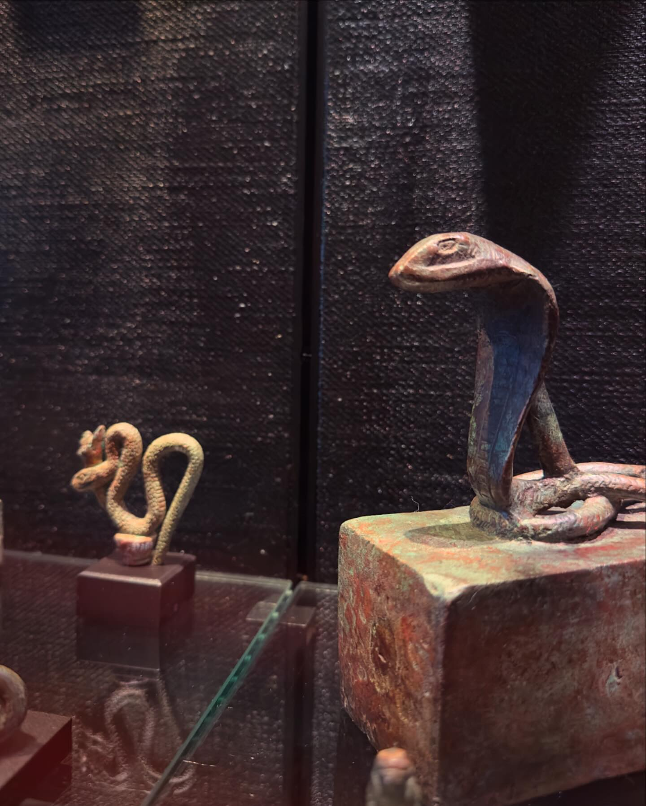
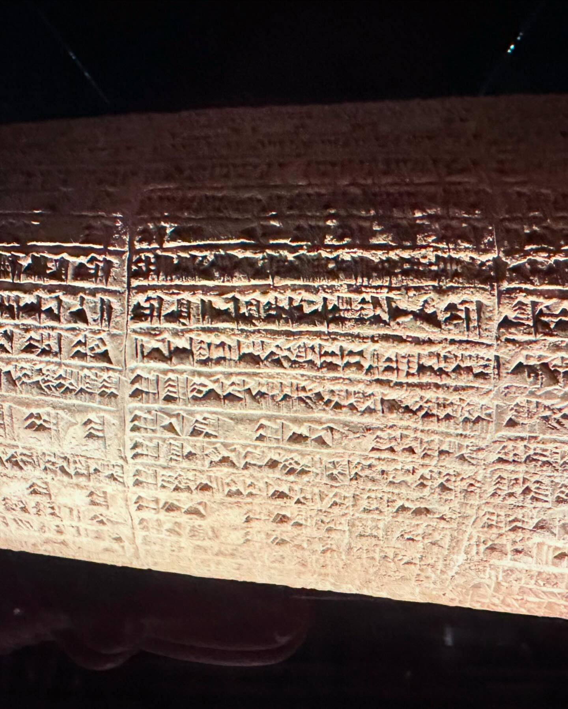
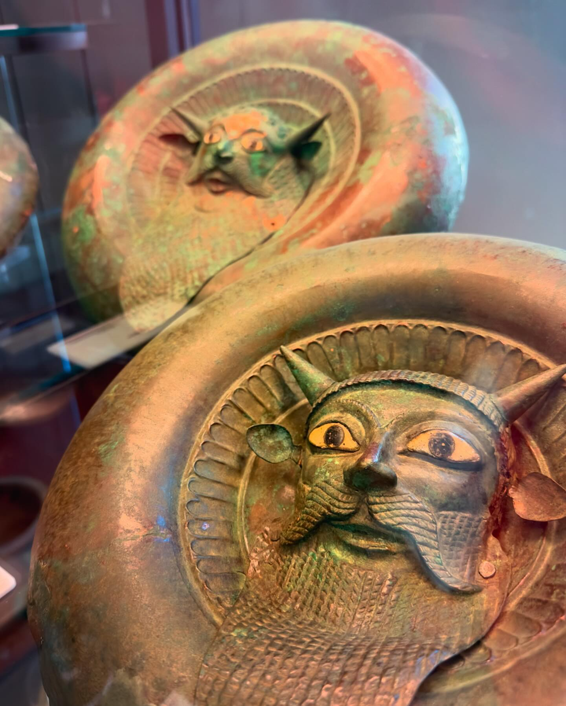
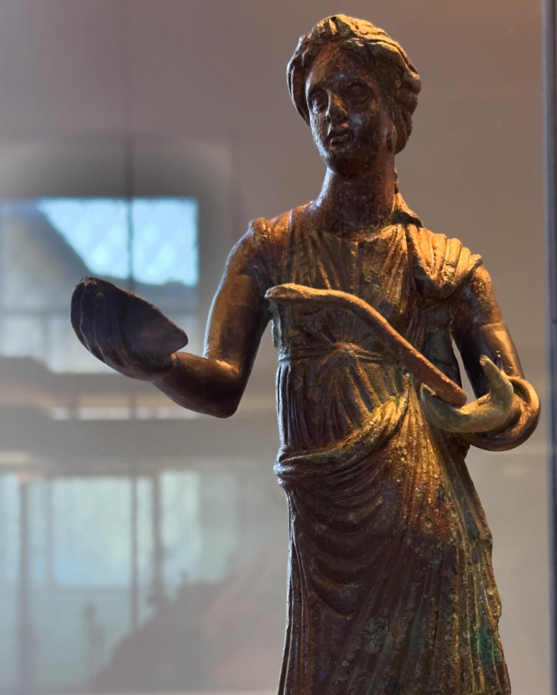
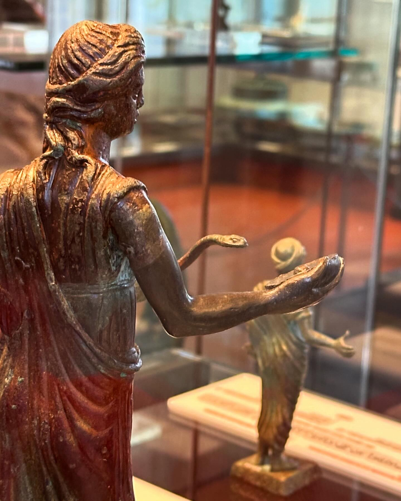
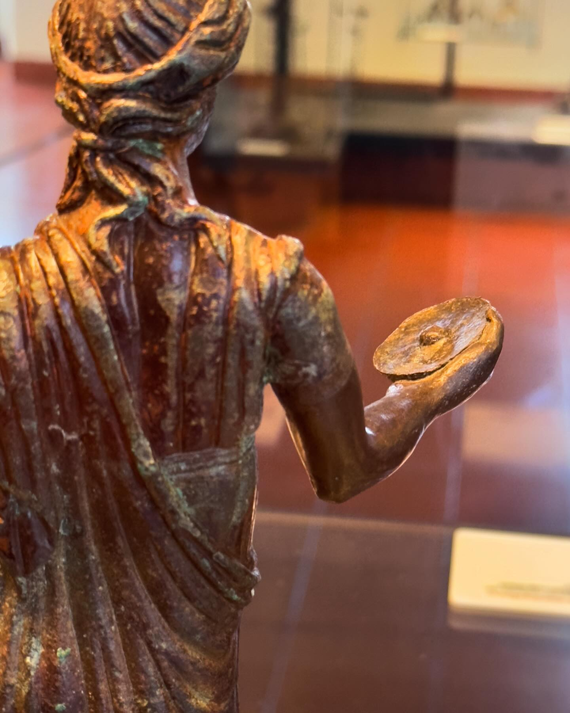
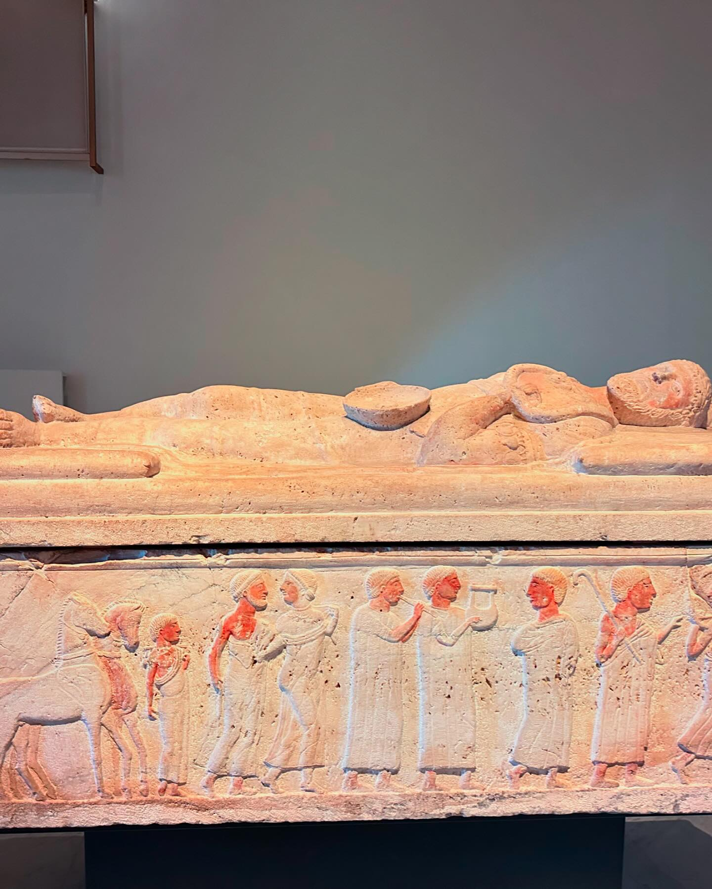
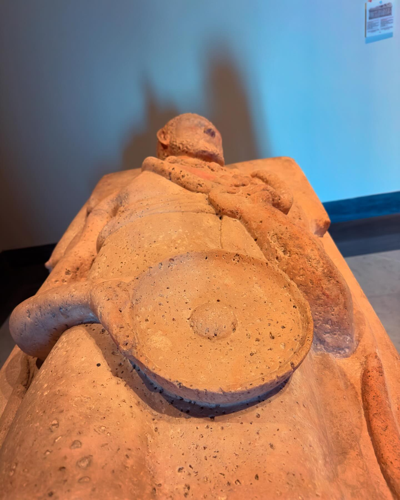
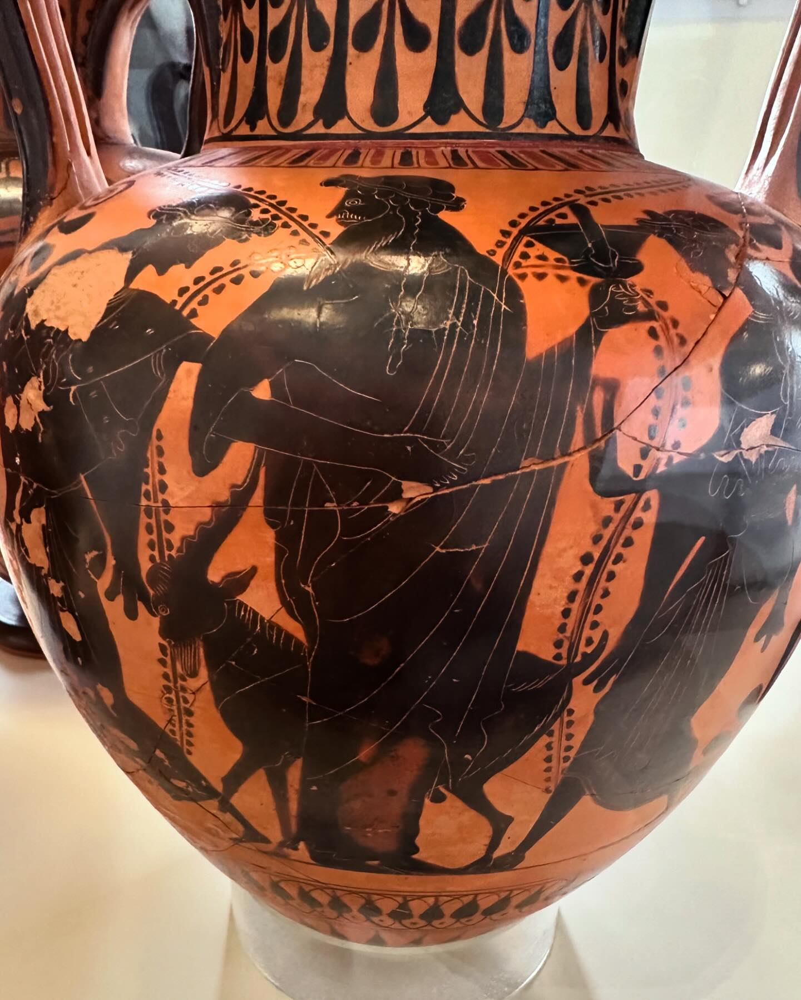

1) L'amulet o estela d'Horus sol tenir la forma d'una làpida de pedra que representa el déu Horus en forma de nen (Harpocrates), dret sobre dos cocodrils i sostenint altres animals perillosos com serps i escorpins.

