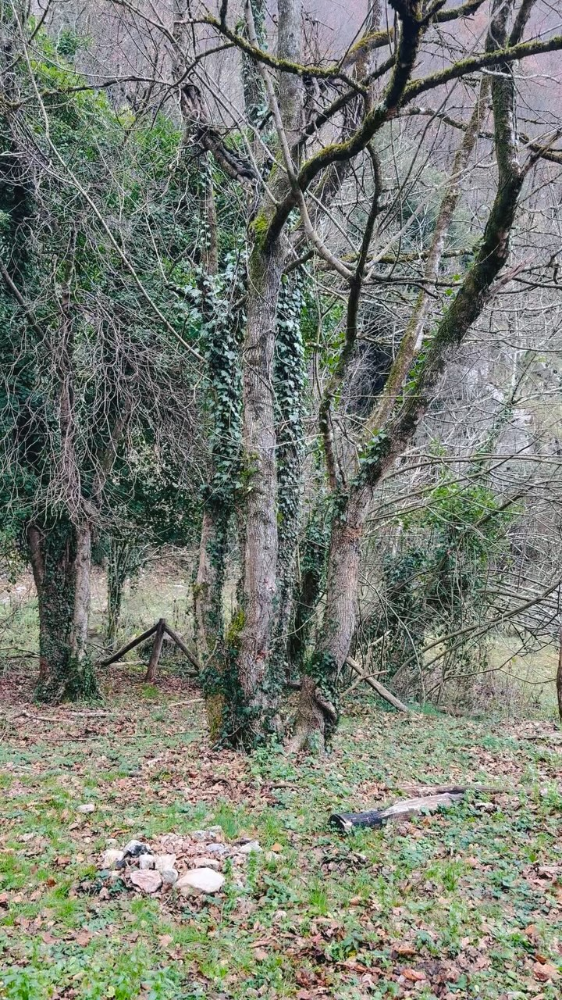

En las caminatas por el bosque encontré un lugar: 42°5’29.76” N 12°53’4.56” E, un pequeño espacio que no supera los 50 m². Allí, la luz del sol se filtra tímidamente entre los árboles durante unas pocas horas al día. El torrente, Fosso Maricella, es apenas un hilo de agua cuyo sonido hipnótico acompaña la quietud del lugar. En este rincón diminuto, las escalas adquieren otra dimensión: lo pequeño contiene un universo, y el tiempo parece seguir un ritmo distinto.

Las fotografías buscan a estas ninfas acuáticas, sus profecías y su entorno. En ellas, los reflejos del sol sobre el agua en movimiento, capturados con exposiciones prolongadas, revelan trazos y dibujos que imagino como manifestaciones de las ninfas o de sus mensajes. Esta búsqueda se convierte en un intento de hacer visible lo invisible, de descubrir en lo efímero las huellas de lo eterno.

Este vínculo entre el agua y el cielo fue aprovechado por los romanos en la construcción de templos, villas y ciudades. A través de estanques y cursos de agua, simbolizaban la idea de traer “el cielo a la tierra”.

Este viaje, entre el cielo y la tierra, es el mismo viaje de las Sibilas entre Apolo y el inframundo de la serpiente Pitón. Es también el viaje de los iatromantes, los chamanes europeos y americanos, y las sacerdotisas tántricas. Es el viaje de la muerte antes de la muerte. Todos ellos pueden hacer el viaje, contarlo después y ayudar a otros a recorrerlo.

El QR invita a los caminantes a leer este texto y ver las obras de esta etapa del viaje.



