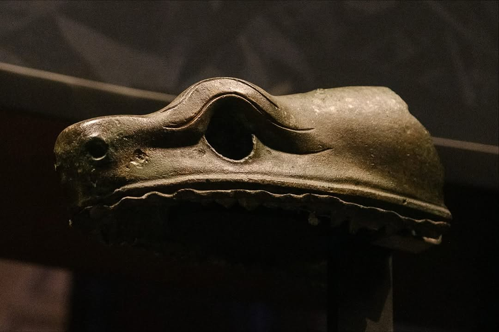
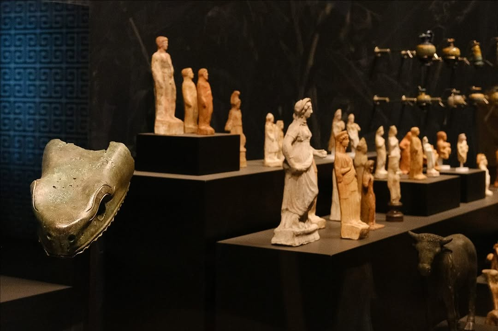
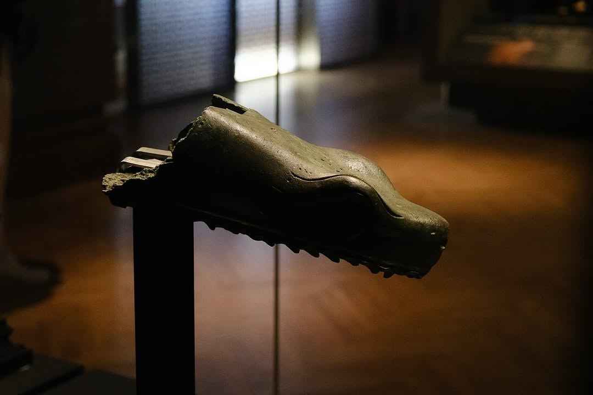
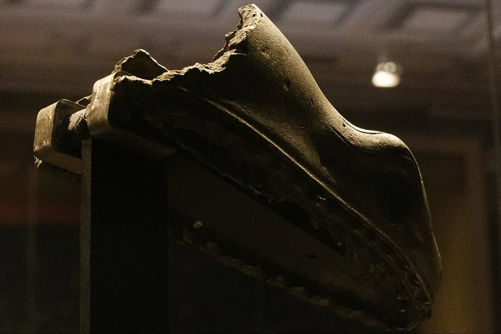

La testa di uno dei serpenti di Delfi che Costantino “trasferì” a Istanbul.  A mio avviso, un gesto volto a proclamare la fine del mondo antico, del culto delle dee e del potere delle sibille e delle pitonesse (sacerdotesse).

