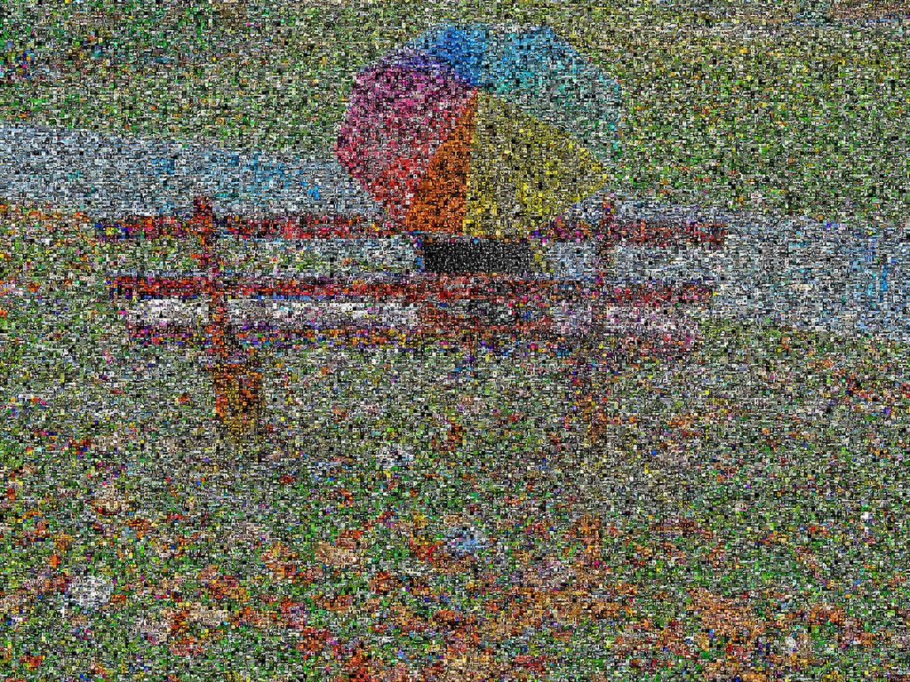

[Rainy Day](http://www.flickr.com/photos/summerfeelings/3030122090/) come flickrGrama.

Questo è un progetto su cui sto lavorando chiamato **flickrGramas**.

Questa è una versione molto precoce, il mio primo tentativo. I futuri miglioramenti includono:
1) Utilizzare solo immagini derivati con licenza Creative Commons consentita  
2) Creare flickrGramas per tag (ad es., un volto formato da migliaia di immagini di volti, una giornata piovosa formata da migliaia di immagini relative alla pioggia)  
3) Migliorare le tecniche di indicizzazione dei colori

Risoluzione più alta disponibile [qui](3049300655_8ca88c85b5_o.jpg) (1.800px)  
Risoluzione completa disponibile [qui](http://entregas.fransimo.info/flickrGramas/3030122090/fG_3030122090_ps.jpg) (18.000px, 106MB).

Questo flickrGrama contiene 43.200 pixel rappresentati da 22.938 immagini diverse.

flickrGramas sono un'evoluzione del software [Elements Exhibition](http://elements-barcelona.com/).

