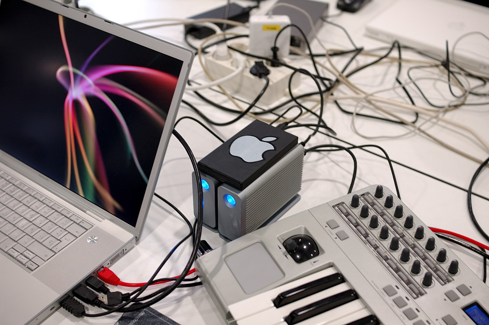

> _“Il semplice curioso non ha il diritto… Zen, come tutta la mistica, sarà compreso solo da un mistico che… non cederà alla tentazione di ottenere in modo subdolo ciò che l’esperienza mistica nega”_ (Nota del traduttore da *Zen in the Art of Archery*)

Dalla conferenza di Pepe Baeza ho scoperto che Braque aveva consigliato a Henri Cartier-Bresson di leggere il libro *Zen in the Art of Archery* di Eugen Herrigel.

Con questo articolo intendo spiegare ciò che chiamo fotografia intuitiva. È lo stile fotografico che ho praticato di più, e da quando ho scoperto che HCB basava la sua fotografia sul libro di Herrigel, ho capito che il mio atteggiamento dietro la fotocamera si basa sugli stessi principi di HCB ma con alcune differenze.

Ecco alcune frasi che potrebbero riassumere le idee di HCB su ciò che chiamava l’imaginaire d’après nature (la natura immaginaria), qualcosa di strettamente legato al pensiero buddhista e al libro di Herrigel:

-   “Fotografare… è mettere la propria testa, il proprio occhio e il proprio cuore sulla stessa asse.”
-   “Soprattutto, desideravo, in un’unica fotografia, racchiudere l’intera essenza di una situazione che si stava srotolando davanti ai miei occhi.”
-   “… dobbiamo essere lucidi su ciò che accade nel mondo e onesti su ciò che sentiamo.”

Coloro che sono interessati a leggere gli articoli completi di HCB possono leggere *The Imaginary Nature* e *The Decisive Moment* sul blog, ma vi consiglio di acquistare il libro.

Nel Zen, una conseguenza non richiede una causa. Contrariamente al nostro razionalismo illustrato e alle nostre radici ebraico‑cristiane, il Zen è più semplice: solo il “adesso”, solo il momento conta.

Anche se penso di poterne spiegare il senso e voi potete capirlo, nulla di tutto ciò avrà senso; bisogna viverlo. E la verità è che non è necessario chiudersi in un monastero per viverlo, anzi… non è nemmeno necessario essere un mistico! Il momento trascende il Zen.

Non avendo un “black belt” in alcuna arte marziale, penso di avere abbastanza esperienza per sapere un po’ di cose sulle arti marziali. I praticanti di un’arte marziale esercitano quotidianamente per rendere i loro movimenti automatici e sincronizzati con il respiro e con un certo atteggiamento. Facile da dire, ma questi tre stadi (movimento, respiro, atteggiamento‑sensazione) possono richiedere a uno studente un’intera vita… una vita o un istante. Un istante? Sì, ma lo lascio per i dibattiti faccia a faccia.

L’obiettivo finale degli esercizi di qualsiasi arte marziale è che il guerriero, quando viene attaccato, non pensi e agisca. Questo atto di difesa è considerato arte perché la combinazione di tecniche studiate per anni viene scelta automaticamente dal guerriero‑artista e viene eseguita senza pensare, senza sforzo e senza alcuna intenzione; semplicemente accade. La combinazione scelta è unica e in ripetibile.

Qualcuno pensa che un ballerino calcoli ogni movimento che fa in una performance? Le arti marziali, per dirlo semplicemente, sono come una danza o una musica, un insieme di abilità così interiorizzate che “accadono semplicemente”… come un solo di chitarra o come evitare un ostacolo mentre si cavalca una bicicletta.

Cosa hanno in comune l’arte dell’arco, la fotografia (secondo HCB), l’Aikido e l’hip‑hop? È l’uso del cervello in modo non linguistico. Poiché non sono un esperto di intelligenza, forse queste tre caratteristiche mi aiuteranno a spiegare cosa intendo:

-   Cancellare il razionalismo o il controllo conscio al momento dell’azione
-   Usare il subconscio
-   Usare l’intelligenza spaziale

Non c’è nulla di magico in questa questione e l’Est non la possiede; è solo che noi, gli occidentali, abbiamo inghiottito (volontariamente o no) Cartesio con il suo famoso “Cogito, ergo sum”. Le persone dell’Est sanno che esistono anche dormendo… fortunatamente alcuni umani non l’hanno dimenticato.

Per renderla ancora più pagana, un altro esempio: quando siamo in uno spazio pieno di persone, a volte, distinguiamo soprattutto uno tra tutti gli altri, per esempio qualcuno particolarmente attraente; ma non è che lo stessimo cercando. Si pensa che questa persona faccia qualcosa per essere più visibile, ma non è così. Nella maggior parte dei casi, il nostro subconscio riconosce questa persona e ci attira. Il subconscio riconosce un pattern e “suona una campanella” anche se potremmo aver parlato di calcio, politica o fotografia. Le arti marziali funzionano così. L’allenamento trasforma la tecnica in un istinto.

Al momento della cattura, ci sono due grandi problemi da risolvere: la macchina e l’arte. La macchina e tutti i suoi dettagli tecnici richiedono un certo livello di apprendimento a seconda della sua complessità. Scattare con una D300 è molto diverso da usare un rangefinder a pellicola o un Lomo. Ogni macchina, più o meno costosa, può essere dominata con la pratica. La pratica e un certo grado di conoscenza in questo senso sono necessari ma solo fino al punto di non occupare il nostro tempo quando stiamo scattando, quando siamo di fronte al nostro soggetto.

È infinitamente più facile scattare con una fotocamera che invertire il potere di un attaccante per farlo volare tre metri usando solo le mani, come in Aikido.

Mi è stato chiesto molte volte come configuro la mia fotocamera e la tecnologia, e i fan di solito non mi credono quando dico: “In modalità automatica.” Quando sono in strada, la mia fotocamera è di solito in modalità P, ISO-auto e autofocus automatico. La mia D300 sa più della tecnica di me. Se lascio il bilanciamento del bianco fissato su “day light”, è per abitudine analogica e romanticismo più che per altro.

La cosa importante è respirare, vedere, annusare, ascoltare, aprire il subconscio, permettendogli di guidarmi e non pensare alla fotocamera.

Comporre? No, respirare. Tutte le regole di composizione derivano dallo studio di come guardiamo le cose. Studia come il tuo subconscio analizza un’immagine. Lascia che il subconscio veda e non avrai bisogno di sapere come mettere la realtà in un fotogramma. Il primo errore è pensare che dobbiamo fare qualcosa. La prima cosa che ci insegnano sulla composizione è che tagliamo la realtà fuori e la mettiamo in un fotogramma… un triste reliquio del pictorialismo. I nostri occhi non vedono l’universo nella sua interezza: tagliare è nella nostra natura; non possiamo farne a meno. Scegliamo sempre ciò che vediamo, a quale parte del nostro già limitato campo visivo prestiamo più attenzione. I nostri occhi non hanno zoom ma il nostro cervello sì.

Tornando all’esempio pagano, quando una persona molto attraente entra nella stanza e la nostra vista si dirige verso di lei, il nostro angolo di visione è ancora lo stesso, non cambiamo gli occhi, ma la nostra attenzione si centra e, per un istante, non c’è altro nella stanza. Forse siamo catturati dalla sua maglietta rossa, dal colore dei suoi occhi, dalle sue curve o da qualsiasi altro dettaglio, ma, per un istante, i nostri “occhi” non vedono altro.

Raggiungere questo con una fotocamera è il primo compito della fotografia intuitiva; fino a questo punto concordo con HCB. Ma poi porto le cose oltre. Uso la stessa intuizione nell’editing.

Come scelgo una tra tre scatti quasi identici? Senza pensare, il primo pensiero è quello corretto. Ancora una volta, mi baso sulla capacità del subconscio di vedere più di quanto io possa comprendere.  
Non sto cercando di dire che non sia necessario pensare; potete pensare tutto quello che volete ma solo fino al punto dello scatto. La mente deve essere disconnessa durante il momento decisivo.

[Jodi Cobb](http://photography.nationalgeographic.com/photography/photographers/photographer-jodi-cobb.html) [riconosce](http://www.amazon.com/National-Geographics-Photographers-Keith-David/dp/0792299957) che [una delle sue foto di copertina per *National Geographic*](http://travel.nationalgeographic.com/travel/countries/women-saudi-arabia-photos/#/saudiarabia-veiled-woman_3140_600x450.jpg) era un riflesso: non vedeva ciò che stava fotografando; lui vedeva solo alcune ombre in un certo momento. Alcune ombre in un certo momento hanno fatto la copertina di *National Geographic* ̶ che è fotografia intuitiva o natura immaginaria.

La [foto](http://justpictures.es/photo/1394/) che è nell’intestazione di questo articolo è una delle mie foto intuitive. Sono particolarmente affezionato a essa perché davvero non avevo idea di cosa stessi facendo quando l’ho presa o selezionata. È stata la mia prima volta al Mac Campus; ero lì per dare una lezione di fotografia. Dopo, volevo fare una passeggiata e scattare qualche foto come souvenir. I cavi e le connessioni mi hanno davvero attirato. Il campus Mac è un luogo dove i fan di Apple possono incontrare altri fan, imparare, divertirsi e, in ultima analisi, connettersi tra loro.

Una volta tornato a casa, volevo caricare il PDF della presentazione e serviva una foto. Ero stanco e non avevo voglia di rovinare il mio cervello, quindi, senza prestare molta attenzione, ho selezionato la foto in cui, per caso, tutto si collega. Sono sicuro che se avessi voluto scegliere una foto deliberatamente, non ce l’avrei fatta. Hai visto quanto velocemente quelle linee nel salvaschermo si muovono? Quali sono le probabilità che quasi tutti si colleghino con un cavo? È questa foto un caso? Per me non lo è. Non è un caso, è intuizione che lascia il subconscio prendere il sopravvento e trovare il momento decisivo perché è infinitamente più veloce e capace di vedere della nostra ragione… e non devi essere un monaco Zen per viverlo. Lascia solo andare con il flusso.

Da [Barcelona Photobloggers](http://barcelonaphotobloggers.org/2009/01/01/fotografia-intuitiva/)

