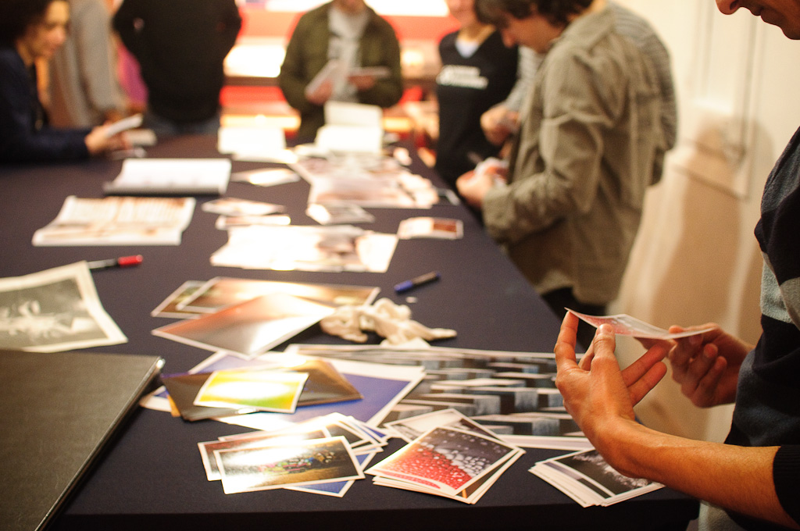
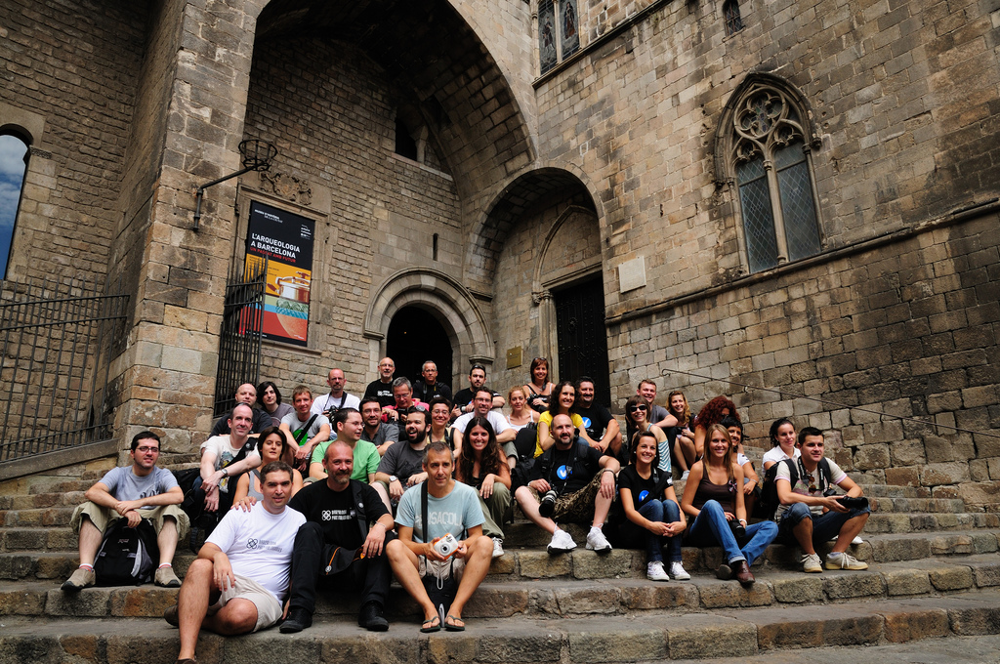
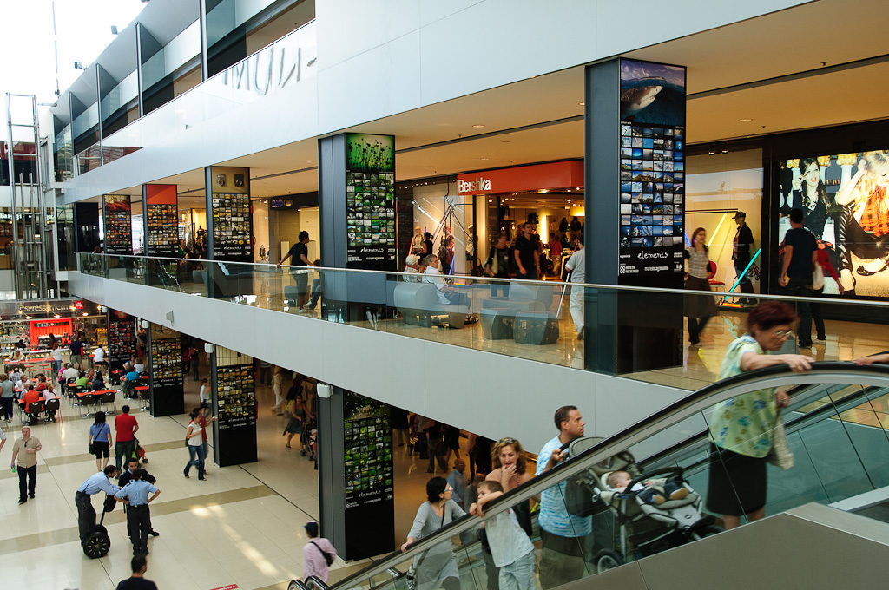

Durant el 2002 el laboratori on acostumava a revelar baixà els preus del “revelat a CD” i vaig començar a demanar sempre el suport digital. A principi del 2003 ja havia decidit abandonar el paper.

La desmaterialització de les meves fotos implicà que ja no tenia “nada” que portar a la feina per comentar al cafè. Un company em va suggerir un soft que estava utilitzant per a galeries. Vaig acabar adaptant el programa; buscava que es veien primer les últimes fotos que hagués pujat, que les fotos es veien grans, ocupant gairebé tota la pantalla, sense estorbes, i que es poguessin deixar comentaris.

Amb el temps vaig descobrir que havia muntat un fotoblog. I com a tot, no era el primer, ni el que millor ho havia fet. Els fotoblogs s’estaven sorgint per a totes parts a principis de “els 2000”, però a això tornaré més tard.

La paraula fotoblog és la castellanització de photoblog una categoria de blog segons la classificació per “media type”, alguna cosa així com una classificació morfològica.

Segons aquesta classificació els blogs poden ser

-   blogs (textuals)
-   photoblogs (fotografies)
-   videoblogs (vídeos)
-   podcast (àudio)
-   sketchblogs (dibuxos, teòricament publicats amb formats de fitxers específics)
-   typecast (manuscrits)
-   etc…

Així un fotoblog és un tipus de blog en què es publiquen fotografies. La fotografia és el contingut, no il·lustra ni acompanya. Podríem definir un fotoblog com un format expositiu en xarxa per a fotografies, dissenyat per ser actualitzat i llegit periòdicament i que es caracteritza per ser una recopilació ordenada cronològicament de forma inversa a la publicació.

Cada entrada (o post) d’aquesta tipologia de blog té almenys una fotografia, pot prescindir de text, fins i tot de títol. L’objectiu d’un fotoblog és mostrar  
fotografies.

Per contrast haurà de quedar clar que un fotoblog no és un blog en què es parla de fotografia, ni de càmeres, això seria una classificació semàntica de la qual podrien sorgir coses com els vacablogs, si escriguéssim de vaces.

## Disseny, layout i interacció

Hi ha diversos layouts estandarditzats, el primer, el més clàssic, és el d’una sola fotografia per entrada i que ocupa tota la pantalla. Per exemple, el meu fotoblog, [http://justpictures.es/](http://justpictures.es/)

El segon més utilitzat segueix sent tenir una imatge per entrada, però es poden veure diverses imatges al mateix temps. Per exemple, [Silvia Varela Diary](http://www.silviavareladiary.com/)

Finalment hi ha dos tipus en què cada entrada mostra una sèrie, alguns en forma vertical i altres en forma horitzontal. De la primera classe podríem veure, [yakuzasblog](http://www.yakuzasblog.net/?p=18), d’Albert Jordar, i de la segona, els horitzontals podríem citar a [Abigail Reese](http://abigailreese.com/blog/).

Per a mi, aprofitar tota la pantalla i aconseguir la interacció més simple és essencial. En el disseny més clàssic el lector només té d’hacer clic, sense ni tan sols moure el ratolí, en el cas d’un dispositiu tàtil és, encara més senzill, només té d’«tocar» la foto per veure la següent. Tenir d’utilitzar les barres de desplaçament, siguin horitzontals o verticals, és una molèstia. A més, prefereixo que a la pantalla es vegi una sola imatge, la sèrie es pot llegir interactuant.

## Llibres, diaris, quadres, pantalles, iPad i Wii

En una ponència de Quentin Bajac a SCAN’08 esmentà un estudi del Centre Pompidou referent a la idoneïtat del format expositiu vertical u horitzontal per a la fotografia. L’estudi analitzava la horitzontalitat i verticalitat, la idea de col·locar fotografies estava molt influenciada per la idea de col·locar quadres, semblava més natural llegir fotografies en llibres o diaris perquè eren un format més modern, més contemporani a la fotografia mateixa…

Resulta que ara podem veure fotografies a pantalles d’ordinador, telèfons mòbils, iPads i podem interactuar amb elles fins i tot amb les consoles de joc. El nexe comú que tenen tots els dispositius, des del punt de vista d’un autor que distribueix contingut, és la web.

Des de llavors existeixen altres contenidors per a la distribució on‑line de les fotografies, com les galeries, els PDFs, els mails i els diferents formats d’eBooks i cadascun d’ells s’adapta millor a diferents tipus de comunicació.

Els fotoblogs són, abans que res, blogs, és a dir, una publicació periòdica que es llegeix de manera regular en la qual normalment es poden deixar comentaris i que dóna major rellevància al contingut més nou. Sembla una eina més adequada per a comunicar projectes en desenvolupament, diaris personals, notícies o treball diari. En canvi una galeria, PDF o eBook s’adapta més a projectes terminats i portfolios.

Aquí cal fer una salvedat tecnològica, els fotoblogs, com a blogs, estan més adaptats a la web 2.0. La web 2.0 i les xarxes socials donen molta importància a la renovació del contingut. Aquesta podria ser una raó per la qual ens interessés utilitzar un fotoblog per mostrar projectes ja acabats o portfolios, no perquè sigui el contenidor que més s’adapta al contingut, sinó perquè aconsegueix una major difusió.

## Fotoblog com a projecte i fotoblogs conceptuels

El fotoblog pot ser un projecte en si mateix o ser un mitjà per a donar a conèixer un projecte concebut independentment.

[justPictures](http://justpictures.es/), el meu fotoblog, compleix amb la definició més clàssica de fotoblog. És un diari personal, publica cada dia, només hi ha una fotografia a cada entrada, rara vegada hi ha text i el disseny és minimalista. Vist així, té molt poc glamour, no té un únic concepte ni estil fotogràfic darrere, el que moltes vegades li treu coherència visual. Un visitant casual, al veure només una foto a la home, no entén que darrere hi ha moltes més.

Però l’objectiu del meu fotoblog no és arribar a un públic massiu, sinó a un grup reduït de lectors, molts propers, i, per sobre de tot, mantenir-me treballant i pensant. No és un canal per a vendre la meva fotografia, considero que les fotografies publicades en ell són esborranys.

Va una etapa de selecció, molt pròxima a la captura i careixen de perspectiva, però una lectura posterior em dóna pistes per continuar buscant. Però existeixen infinits fotoblogs que han nascut amb un concepte, estil i intenció definits.

En el seu “sobre” [Muros hablados](http://muroshablados.es/) diu “Quan no queda un altre lloc que un mur o paret a la carrer per expressar-te…” “Això és el motiu del photoblog, aprofitar aquest mitjà perquè aquelles paraules que van escrites puguin ser llegides.” i com a exemple una de les [últimes entrades](http://muroshablados.es/archives/1919) molts podrien creure que és un fotoblog de graffitis, però es tracta d’un conjunt de missatges deixats a les parets.

Altres fotoblogs amb una definició estilística o conceptual podrien ser:

-   Erika Svensson: [http://erikasvensson.com/](http://erikasvensson.com/)
-   nofound, de diversos autors, curat per Emeric Glayse: [http://nofound.tumblr.com/](http://nofound.tumblr.com/)
-   Oscar Ciutat: [http://oscarciutat.com/](http://oscarciutat.com/)
-   emillamola de Enric Mestres Illamola: [http://emillamola.com/](http://emillamola.com/)
-   yamasaki ko-ji: [http://www.yamasakiko-ji.com/](http://www.yamasakiko-ji.com/)
-   Nocturama fotoblog de Marcelo Aurelio: [http://www.arte-redes.com/nocturama/](http://www.arte-redes.com/nocturama/)
-   macroColors de Lia Naim, [http://macrocolors.com/](http://macrocolors.com/)
-   deletedimages, de diversos autors: [http://www.deletedimages.com/](http://www.deletedimages.com/)
-   baldiri: [http://baldiri.net/](http://baldiri.net/)

Un bon lloc on buscar fotoblogs interessants són els premis anuals de fotoblogs. Els que més m’agradien només han tingut tres edicions són els [photobloggies](http://photobloggies.org/). Els [photoblog awards](http://www.photoblogawards.com/) encara continuen i podeu veure els més votats al premi del 2010 a [http://www.coolphotoblogs.com/awards](http://www.coolphotoblogs.com/awards) (aquest premi es basa en votacions populars, per això no  
em acaba de convèncer)

## “Déu els cria i ells es reuneixen”

Us digués que a principis del 2000 els fotoblogs apareixien per a totes parts, en aquella època tot girava en torno a un directori de fotoblogs [photoblogs.org](http://photoblogs.org/) La wiki de photoblogs.org tenia les definicions bàsiques i instruccions per a començar.  
El directori ens va permetre trobar fotoblogs per temàtiques similars i per ubicació del fotobloguer. Aquella va ser la clau, la ubicació. De sobte teníem un llistat dels fotoblogs d’Espanya i vam començar a seguir els fotobloguers espanyols a comentar a les fotos i, poc a poc, va nasint la comunitat fotobloguer. La primera manifestació física de la comunitat on‑line va ser l’encontre a Zaragoza a octubre del 2005. Com a conseqüència directa es va crear [Barcelona Photobloggers](http://barcelonaphotobloggers.org/) a febrer del 2006, a la qual després es van unir [Madrid Photobloggers](http://madridphotobloggers.blogspot.com/), [Vinaròs Photobloggers](http://www.vinarosphotobloggers.org/) i [Valencia Photobloggers](http://valenciafotobloggers.org/).

Al mateix temps, a nivell europeu, creix [Europe Photobloggers](http://europephotobloggers.org/) i a moltes ciutats es repeteix la tendència com Londres, Nova York, Toronto, Chicago, etc.

Així, el que havia començat com una forma de mostrar les fotos on‑line, es converteix en una comunitat local d’activitats culturals. En el meu cas, com a co‑fundador de Barcelona Photobloggers us puc assegurar que la realitat ha superat àmpliament a la imaginació.

M’agradaria que vistes aquesta referència, alguns dels projectes que [hem fet](http://barcelonaphotobloggers.org/info/#a52) a què podem sumar col·laboracions com [Caja Azul](http://caja-azul.org/), un espai de debat teòric de fotografia i moltes més que estan per veure la llum.

En aquesta petita ressenya de fotobloguejant he omès certs temes com Flickr, la influència en el mercat dels aficionats, les tendències estètiques natives de la web i moltes altres coses. Em he centrat en els fotoblogs allotjats en dominis propis amb dissenys personalitzats perquè em semblen més apropiats com a recurs artístic, però hi ha molt més de què parlar.

A la wikipedia es defineix photoblogging com l’acció de publicar periòdicament fotografies a la xarxa, però és molt més quan comencen les interaccions, les connexions de la xarxa i les ganes de treballar en projectes comuns, espero haver pogut donar una petita pinzellada d’aquest món, una barreja entre artístic i tecnològic, als lectors del Blog PHotoEspaña SanDisk.

Us deixo algunes imatges de despedida:
<table>
<tr valign="top">
<td>
Intercanvi de fotografies, segon aniversari de Barcelona Photobloggers 2007 
</td>
<td>
Encontre Europe Photobloggers, Barcelona 2008
</td>
</tr>
</table>

Exposició “elements” 1578 fotografies, centre comercial Maremagnum, Barcelona 2008 http://www.elements-barcelona.com/

Originalment publicat al [Blog SanDisk de PHEspaña](http://www.phedigital.com/portal/es/load.php?file=blogsandisk.php&post=10406)

