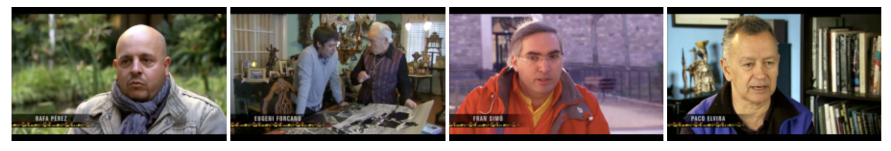

Il 24 febbraio alle 21:45, il programma Fotografies su ‘channel 33’ ha trasmesso un speciale sulla street photography per il quale ho avuto la fortuna di essere intervistato.  
I miei compagni d’avventura erano incredibili: [Eugeni Forcano](http://www.eugeniforcano.info/), [Paco Elvira](http://pacoelvirafoto.blogspot.com.es/) e [Rafa Perez](http://elfotografoviajero.com/).

Il programma di 25 minuti può essere visto qui: [http://www.ccma.cat/tv3/alacarta/fotografies/street-photography/video/3966610/](http://www.ccma.cat/tv3/alacarta/fotografies/street-photography/video/3966610/)

Alcune delle mie fotografie possono essere visualizzate sul sito di Catalunya Television in questa [galleria online](http://www.ccma.cat/tv3/Galeria-Fran-Simo/foto-galeria/19654/).

Consiglio di dare un’occhiata al [post del blog di Paco](http://pacoelvirafoto.blogspot.com.es/2012/02/la-street-photography-en-el-programa.html).

