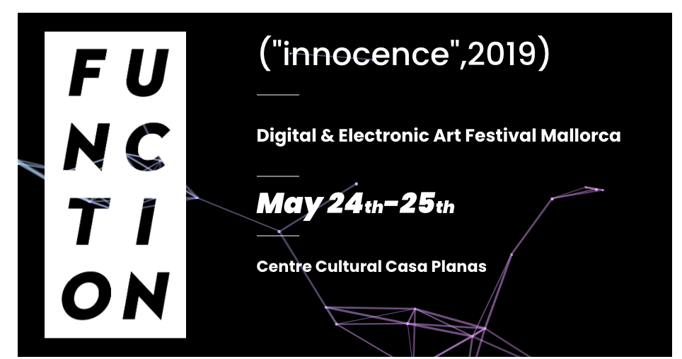

In gennaio 2019, un gruppo di artisti digitali si è riunito al [Centro Culturale Casa Planas](http://www.casaplanas.org/). Di conseguenza, abbiamo creato il primo Festival di Arte Digitale ed Elettronica Mallorca [function("innocence", 2019)](http://2019.functionfest.com/en/function_home_eng/), che è diventato realtà per due giorni tra il 24 e il 25 maggio.

Un'incredibile lista di artisti ha esibito, eseguito, insegnato arte dei nuovi media e mostrato opere interattive.

Sono particolarmente grato a [Enric Socias](https://www.enricsocias.net/), che è stato davvero l'anima del festival.

[Shared Folder. “Red box”](https://fransimo.info/blog/2016/05/07/shared-folder-red-box/) è stato il mio lavoro ufficiale. Tuttavia, all'ultimo momento, ho prodotto un paio di opere non elencate: [CODE](https://fransimo.info/blog/2019/05/29/code-by-r-mutt/) e *Susurros*.



L'elenco completo degli artisti è: [Abe Pazos](https://hamoid.com/), [Albert Negredo](http://albertnegredo.net/), [Alona Vinç](https://alonavinc.net/), [Antoni Socias](http://antonisocias.es/), [Blanca Alonso](https://www.blancaalonso.com/), [Casper Gottlieb](https://co-dependent.bandcamp.com/album/code616), [Coll.eo](https://colleo.org/), [Colo Alzamora](https://www.instagram.com/colo.alzamora/), [Dasha Lina](http://dashailina.com/), Diego Álvarez, [Elia Núñez Barez](http://www.elianunezbarez.com/), Elías Fabré, [Elías Merino](http://www.eliasmerino.com/), [Enric Socias](https://www.enricsocias.net/), [Estela Sanchís](https://estelasanchis.com/), [Farmer’s Manual](https://farmersmanual.bandcamp.com/), [Fernando Velázquez](https://www.seditionart.com/fernando-velazquez), [Fran Simó](https://fransimo.info/), [Hernando Urrutia](https://digital-art-video-hernando-urrutia.webnode.pt/), [Ignasi Bosch](http://ignaciobosch.com/), [Joan Jordi Oliver](https://joanjordioliver.com/), [Leo Sapere](https://www.youtube.com/channel/UC7UeYDm7NtCsdPR5Ltyy5iw), [Mar Reykjavi](https://vimeo.com/user10339902), [Marina Planas](https://en.marinaplanasantich.com/), [Mark Farid](https://www.markfarid.com/), [Martí Guillem Ciscar](https://marti-net.blogspot.com/), [Mez Breeze](http://mezbreezedesign.com/), [Mitos Colom](https://vimeo.com/mitoscolom), Moxus, P2P, [Pedro Alves Da Veiga](https://pedroveiga.com/), [Pedro Trotz](http://pedrotrotz.com/), [PI](https://www.facebook.com/musicaPi/), [Rohit Gupta](http://rohitg.in/portfolio/), [Ryan Cherewaty](http://ryancherewaty.com/), [Sandrine Deumier](http://sandrinedeumier.com/), [Sarah Rasines](https://sarahrasines.com/), [Stefan Riebel](http://stefanriebel.de/), [Toni Mitjanit](https://coderspaghetti.wordpress.com/), TUUUN, [Victor Moragues](https://victormoragues.bandcamp.com/releases).

