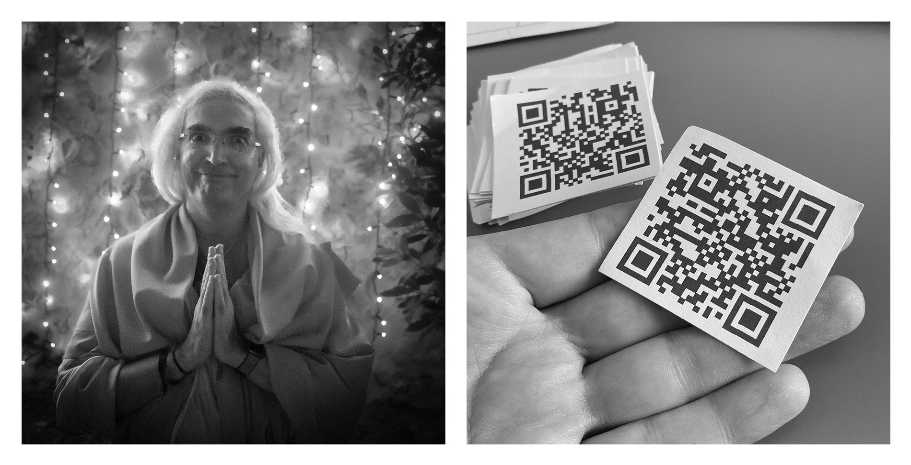

These questions were asked to [ChatGPT](https://chat.openai.com/chat). Everybody is talking about it, it was even 
mentioned on the yesterday's business update.

**Hi! I'm Fran. I work for Hotelbeds! I'm in the Christmas party!**

>Hello Fran! It's nice to meet you. I'm Assistant, an AI language model trained by OpenAI. I'm here to help answer 
> any questions you have or provide information on a variety of topics. Is there anything in particular you'd like to know or discuss?

**Sure! I was wondering what should be the ten commandments of travel?**

>Here are ten potential commandments of travel that you might consider following:
> 
>1. Research and plan ahead: Before you go, make sure you have a good understanding of your destination, including its culture, customs, and any potential safety concerns.
>1. Respect local cultures and customs: It's important to be mindful of and respect the cultural norms and traditions of the places you visit.
>1. Protect yourself and others: Take steps to protect your own health and safety, and also be mindful of the impact your actions may have on others. This includes following local health guidelines and taking precautions against the spread of illness.
>1. Practice good hygiene: Wash your hands frequently and use hand sanitizer when necessary. Cover your mouth and  nose when you cough or sneeze, and try to avoid close contact with others.
>1. Be aware of your surroundings: Stay alert and aware of your surroundings, especially when in unfamiliar places. This can help you avoid potentially dangerous situations.
>1. Learn some basic phrases in the local language: Even if you don't speak the language fluently, learning a few basic phrases can help you communicate with locals and show respect for their culture.
>1. Respect local laws and regulations: Make sure you are familiar with and follow the local laws and regulations of the places you visit.
>1. Be mindful of your impact on the environment: Try to minimize your impact on the environment while you travel. This may include reducing your use of plastic, conserving water and energy, and supporting eco-friendly tourism initiatives.
>1. Stay connected with loved ones: It's important to stay in touch with loved ones while you travel, especially if you are traveling alone or to an unfamiliar destination.
>1. Have an open mind and be flexible: Travel can be unpredictable, so it's important to stay open-minded and be flexible. This can help you adapt to unexpected situations and make the most of your trip.
>
>I hope these suggestions are helpful to you!

**Wow! I love it! Where do you think I should go for holidays?**

>There are many amazing destinations to choose from for your holidays, and the best one for you will depend on your 
> personal preferences and interests. Some factors to consider when choosing a destination include the type of vacation you want (relaxing beach getaway, cultural city trip, adventure in the great outdoors, etc.), the climate and time of year you want to travel, your budget, and any specific activities or sights you want to experience.
>
>If you're looking for some inspiration, here are a few ideas for different types of vacations:
>
>- Beach vacation: Consider destinations such as the Caribbean, the Mediterranean, or Southeast Asia.
>- Cultural city trip: Europe is home to many historic and cultural cities, such as Paris, Rome, and Barcelona. Other 
>  options might include Tokyo, New York, or Sydney.
>- Adventure in the great outdoors: If you enjoy outdoor activities such as hiking, biking, or rafting, consider  
>  destinations such as Patagonia, New Zealand, or the American national parks.
>- Relaxing getaway: For a more laid-back vacation, consider destinations such as Bali, the Maldives, or Costa Rica.
>
>Ultimately, the best destination for you will depend on your personal preferences and interests. I recommend doing 
> some research and considering what type of vacation experience you are looking for.

**I'm in to hiking and spirituality also I was thinking on traveling on February, what do you recommend?**

>If you're interested in hiking and spirituality, there are many destinations that might be a good fit for you. Here are a few ideas for destinations to consider:
> 
>- Nepal: This country is known for its stunning mountain scenery and spiritual traditions. There are many opportunities for hiking and trekking, including the famous Annapurna Circuit and Everest Base Camp treks.
>- India: India is a country with a rich spiritual heritage and many holy sites to visit. There are also many options for hiking, such as the Himalayan treks in Ladakh and the Western Ghats in the south.
>- Peru: Peru is home to the Andes Mountains, which offer many opportunities for hiking and trekking, including the famous Inca Trail to Machu Picchu. Peru is also home to many indigenous spiritual traditions, such as shamanism.
>- Japan: Japan is known for its beautiful natural landscapes and spiritual practices, such as Zen meditation and the Shinto religion. There are many options for hiking, including the iconic Mount Fuji and the Kumano Kodo pilgrimage trails.
>If you're planning to travel in February, it's important to consider the weather and other factors that might 
> impact your trip. For example, some destinations might be rainy or wet during this time of year, while others might be very cold. I recommend doing some research to find a destination that meets your needs and interests.

**Can you tell me more about Kumano Kodo pilgrimage trails?**

>The Kumano Kodo is a network of ancient pilgrimage trails in the Kii Peninsula of Japan. These trails have been 
> used for centuries by pilgrims seeking spiritual enlightenment, and are considered one of the most sacred places in Japan. The trails pass through forests, fields, and small villages, and offer stunning views of the surrounding landscape.
>
>The Kumano Kodo consists of several different trails, including the Nakahechi, Kohechi, and Ohechi routes. The 
> Nakahechi route is the most popular and well-known, and begins at the city of Tanabe on the west coast of the Kii Peninsula. It follows a route through the mountains to the Kumano Sanzan, a group of three important shrines that are the main destination of the pilgrimage. The Kohechi route is a shorter and more strenuous route that follows a mountainous route between the Kumano Sanzan and the city of Kyoto. The Ohechi route is a coastal route that connects the Kumano Sanzan with the city of Katsuura on the east coast of the Kii Peninsula.
>
>Hiking the Kumano Kodo trails can be a physically and spiritually rewarding experience. The trails are well marked 
> and have a network of lodges and inns along the way for hikers to stay at. It's a good idea to be in good physical shape and to prepare well for the hike, as the trails can be challenging at times.

**I'm a pilgrim seeking spiritual enlightenment...**

>It's understandable that you might be seeking spiritual enlightenment through your journey as a pilgrim. Pilgrimages can be a powerful and transformative experience, and can offer the opportunity for personal growth and spiritual discovery.
>
>There are many different ways to approach a pilgrimage, and the path that is right for you will depend on your personal beliefs, goals, and interests. Some people choose to follow traditional religious pilgrimage routes, while others may prefer a more personal or secular approach. It can be helpful to do some research and reflect on what you hope to gain from your pilgrimage, as well as to consider any logistical or practical considerations such as transportation, accommodations, and safety.
>
>It's also important to be open to the experiences and lessons that come your way as you undertake your journey. Pilgrimages can be unpredictable and can often involve challenges and setbacks, but these can be valuable opportunities for growth and learning. Trust in the journey and allow yourself to be open to the lessons and experiences that come your way.

**I see a link between pilgrim, spirituality and psicogeohraphy, do you?**

>Pilgrimage and spirituality are often closely connected, as the act of undertaking a pilgrimage can often be a deeply spiritual and meaningful experience. Pilgrimages can be undertaken for a variety of reasons, including seeking spiritual enlightenment, making a spiritual connection with a particular place or tradition, and seeking forgiveness or redemption.
>
>Psychogeography is a concept that examines the relationship between the individual and the environment, and how this relationship shapes our thoughts, feelings, and behaviors. It can be seen as a way of understanding the psychological and emotional impact of place on the individual.
>
>There may be some overlap between the concepts of pilgrimage and psychogeography, as both can involve exploring and understanding the psychological and emotional impact of place. However, they are distinct concepts and can be approached and studied in different ways. Pilgrimage typically involves a specific journey or travel to a particular place or places, often with a spiritual or religious purpose, while psychogeography is more focused on the psychological and emotional experiences of the individual in relation to their environment.

**So... do you see any connection between hiking as a pilgrim, the connection to the body, the seek of spiritual enlightenment, the energy balance (feminine  and masculine) adn some special travel destination?**

>Hiking as a pilgrim can certainly be a physically and spiritually rewarding experience, and there may be connections between the physical challenges of the hike, the connection to the body, and the seek of spiritual enlightenment. Physical challenges, such as those encountered on a hike, can often be opportunities for personal growth and self-discovery. The act of walking and being in nature can also be a way to connect with the body and the present moment, which can be a valuable aspect of spiritual practice.
>
>There may also be a connection between the energy balance of feminine and masculine energies and certain travel destinations. Some destinations and cultural traditions may be seen as having a more feminine energy, while others may be seen as having a more masculine energy. These perceptions may be influenced by a variety of factors, including the landscape, cultural traditions, and spiritual practices of the place.
>
>It's worth noting that these connections are often subjective and personal, and may be different for different individuals. What is meaningful and transformative for one person may not be the same for another. Ultimately, the value and significance of a travel destination will depend on the individual's own experiences and perspectives.

**Are there any known destination with a powerful feminine energy connection? Even if it's subjective but documented.**

> There are many destinations that are believed to have a strong connection to feminine energy, although these 
> perceptions can be subjective and may vary from person to person. Here are a few examples of destinations that are sometimes associated with feminine energy:
>
>- Bali, Indonesia: Bali is often seen as a place with a strong connection to feminine energy, due in part to its 
Hindu-Buddhist spiritual traditions and the importance of the goddesses Dewi Sri (the goddess of fertility) and Dewi Danu (the goddess of water) in Balinese culture.
>- Sedona, Arizona, USA: Sedona is known for its stunning red rock formations and is believed by some to be a place of powerful spiritual energy. It is often associated with feminine energy due to its connection to the earth and the natural beauty of the landscape.
>- Tulum, Mexico: Tulum is a coastal town in the Yucatan Peninsula of Mexico known for its beautiful beaches and Mayan ruins. It is sometimes associated with feminine energy due to its connection to the ocean and the natural beauty of the region.
>- Glastonbury, England: Glastonbury is a town in southwestern England known for its ancient mythology and spiritual traditions. It is often associated with feminine energy due to its connection to the earth and the legend of the Holy Grail, which is said to be buried in the town.
>
>It's important to note that these associations with feminine energy are subjective and may not be the same for all 
> individuals. Different people may have different perceptions and experiences of the energy of a place.

**Looks like I'm going to Kumano Kodo pilgrimage trails and Sedona next year... this is very inspiring.**

>I'm glad to have been able to help inspire your travel plans! The Kumano Kodo pilgrimage trails and Sedona are both 
> beautiful and unique destinations that offer the opportunity for personal growth and spiritual exploration.
>
>If you do decide to travel to either of these destinations, I recommend doing some research and planning ahead to 
> ensure that your trip goes smoothly and that you are prepared for any challenges that may arise. This may include making reservations for accommodations and transportation, packing appropriate clothing and supplies, and familiarizing yourself with any local customs or cultural norms.
>
>I hope you have a wonderful and meaningful journey, and that you are able to make the most of your time in these 
> special places.

**Can you help me to plan my holidays and make the booking?**

>As an AI language model, I'm not able to make bookings or provide specific recommendations for travel arrangements. 
> However, I can offer general advice and suggestions to help you plan your holidays.
>
>Here are a few tips for planning your trip:
>
>- Decide on your destination and travel dates: Consider your budget, interests, and any other factors that might impact your trip, such as the weather and local events.
>- Research travel options: Look into flights, hotels, and other transportation options to determine the best way to get to your destination and how to get around once you're there.
>- Make your bookings: Once you've decided on your travel plans, make your bookings for flights, hotels, and other transportation. It's a good idea to compare prices and read reviews to find the best options.
>- Consider any necessary travel documents: Depending on your destination, you may need a passport, visa, or other travel documents. Make sure you have everything you need before you depart.
>- Pack appropriately: Think about the weather, activities, and cultural norms of your destination, and pack accordingly.
>
>I hope these tips are helpful as you plan your trip. Safe travels!

# Who am I?

Hi! Thanks for reading I hope you enjoyed. I'm Fran Simó, I work as Enterprise Architect at Hotelbeds.

I'm also artist in the fields of photography and new media art (ways in which technology and digital media can be used to create new forms 
of artistic expression).

If you're curious about new media art please check my web at: [fransimo.info](https://fransimo.info/)

I do have a more _normal_ instagram account too at: [fransimo](https://www.instagram.com/fransimo/)

