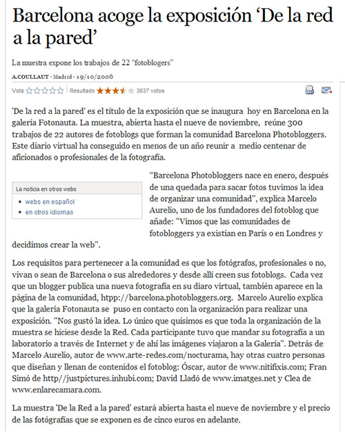

The newspaper El País has written a <a href="http://tecnologia.elpais.com/tecnologia/2006/10/19/actualidad/1161246483_850215.html">article</a> about the exhibition <a href="http://barcelonaphotobloggers.org/2006/10/16/exposicion-de-la-red-a-la-pared/">"From the Network to the Wall"</a> organized by Barcelona Photobloggers and the gallery Fotonauta.

Thank you very much!

