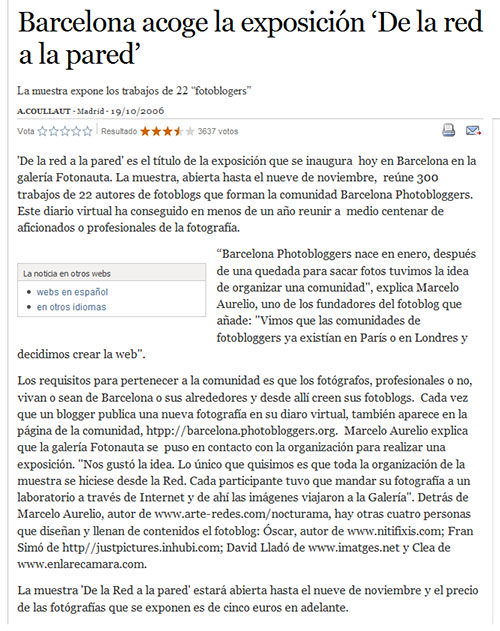

El diario El País ha escrito
un <a href="http://tecnologia.elpais.com/tecnologia/2006/10/19/actualidad/1161246483_850215.html">artículo</a> sobre la
exposición <a href="http://barcelonaphotobloggers.org/2006/10/16/exposicion-de-la-red-a-la-pared/">"De la red a la
pared"</a> organizada por Barcelona Photobloggers y la galería Fotonauta. 

¡Muchas gracias!

