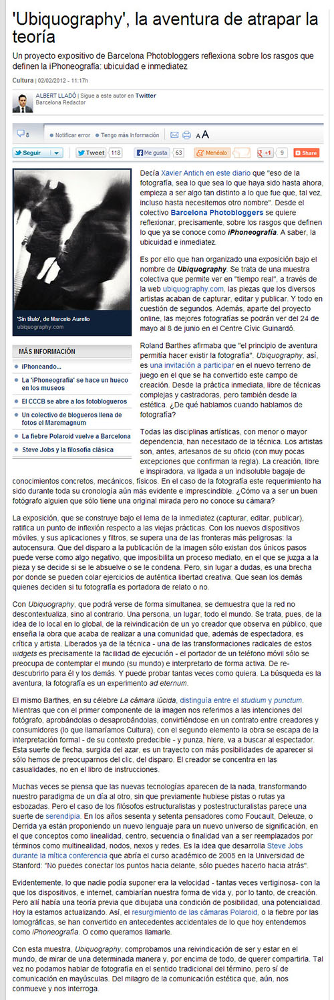

The newspaper La Vanguardia has written
a <a href="http://www.lavanguardia.com/cultura/20120202/54247595516/ubiquography-aventura-teoria.html">article</a>
about the
project <a href="http://barcelonaphotobloggers.org/2012/02/02/ubiquography-un-proyecto-de-reflexion-sobre-la-iphoneografia/">
Ubiquography</a> driven by Barcelona Photobloggers. Thank you very much!

