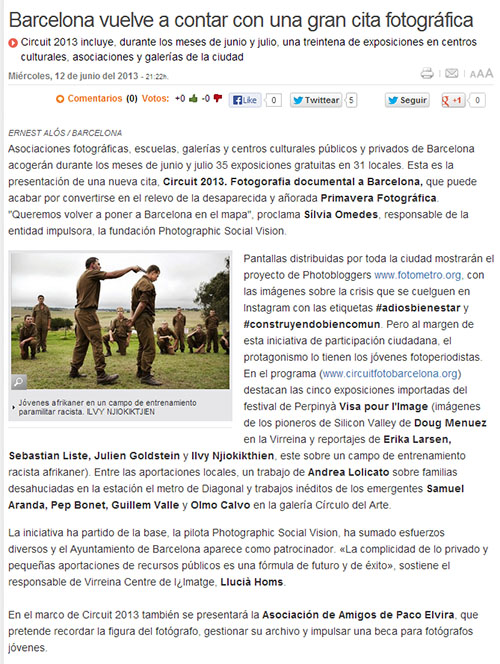
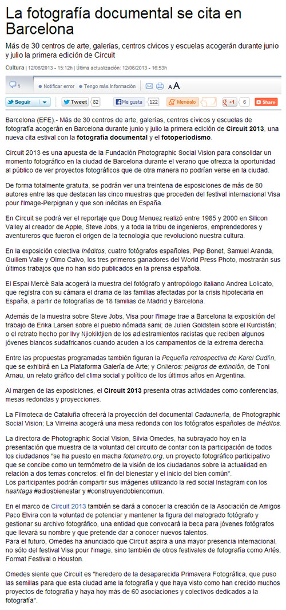
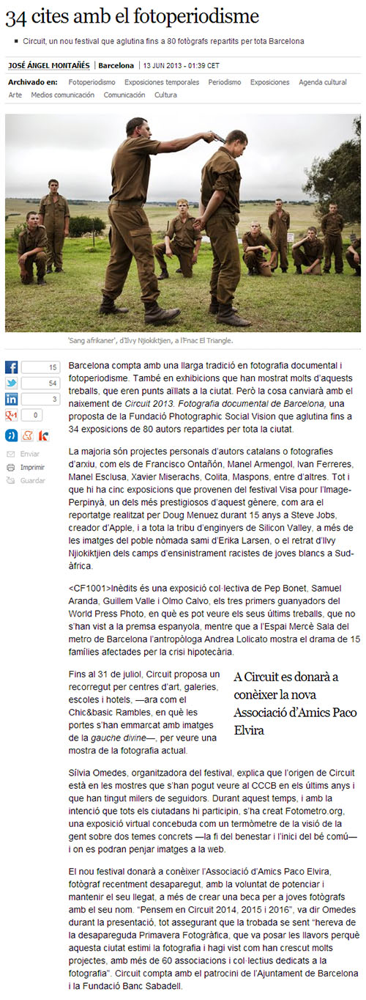

The newspapers El Periódico, La Vanguardia and El País have written articles about the <a href="http://circuitfotobarcelona.org/">Circuit 2013</a> and all of them include mentions of the <a href="http://fotometro.org/">fotometro.org</a> project, with which Barcelona Photobloggers participates in this festival dedicated to documentary photography and photojournalism.

