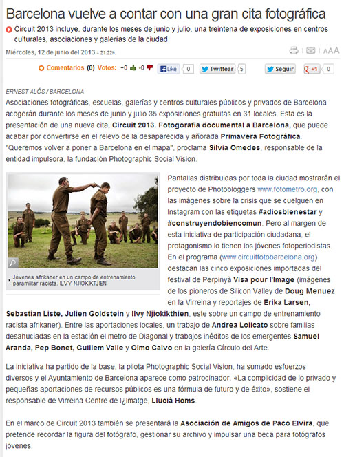
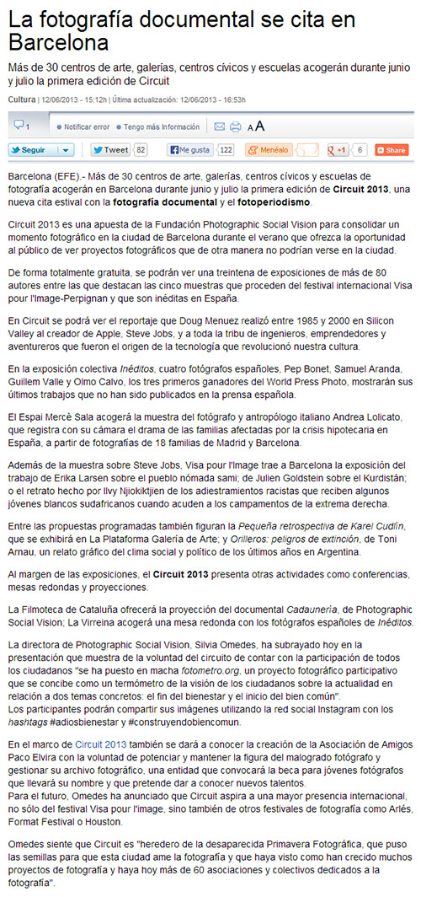
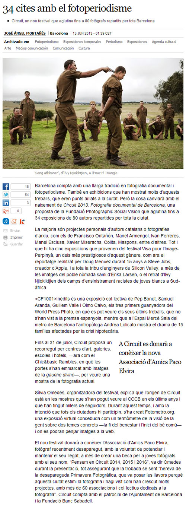

Los diarios El Periódico, La Vanguardia y El País han escrito artículos sobre el <a href="http://circuitfotobarcelona.org/">Circuit 2013</a> y todos ellos incluyen menciones al proyecto <a href="http://fotometro.org/">fotometro.org</a>, con el que Barcelona Photobloggers participa en este festival dedicado a la fotografía documental y el fotoperiodismo.

