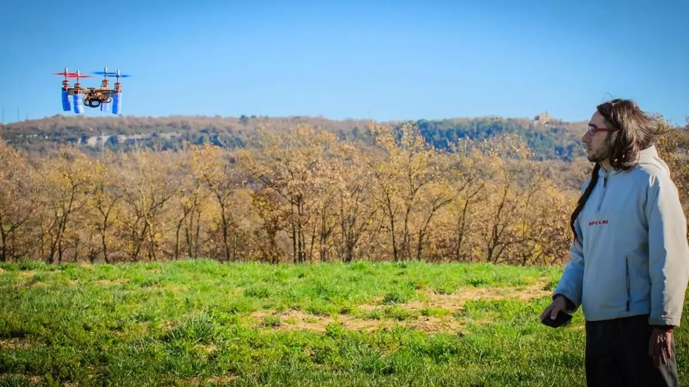

More than **15 professionals from the art sector** will participate in **nine events** across different cultural centers in the city of Alicante. This is the core of **ppt Open Art Festival,** the first edition of a gathering aimed at presenting **new visions of contemporary art**.

Exhibitions, talks, and workshops covering topics such as **crypto art, sustainability, bio-art, and artificial intelligence** are at the heart of this new festival, created by the founders of [A Quemarropa residencies](https://www.informacion.es/cultura/2019/06/21/quemarropa-suspende-residencias-artisticas-despues-5386100.html) and [Piedra Papel Tijera ALC](https://www.informacion.es/cultura/2020/08/12/cinco-artistas-explicaran-obras-publico-8701120.html), **Juan Fuster, Miriam Martínez Guirao, and Ana Pastor**.

"The world is changing, and the festival seeks to highlight some of the currents that contemporary creators are addressing today, which may sometimes appear blurred due to the complex and turbulent moment that art is experiencing," say the organizers.

This cycle **kicks off tomorrow at 12:00 PM** with the exhibition _**Bio-Eco-Digital Art. New Currents**_ at La Caja Blanca in **Las Cigarreras**, featuring works by **Almudena Romero, Fran Simó, Lot Amorós, Marina Planas, Miguel Moreno, and Vicente Aguado**, who will also participate in other activities.

On the same day, the second event will take place with the roundtable discussion _**Ecology, Digital Art, Bio-Art, and Other Approaches**_, at the University Headquarters in Alicante.

One highlight is the workshop led by artist Almudena Romero at Las Cigarreras on October 1st, titled _**Anthotype. Chlorophyll Printing**_.

The following Thursday, at the same venue, Valencian artist Vicente Aguado will explore the complex world of NFTs in his talk **Raw Crypto Art**. On October 7th, **Cynthia Nudel** will lead a workshop on creating ceramics with biomaterials. For younger audiences, **Open Play** will be held on Saturday, October 8th, at Las Cigarreras.

_Art and Sustainability_ is the title of the roundtable discussion taking place on October 13th at Casa Bardín, featuring **gallery owner Begoña M. Deltell, the director of the** [**Museum Consortium**](https://www.informacion.es/cultura/2022/01/17/consorcio-museos-abre-convocatoria-artistas-61671467.html)**, José Luis Pérez Pont, and Miriam Martínez Guirao.**

The following day, **Alelí Mirelman**, project director at the Casa Planas Foundation in Mallorca, will give a talk on the carbon footprint of digital archives. Finally, on October 14th and 15th, artist Lot Amorós will lead the **Anti-Extinction Laboratory** workshop at MUA.

Attendance at the festival is free, although some workshops require prior registration.
