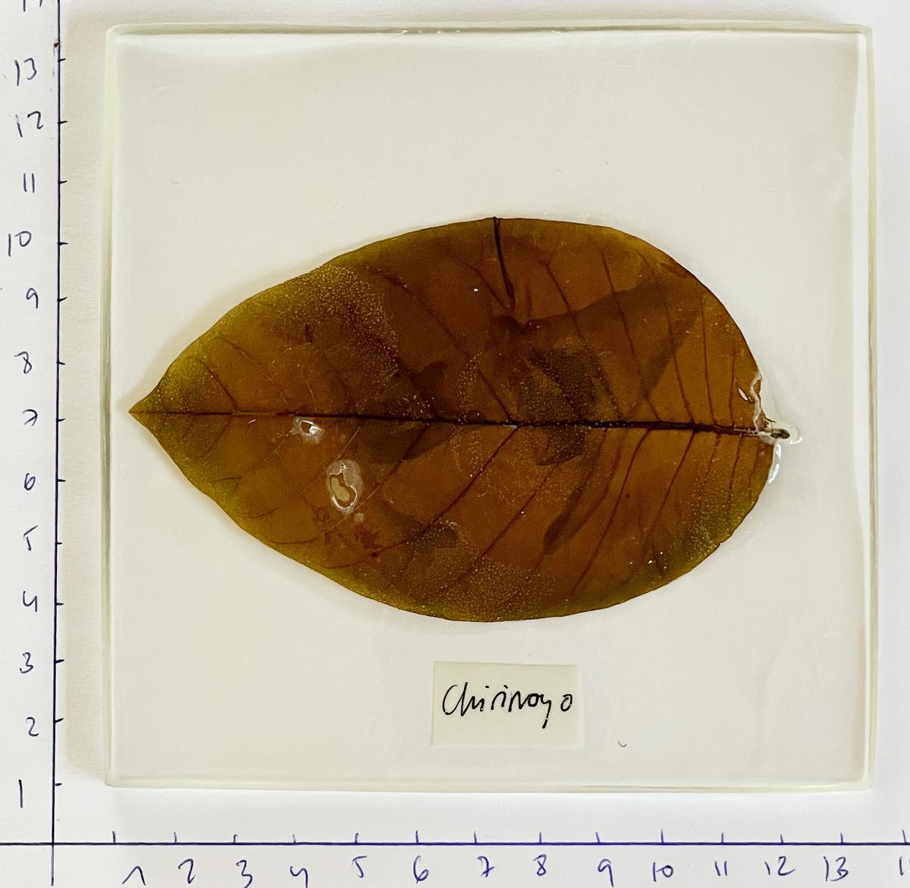

Más de **15 profesionales del sector artístico** para **nueve acciones** que se desarrollarán en diferentes centros culturales de la ciudad de Alicante. Ese es el eje central de **ppt Open Art Festival,** primera edición de un encuentro que pretende poner sobre la mesa **nuevas visiones del arte contemporáneo**.

Exposiciones, charlas y talleres, con temas como el **crypto arte, la sostenibilidad, el bio-arte o la inteligencia artificial** centran las propuestas que ofrece este nuevo festival, creado por los impulsores de las [residencias A Quemarropa](https://www.informacion.es/cultura/2019/06/21/quemarropa-suspende-residencias-artisticas-despues-5386100.html) y [Piedra Papel Tijera ALC](https://www.informacion.es/cultura/2020/08/12/cinco-artistas-explicaran-obras-publico-8701120.html), **Juan Fuster, Miriam Martínez Guirao y Ana Pastor**.

«El mundo está cambiando y el festival trata de poner sobre la mesa algunas de las corrientes de las que se están ocupando los creadores contemporáneos en la actualidad y que pueden quedar algo borrosas debido al momento tan complejo y convulso que vive el arte», aseguran los organizadores.

Este ciclo **arranca mañana, a las 12 horas**, con la exposición _**Bio-Eco-Arte digital. Nuevas corrientes**_ en la Caja Blanca de las **Cigarreras**, con piezas de **Almudena Romero, Fran Simó, Lot Amorós, Marina Planas, Miguel Moreno y Vicente Aguado**, que además participarán en otras actividades.

El mismo día tendrá lugar la segunda acción con la mesa redonda _**Ecología, arte digital, bio-arte y otras aproximaciones**_, en la Sede Universitaria Ciudad de Alicante.

Destaca el taller que la artista Almudena Romero impartirá en Cigarreras el 1 de octubre, bajo el título de _**Antotipia. Impresión con clorofila**_.

El jueves siguiente, en el mismo centro, el valenciano Vicente Aguado hablará del complejo universo de los NFT en la charla **Crypto Arte en crudo**. Y **Cynthia Nudel** impartirá el día 7 un taller para realizar cerámica con biomateriales. Para los más pequeños se ha organizado **Open Play**, el sábado 8 en Las Cigarreras.

_Arte y sostenibilidad_ es el título de la mesa redonda que se celebra el 13 de octubre en la Casa Bardín, con la **galerista Begoña M. Deltell, el director del** [**Consorci de Museus**](https://www.informacion.es/cultura/2022/01/17/consorcio-museos-abre-convocatoria-artistas-61671467.html)**, José Luis Pérez Pont, y Miriam Martínez Guirao.**

Un día después**, Alelí Mirelman**, directora de proyectos de la Fundación Casa Planas de Mallorca, ofrecerá una charla sobre la huella de carbono del archivo digital. Por último, los días 14 y 15 de octubre, el artista Lot Amorós impartirá el taller **Laboratorio Anti-extinción**, en el MUA.

La asistencia al festival es gratuita, aunque algunos talleres precisan de inscripción previa.
