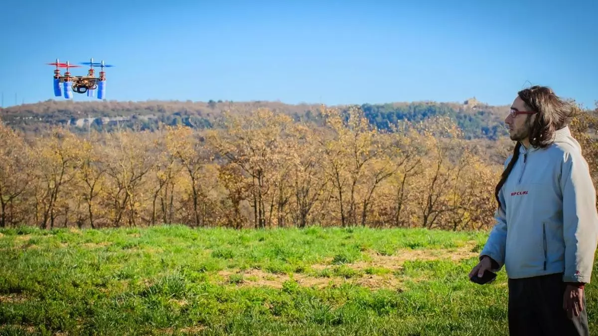
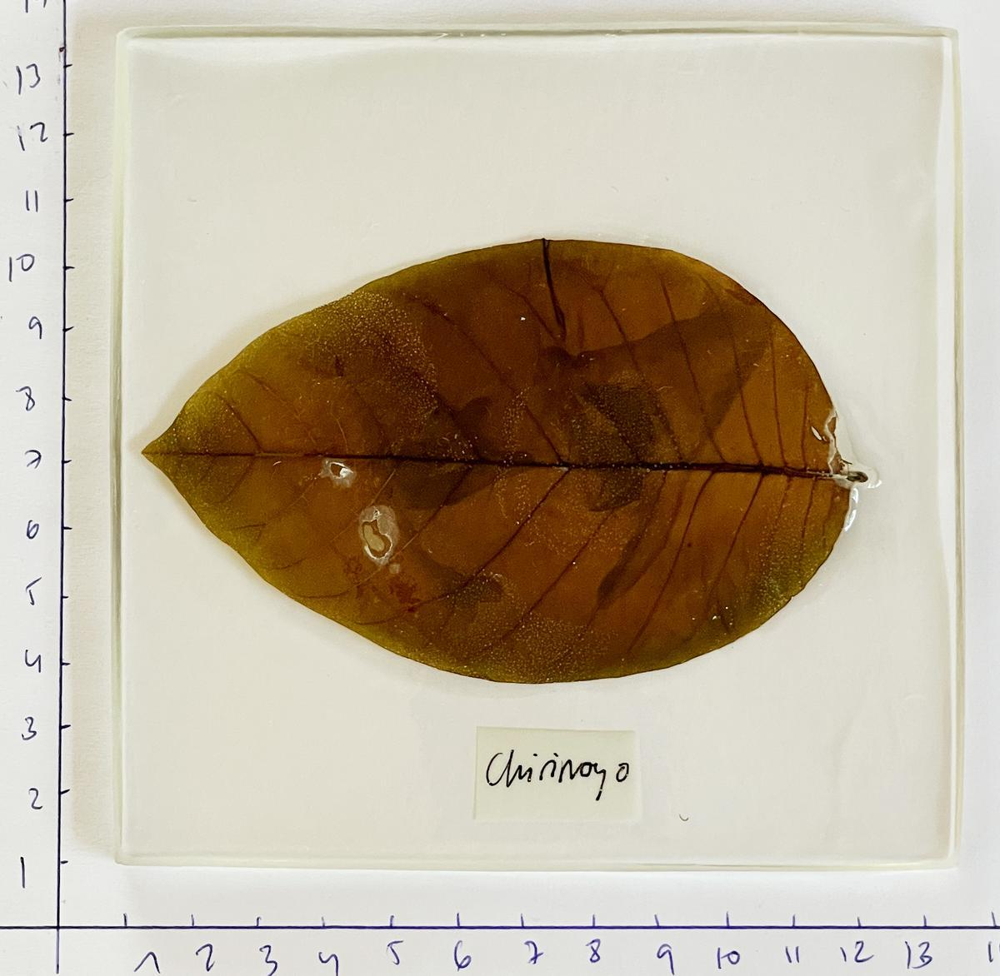

Più di **15 professionisti del settore artistico** parteciperanno a **nove eventi** in diversi centri culturali della città di Alicante. Questo è il nucleo di **ppt Open Art Festival,** la prima edizione di un raduno volto a presentare **nuove visioni dell’arte contemporanea**.

Mostre, conferenze e laboratori che trattano temi come **crypto art, sostenibilità, bio-art e intelligenza artificiale** sono al centro di questo nuovo festival, creato dai fondatori di [A Quemarropa residencies](https://www.informacion.es/cultura/2019/06/21/quemarropa-suspende-residencias-artisticas-despues-5386100.html) e [Piedra Papel Tijera ALC](https://www.informacion.es/cultura/2020/08/12/cinco-artistas-explicaran-obras-publico-8701120.html), **Juan Fuster, Miriam Martínez Guirao e Ana Pastor**.

"Il mondo sta cambiando, e il festival cerca di evidenziare alcune delle correnti che i creatori contemporanei stanno affrontando oggi, che a volte possono apparire sfocate a causa del momento complesso e turbolento che l’arte sta vivendo," dicono gli organizzatori.

Questo ciclo **inizia domani alle 12:00** con la mostra _**Bio-Eco-Digital Art. New Currents**_ a La Caja Blanca a **Las Cigarreras**, con opere di **Almudena Romero, Fran Simó, Lot Amorós, Marina Planas, Miguel Moreno e Vicente Aguado**, che parteciperanno anche ad altre attività.

Stesso giorno, il secondo evento si svolgerà con la tavola rotonda _**Ecology, Digital Art, Bio-Art, and Other Approaches**_, presso la sede dell’Università di Alicante.

Un punto di forza è il laboratorio guidato dall’artista Almudena Romero a Las Cigarreras il 1° ottobre, intitolato _**Anthotype. Chlorophyll Printing**_.

La settimana successiva, giovedì, nello stesso luogo, l’artista valenciano Vicente Aguado esplorerà il complesso mondo degli NFT nella sua conferenza **Raw Crypto Art**. Il 7 ottobre, **Cynthia Nudel** condurrà un laboratorio sulla creazione di ceramiche con biomateriali. Per il pubblico più giovane, **Open Play** si terrà sabato 8 ottobre, a Las Cigarreras.

_Art and Sustainability_ è il titolo della tavola rotonda che si terrà il 13 ottobre a Casa Bardín, con la proprietaria della galleria Begoña M. Deltell, la direttrice del **[Museum Consortium](https://www.informacion.es/cultura/2022/01/17/consorcio-museos-abre-convocatoria-artistas-61671467.html)**, José Luis Pérez Pont e Miriam Martínez Guirao.

Il giorno successivo, **Alelí Mirelman**, direttore di progetto della Casa Planas Foundation a Maiorca, terrà una conferenza sul carbon footprint degli archivi digitali. Infine, il 14 e 15 ottobre, l’artista Lot Amorós condurrà il laboratorio **Anti-Extinction Laboratory** a MUA.

La partecipazione al festival è gratuita, anche se alcuni laboratori richiedono la registrazione anticipata.

