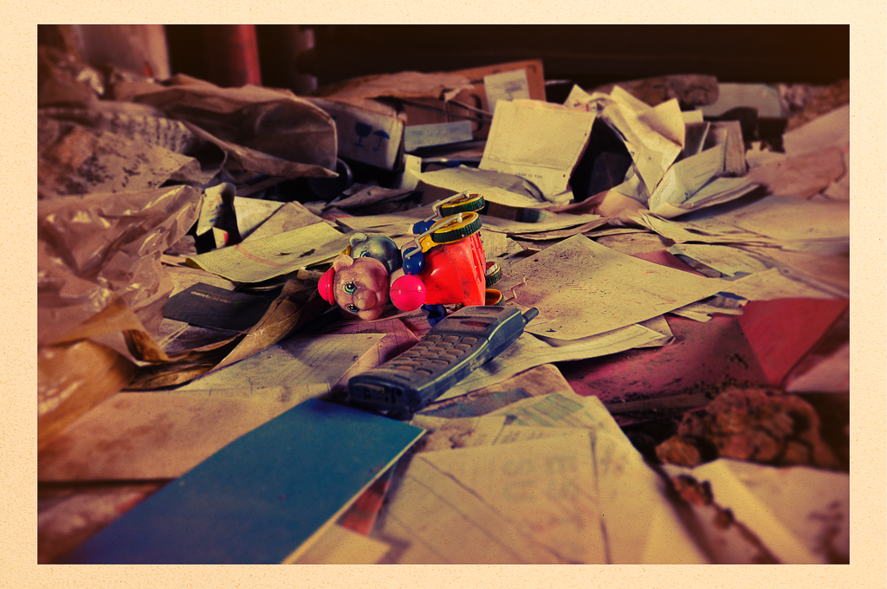
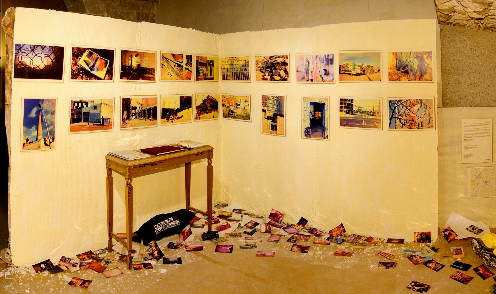
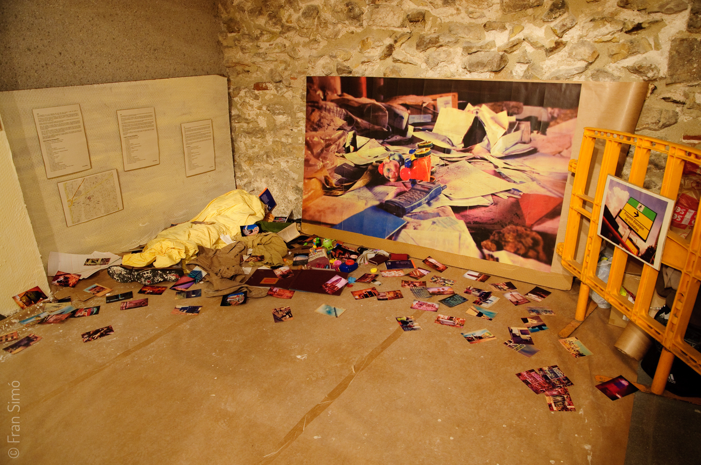
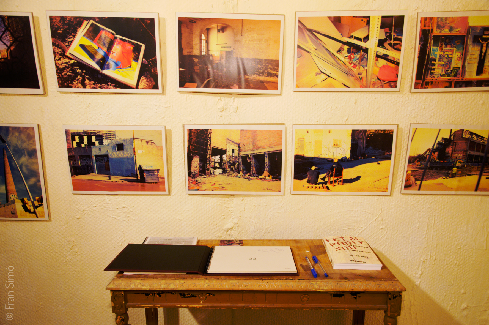

# 22 
{}
2000-2009
Libro
Autoedición, 21×29 cm, 26 páginas, impresión laser color sobre papel reciclado, encuadernación manual.
Edición de 10 ejemplares + 1 prueba de artista

Instalación site-specific Centre Civi Pati Llimona.
Construcción de espacio 6x3m, objetos diversos y fotografías.
22 fotografías (21 en A4 y una copia de 150×100 cm), impresión láser color sobre papel reciclado, enmarcadas en cartón.
200 fotografías 10x15cm impresión en papel fotográfico sin enmarcar. Copias únicas.

Disponible como ebook en [English](http://www.lulu.com/shop/fran-sim%C3%B3/22/ebook/product-20663836.html) y [Español](http://www.lulu.com/shop/fran-sim%C3%B3/22/ebook/product-18680983.html).

{}

Las fotografías de 22 son fragmentos del remanso entre dos épocas, entre dos modelos de desarrollo, el primero industrial y el segundo del conocimiento.

Poble nou sufrió la crisis de la industria y quedó en un letargo. En ese tentempié fue conquistado por otros habitantes: inmigrantes sin hogar, okupas, ruinas, demoledores, gitanos, juguetes abandonados, libros de contabilidad dejados atrás… …y la resistencia, los que siempre habían vivido ahí y que no han querido irse.

Esta selección de 22 fotos parte de un archivo de unas 2000 imágenes tomadas desde el año 2000 hasta el día de hoy. Es más emocional que estrictamente documental.

Cuando encaré el proyecto sabía que quería darle una imagen y una presentación de abandono, despojo y radicalmente no-digital. A su vez, me gustaba la idea de explotar la capacidad de mentir del soporte digital (base de la sociedad del conocimiento) para convertirlo en algo con look analógico.

Quise reproducir lo que podrían haber sido fotografías hechas con una cámara encontrada entre las ruinas de las fábricas, alguna cámara barata que alguien olvidara al dejar atrás la planta. Esa cámara tendría lentes de plástico y con los años se le filtraría luz por alguna parte… además, si llevaba carrete estaría caducado.

{}
 
<--->

{}



# Fotografías


